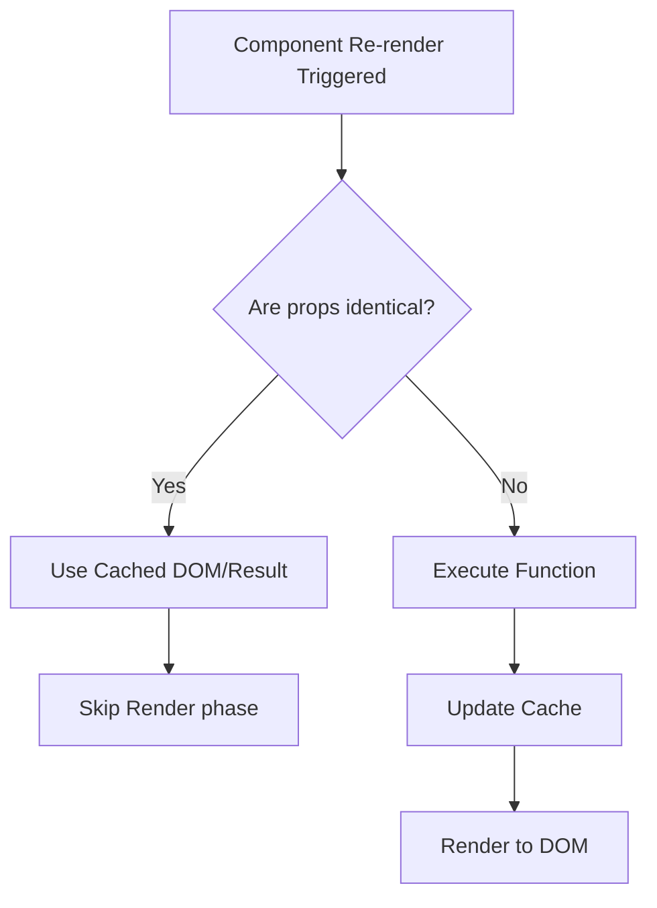

# Memoization
Мемоизация (Memoization) — это техника кэширования результатов дорогих вычислений, чтобы не выполнять их повторно при тех же входных данных. В контексте UI-фреймворков (как React) это еще и способ предотвратить лишние ререндеры дочерних компонентов (через `React.memo`, `useMemo`, `useCallback`). Боль: приложение тормозит, потому что при изменении одного счетчика в корневом компоненте, перерисовывается всё дерево приложения, включая тяжелые списки и графики, хотя их пропсы не изменились. Практика: оборачивать тяжелые компоненты в `memo`, а вычисляемые значения кэшировать. Трейдоффы: мемоизация не бесплатна. Сравнение пропсов (`Object.is` или shallow compare) и замыкания потребляют память и процессорное время. Чрезмерная мемоизация простых компонентов может сделать приложение медленнее из-за оверхеда на проверки.



```javascript
import { useMemo, memo } from 'react';

// Антипаттерн: Медленная функция выполняется при каждом рендере
function BadComponent({ data, filter }) {
  // Вычисляется заново даже если изменился другой стейт компонента
  const filteredData = data.filter(item => item.name.includes(filter)); 
  return <ul>{filteredData.map(i => <li key={i.id}>{i.name}</li>)}</ul>;
}

// Правильное решение: Кэширование результата вычисления и рендера компонента
const HeavyListItem = memo(({ item }) => {
  return <li>{item.name}</li>; // Рендерится только если item изменился
});

function GoodComponent({ data, filter }) {
  const filteredData = useMemo(() => {
    return data.filter(item => item.name.includes(filter));
  }, [data, filter]);

  return <ul>{filteredData.map(i => <HeavyListItem key={i.id} item={i} />)}</ul>;
}
```
