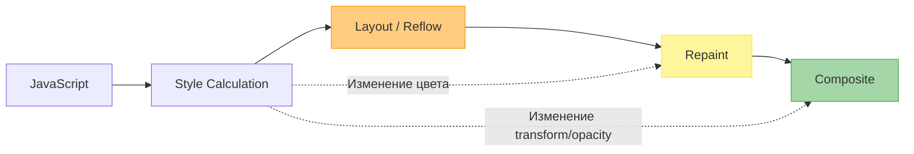

# Reflows и Repaints

## Суть концепции
Когда вы меняете что-то на странице через JavaScript (например, ширину элемента или его цвет), браузер должен обновить экран, чтобы отразить эти изменения. Однако не все изменения одинаково "дороги" для производительности. 

- **Reflow (Layout):** Вычисление геометрии страницы. Если вы изменили ширину элемента, браузеру нужно пересчитать размеры и позиции не только этого элемента, но и всех его детей, соседей и родителей. Это крайне тяжелая операция.
- **Repaint:** Перерисовка пикселей. Если вы изменили цвет фона (`background-color`), геометрия не поменялась, но браузеру нужно закрасить область заново. Это дешевле, чем Reflow, но всё еще требует ресурсов.
- **Composite:** Склейка слоев. Самая дешевая операция. Если вы меняете прозрачность (`opacity`) или трансформацию (`transform`), и элемент вынесен в отдельный композитный слой (через GPU), браузер просто накладывает картинку поверх другой без пересчета.

## Как это работает



Частая проблема (боль) — это **Layout Thrashing (взбучка слоев)**. Это происходит, когда ваш JS-код циклично читает свойства, зависящие от геометрии (например, `offsetWidth`), а затем сразу записывает их (меняет стили). Браузер вынужден делать синхронный Reflow на каждой итерации, чтобы вернуть актуальные данные.

## Примеры кода

### ❌ Антипаттерн: Layout Thrashing
```javascript
const boxes = document.querySelectorAll('.box');

// Чередование чтения и записи геометрии вызывает немедленный Reflow на каждом шаге цикла!
boxes.forEach(box => {
  const width = box.offsetWidth; // Чтение (Браузер вычисляет Layout)
  box.style.width = width + 10 + 'px'; // Запись (Браузер инвалидирует Layout)
});
```

### ✅ Как надо: Пакетное чтение и запись
```javascript
const boxes = document.querySelectorAll('.box');

// 1. Сначала читаем все данные (Браузер делает Layout один раз)
const widths = Array.from(boxes).map(box => box.offsetWidth);

// 2. Затем массово записываем новые значения
boxes.forEach((box, index) => {
  box.style.width = widths[index] + 10 + 'px';
});

// А лучше использовать requestAnimationFrame для планирования изменений!
```

### ❌ Антипаттерн: Анимация через геометрию
```css
/* Анимация left и top вызывает постоянные Reflow, нагружая CPU */
.menu {
  left: -200px;
  transition: left 0.3s;
}
.menu.open {
  left: 0;
}
```

### ✅ Как надо: Анимация через Composite
```css
/* Анимация transform выполняется на GPU, не вызывая Reflow/Repaint */
.menu {
  transform: translateX(-100%);
  transition: transform 0.3s;
  will-change: transform; /* Подсказка браузеру вынести элемент в свой слой */
}
.menu.open {
  transform: translateX(0);
}
```

## Трейдоффы и границы применимости
- **will-change и создание слоев:** Кажется логичным добавить `will-change: transform` ко всем элементам, чтобы ускорить анимации. Но каждый слой потребляет видеопамять (VRAM). Если слоев слишком много, браузер начнет тормозить или даже "крашнется" на мобильных устройствах.
- **Где не обойтись без Reflow:** Сложные анимации с изменением высоты от `0` до `auto` (например, аккордеоны) невозможно сделать чисто на GPU без CSS Hacks или `ResizeObserver`. В таких случаях нужно аккуратно контролировать частоту вызовов через `requestAnimationFrame` или новые API, такие как CSS `interpolate-size` (в новых стандартах).
