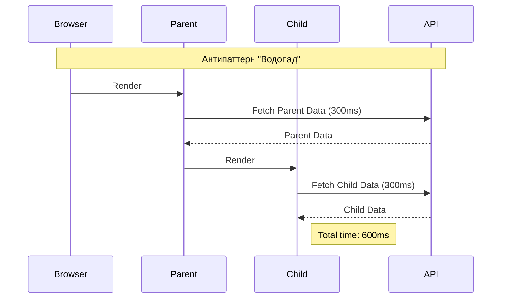

# Rendering Waterfalls
Водопады рендеринга (Rendering Waterfalls) — это антипаттерн загрузки данных и компонентов, при котором каждый последующий шаг ждет завершения предыдущего, образуя на графике сети "ступеньки" водопада. Боль: компонент `A` рендерится и делает запрос за своими данными, затем он рендерит дочерний компонент `B`, который тоже делает запрос, и так далее. Если каждый запрос занимает 300 мс, то цепочка из трех компонентов заставит пользователя ждать почти секунду. Практика: поднимать загрузку данных (Data Fetching) на уровень роута (Route Loaders в Remix/React Router) или использовать паттерн Fetch-on-Render / Render-as-You-Fetch. Трейдофф: поднятие всех запросов на верхний уровень может привести к оверфетчингу (загрузке лишних данных) или к тому, что весь экран будет заблокирован, пока загружается самая медленная часть.



```javascript
// Антипаттерн: Водопад (useEffect внутри useEffect по цепочке)
function Parent() {
  const [data, setData] = useState(null);
  useEffect(() => { fetch('/parent').then(setData) }, []);
  if (!data) return <Spinner />;
  return <Child parentId={data.id} />;
}

// Правильное решение: Загрузка всех данных параллельно (Promise.all) или на уровне роута
async function routeLoader() {
  const [parentData, childData] = await Promise.all([
    fetch('/parent'),
    fetch('/child-for-parent')
  ]);
  return { parentData, childData };
}
```
