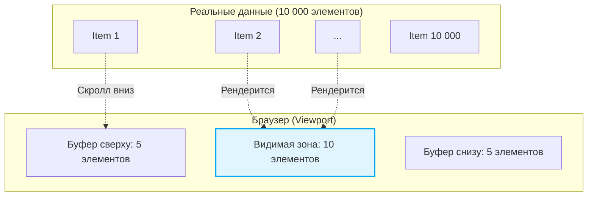

# Virtualization (Виртуализация списков)

## Суть концепции
Браузеры отлично справляются с рендерингом сотен DOM-узлов, но если вы попытаетесь отрендерить длинный список из 10 000 сложных элементов (таблица, лента соцсети, чат), страница неминуемо зависнет. DOM станет огромным, потребление памяти взлетит, а каждый скролл будет вызывать катастрофически долгие Reflow и Repaint.

**Virtualization (или Windowing)** — это техника, при которой в DOM рендерятся только те элементы списка, которые физически видны пользователю в данный момент (viewport), плюс небольшой буфер сверху и снизу для плавности скролла. 

## Как это работает

Вместо того чтобы держать 10 000 `<div>`, мы держим, например, всего 20. По мере скролла мы переиспользуем эти узлы, подменяя в них данные, и абсолютно позиционируем их внутри контейнера (используя `transform: translateY`), чтобы сымитировать реальный скроллинг.



1. Рассчитывается общая высота скролл-контейнера (количество элементов × высота элемента).
2. На основе текущей позиции скролла (`scrollTop`) высчитывается индекс первого видимого элемента.
3. Рендерится срез массива данных.

## Примеры кода

### ❌ Антипаттерн: Наивный рендер
```javascript
function Feed({ items }) {
  // 10 000 элементов сразу попадут в DOM. Привет, зависания!
  return (
    <div className="feed">
      {items.map(item => <Post key={item.id} data={item} />)}
    </div>
  );
}
```

### ✅ Как надо: Использование виртуализации (на примере react-window)
```javascript
import { FixedSizeList as List } from 'react-window';

function Feed({ items }) {
  const Row = ({ index, style }) => (
    <div style={style}> {/* Обязательно применяем style для абсолютного позиционирования */}
      <Post data={items[index]} />
    </div>
  );

  return (
    <List
      height={800} // Высота видимой области
      itemCount={items.length} // 10 000
      itemSize={150} // Высота одного элемента (фиксированная)
      width="100%"
    >
      {Row}
    </List>
  );
}
```

## Трейдоффы и границы применимости

- **Динамическая высота:** Виртуализация тривиальна, если элементы имеют фиксированную высоту. Если контент разный (текст, картинки), требуются сложные расчеты "на лету" (measure elements), что увеличивает нагрузку на процессор и может вызывать дергания скролла (jumpy scroll).
- **Доступность (a11y) и SEO:** Экранные дикторы и поисковые боты не увидят контент за пределами viewport. Для SEO контент нужно отдавать целиком (на сервере), а для a11y применять специальные ARIA-атрибуты, что часто нетривиально.
- **Поиск по странице (Ctrl+F):** Стандартный браузерный поиск не найдет текст в элементах, которых нет в DOM. 
- **Где не нужно:** Если у вас список из 50-200 элементов, виртуализация — это оверхад. Обычный рендер с грамотным мемоизированием компонентов справится лучше и без архитектурного усложнения.
