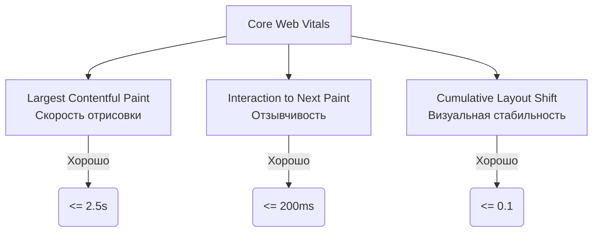

# Core Web Vitals (CWV)

## Суть концепции
Исторически производительность веба измеряли техническими метриками: `DOMContentLoaded`, `Load`, размером бандла. Но эти метрики не отвечают на главный вопрос: *а насколько комфортно пользователю?* Сайт может загрузиться, но быть белым экраном, или показать контент, но не реагировать на нажатия.

**Core Web Vitals** — это стандартизированный Google набор метрик, который измеряет реальный пользовательский опыт (UX) по трем направлениям: скорость загрузки, интерактивность и визуальная стабильность. Они напрямую влияют на SEO-ранжирование (Google Search).

## Как это работает

CWV фокусируется на трех столпах, у каждого из которых есть четкие пороги (Хорошо / Требует улучшения / Плохо):

1. **LCP (Largest Contentful Paint):** Время до отрисовки самого большого элемента в области видимости (текстовый блок, картинка, видео). Показывает, когда главный контент стал доступен.
2. **INP (Interaction to Next Paint):** *Заменила FID (First Input Delay).* Измеряет задержку всех взаимодействий (клики, тапы) на протяжении всего времени жизни страницы. Показывает, насколько сайт "лагает" при использовании.
3. **CLS (Cumulative Layout Shift):** Сумма неожиданных сдвигов макета. Показывает, насколько прыгает контент, пока грузятся шрифты или картинки.

## Примеры оптимизаций

### ❌ Антипаттерны, убивающие метрики
- **LCP:** Огромный hero-banner на главной загружается через JS-слайдер, картинка не оптимизирована и не имеет `preload`.
- **INP:** При клике на "Добавить в корзину" запускается тяжелый синхронный расчет на 500 мс в главном потоке, замораживая UI.
- **CLS:** Картинки и рекламные баннеры вставляются в DOM без указания атрибутов `width` и `height`, из-за чего текст прыгает вниз после их загрузки.

### ✅ Как надо чинить
- **LCP:** Server-Side Rendering (SSR) для отдачи HTML сразу, прелоад главной картинки (`<link rel="preload" as="image">`), кэширование CDN.
- **INP:** Использование Web Workers для тяжелой логики, разбиение длинных задач (Long Tasks) через `setTimeout` или `scheduler.yield()`, использование CSS-анимаций вместо JS.
- **CLS:** Резервирование места (атрибуты размеров или CSS `aspect-ratio`), использование системных шрифтов (или `font-display: optional`).

## Трейдоффы и границы применимости
- **Синтетика (Lab) vs Реал (Field):** Вы можете получить 100/100 в Lighthouse (Lab), но провалить CWV в Google Search Console (Field). CWV собирается на основе реальных устройств (часто слабых Android-телефонов на 3G) через Chrome UX Report (CrUX).
- **Бизнес-конфликты:** Маркетологи хотят 10 A/B тестов, 5 трекеров и тяжелый пиксель аналитики. Все это убивает INP и LCP. Архитектор должен защищать метрики через Performance Budgets.
- **SPA специфика:** Исторически метрики (особенно LCP) плохо замерялись при клиентских роутах (Soft Navigations). Сейчас API браузеров обновляются, чтобы правильно учитывать переходы внутри SPA.
