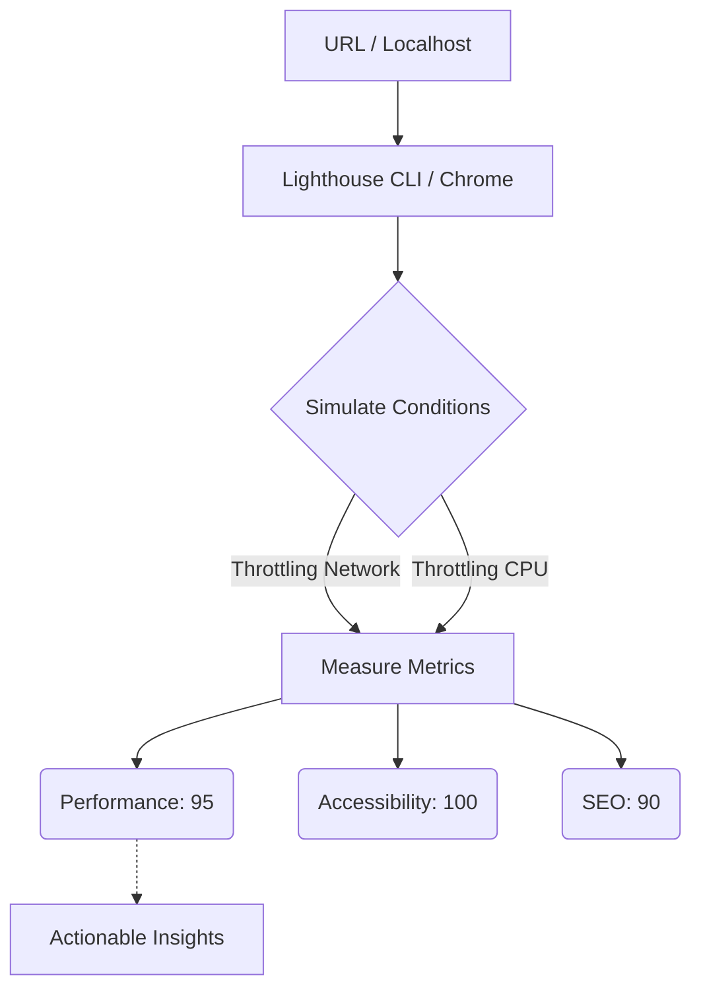

# Lighthouse
Lighthouse — это автоматизированный инструмент от Google для оценки качества веб-страниц (встроен в Chrome DevTools). Боль: разработчикам нужна объективная, повторяемая метрика для оценки производительности, доступности (a11y), SEO и PWA перед выкаткой в продакшен. Без этого "всё работает быстро" остается субъективным мнением. Lighthouse загружает страницу в эмулируемых условиях (обычно 4G и слабый CPU смартфона) и выдает скоринг от 0 до 100 по разным категориям. Практика: интегрировать Lighthouse CI в пайплайн, чтобы блокировать PR, которые роняют производительность. Трейдоффы: Lighthouse измеряет "лабораторные" (Synthetic) данные. 100 баллов в Lighthouse не гарантируют, что реальный пользователь в метро не будет страдать. Кроме того, оценки могут "плавать" от запуска к запуску из-за нестабильности сети на CI-сервере.



```json
// Правильное решение: Интеграция lhci (Lighthouse CI) с жесткими бюджетами
// lighthouserc.json
{
  "ci": {
    "collect": {
      "numberOfRuns": 3,
      "url": ["http://localhost:3000/"]
    },
    "assert": {
      "assertions": {
        "categories:performance": ["error", {"minScore": 0.9}],
        "first-contentful-paint": ["warn", {"maxNumericValue": 2000}]
      }
    }
  }
}
```
