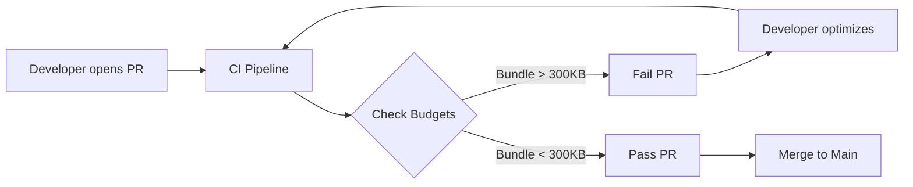

# Performance Budget
Бюджет производительности (Performance Budget) — это заранее согласованный лимит на размер ресурсов (JavaScript, CSS, изображения) или метрики времени (TTI, LCP), который команда обязуется не превышать. Боль: без бюджетов приложение неизбежно "пухнет". Каждый новый спринт добавляет фичи и библиотеки, и через год бандл вырастает с 200 КБ до 2 МБ. Бюджет ставит жесткие рамки: "мы не можем добавить эту 3D-библиотеку на 500 КБ, потому что наш лимит на бандл — 300 КБ". Практика: бюджеты внедряются на уровне сборщика (Webpack/Vite) или через CI инструменты (bundlesize, Lighthouse). Трейдоффы: жесткие бюджеты могут замедлить продуктовую разработку. Возникают конфликты с бизнесом, когда фичу нужно выкатить "вчера", а бюджет не пускает PR. Приходится тратить время на рефакторинг и оптимизацию вместо написания нового кода.



```javascript
// Правильное решение: Настройка лимитов размера в бандлере (Vite/Rollup)
export default defineConfig({
  build: {
    // Предупреждать, если чанк превышает 250 КБ (после минификации, без gzip)
    chunkSizeWarningLimit: 250, 
    rollupOptions: {
      output: {
        manualChunks: {
          lodash: ['lodash'] // Выносим большие зависимости
        }
      }
    }
  }
});
```
