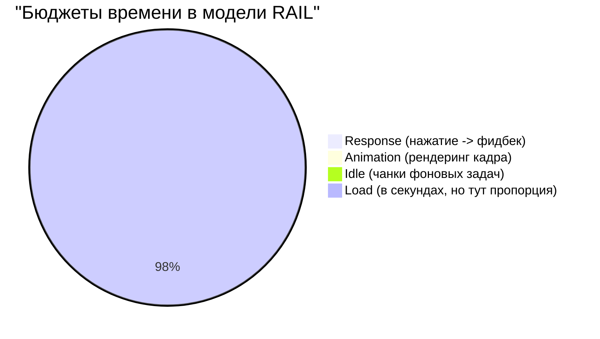

# RAIL Model
Модель RAIL (Response, Animation, Idle, Load) — это концептуальный фреймворк от Google, который ставит пользователя в центр понимания производительности. Боль: инженеры часто фокусируются на абстрактных миллисекундах и размерах файлов, забывая о том, как интерфейс воспринимается человеком. RAIL задает жесткие рамки восприятия. Практика: 
- **R**esponse: реакция на клик за 50 мс.
- **A**nimation: генерация кадра за 10 мс (чтобы обеспечить 60 FPS).
- **I**dle: максимальное использование свободного времени для фоновой работы (отложенная загрузка в чанках по 50 мс).
- **L**oad: доставка интерактивного контента за 5 секунд на 3G.
Трейдоффы: следование RAIL требует серьезных инженерных усилий (вынос вычислений в Worker'ы, виртуализация списков). В сложных корпоративных дашбордах достигнуть Response < 50ms при фильтрации 100k записей на клиенте бывает экономически нецелесообразно.



```javascript
// Антипаттерн: Игнорирование Idle Time. Блокирующий префетч.
// Выполнится сразу и может заблокировать важный UI
fetch('/heavy-analytics-data');

// Правильное решение: Использование requestIdleCallback (Idle phase в RAIL)
if ('requestIdleCallback' in window) {
  requestIdleCallback((deadline) => {
    // Браузер дал нам окно времени, когда нет важных задач
    if (deadline.timeRemaining() > 10) {
      prefetchNonCriticalData();
    }
  });
} else {
  setTimeout(prefetchNonCriticalData, 1000);
}
```
