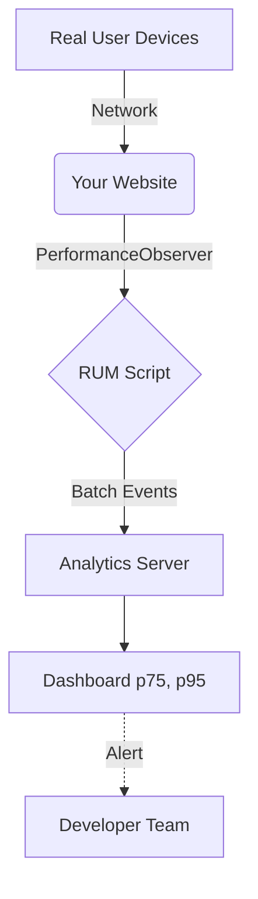

# Real User Monitoring
Real User Monitoring (RUM) — это сбор метрик производительности непосредственно из браузеров реальных пользователей. В отличие от синтетического мониторинга (Lighthouse), который эмулирует условия в лаборатории, RUM показывает, что происходит в дикой природе: у Василия с плохим 3G в метро или у Марии на старом iPhone. Боль: мы оптимизировали приложение, на CI всё зелёное, а пользователи жалуются, что сайт тормозит. RUM решает эту проблему через API вроде `PerformanceObserver`, собирая данные о Core Web Vitals (LCP, FID/INP, CLS) и отправляя их на сервер аналитики (Sentry, Datadog, Google Analytics). Практика: сбор данных в фоне и агрегация их по перцентилям (p75, p95). Трейдоффы: сам скрипт RUM добавляет вес бандлу и требует процессорного времени. Данные зашумлены: плагины в браузере пользователя, антивирусы или прокси могут искажать метрики.



```javascript
import { onLCP, onINP, onCLS } from 'web-vitals';

// Правильное решение: Сбор Core Web Vitals у реальных пользователей
function sendToAnalytics({ name, delta, id }) {
  // Используем sendBeacon, чтобы не блокировать закрытие вкладки
  navigator.sendBeacon('/analytics', JSON.stringify({
    metric: name,
    value: delta,
    id: id
  }));
}

// Измеряем метрики в фоне
onCLS(sendToAnalytics);
onINP(sendToAnalytics);
onLCP(sendToAnalytics);
```
