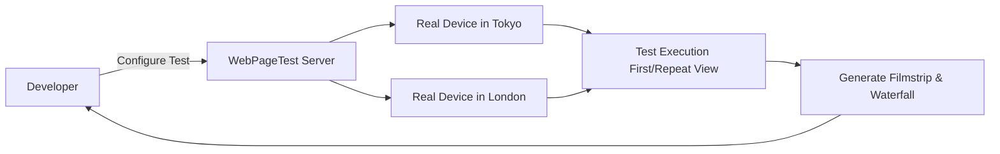

# WebPageTest
WebPageTest — это мощный инструмент профилирования производительности с открытым исходным кодом, который позволяет запускать тесты загрузки страницы на реальных браузерах и устройствах из разных точек мира. Боль: Lighthouse дает базовое понимание, но не показывает точный водопад загрузки ресурсов, покадровую съемку (Filmstrip) рендеринга страницы и не умеет легко эмулировать сложные сценарии (например, авторизацию перед тестом). WebPageTest решает эту боль, предоставляя гранулярный контроль: выбор провайдера интернета, модели телефона, настройку заголовков и блокировку конкретных URL (чтобы проверить, как сайт грузится без тяжелого виджета рекламы). Трейдоффы: интерфейс инструмента перегружен данными, что повышает порог входа. Полные тесты занимают значительное время, поэтому их сложно встроить в быстрый PR-пайплайн.



```json
// Правильное решение: Использование WebPageTest API для CI/CD
// Пример вызова через wptt CLI
{
  "location": "Dulles_MotoG4:Chrome.3G",
  "connectivity": "3G",
  "runs": 3,
  "firstViewOnly": false,
  "script": [
    "logData 0",
    "navigate https://example.com/login",
    "setValue name=username user",
    "setValue name=password pass",
    "submitForm",
    "logData 1",
    "navigate https://example.com/dashboard" // Тестируем закрытую часть!
  ]
}
```
