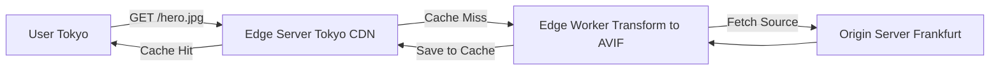

# CDN Optimization
Оптимизация доставки контента (CDN Optimization) — это использование Content Delivery Network (сети доставки контента) не просто как "тупой трубы" для статики, а как интеллектуального граничного (Edge) слоя. Боль: если ваш сервер находится во Франкфурте, пользователь из Токио будет ждать загрузки картинки сотни миллисекунд только из-за физического расстояния (RTT). Базовый CDN решает это, кэшируя ресурсы на ближайшем к пользователю узле. Но продвинутая оптимизация решает проблемы трансформации: отдавать WebP/AVIF в зависимости от браузера (на лету), минифицировать HTML на Edge, обрезать изображения по запросу (Image CDN). Практика: использование Cloudflare Workers или AWS Lambda@Edge для запуска логики (A/B тесты, авторизация) максимально близко к клиенту, разгружая основной сервер. Трейдоффы: сложность инвалидации кэша (Purge). Если вы обновили логотип, а CDN его жестко закэшировал на месяц, пользователи увидят старый. Также Edge-вычисления усложняют дебаггинг и мониторинг.



```javascript
// Правильное решение: Трансформация изображений на лету через Cloudflare Workers
addEventListener('fetch', event => {
  event.respondWith(handleRequest(event.request))
})

async function handleRequest(request) {
  // Проверяем, поддерживает ли браузер современный формат AVIF
  const acceptHeader = request.headers.get('Accept');
  const supportAvif = acceptHeader && acceptHeader.includes('image/avif');

  // CDN сам конвертирует и отдаст оптимизированную версию
  const imageRequest = new Request(request.url, {
    headers: request.headers,
    cf: {
      image: {
        format: supportAvif ? 'avif' : 'webp',
        width: 800,
        quality: 85
      }
    }
  });

  return fetch(imageRequest);
}
```
