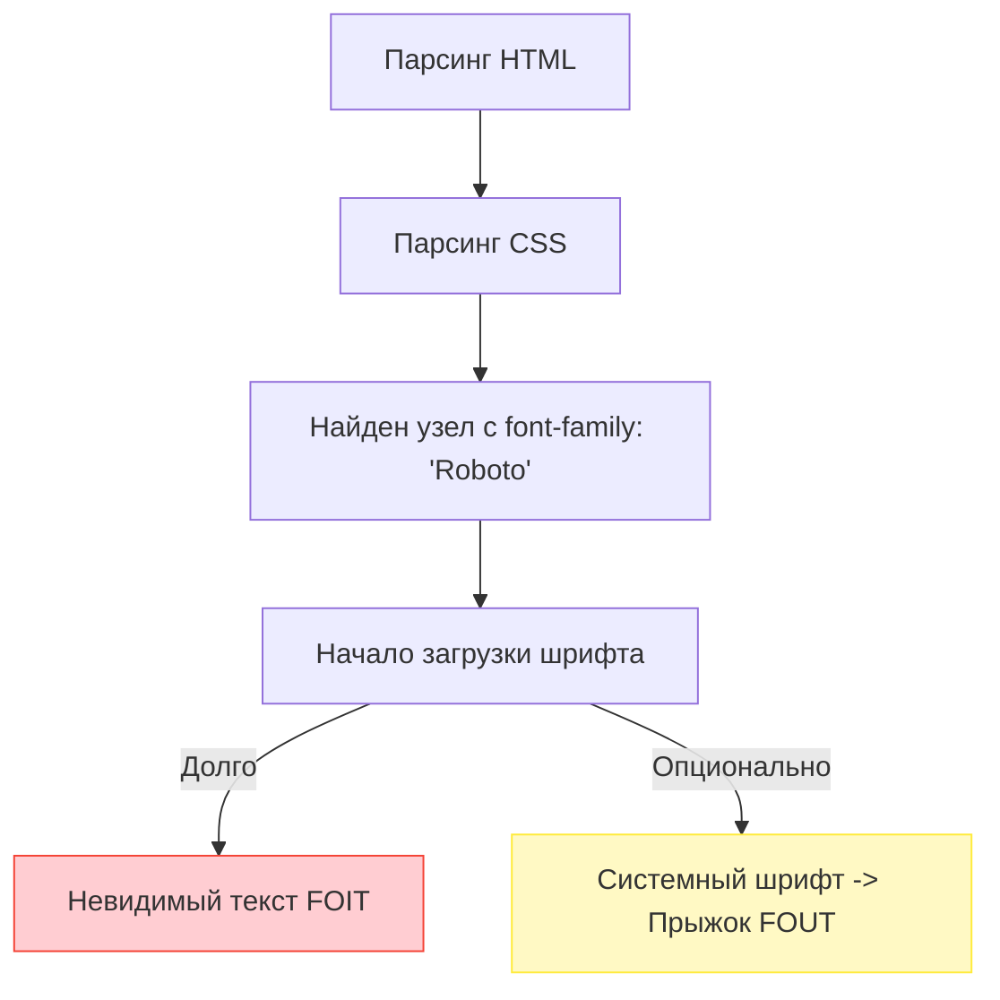

# Font Loading (Загрузка шрифтов)

## Суть концепции
Пользовательские веб-шрифты (Google Fonts, кастомные .woff2) делают дизайн уникальным, но имеют высокую цену производительности. По умолчанию браузер скрывает текст (или делает его невидимым), пока шрифт не загрузится. Это вызывает проблему **FOIT (Flash of Invisible Text)**. 

С другой стороны, если браузер сразу покажет системный шрифт, а затем заменит его на загруженный кастомный, произойдет резкий сдвиг макета (из-за разной ширины букв), что ломает метрику CLS — это **FOUT (Flash of Unstyled Text)**.

Правильная архитектура загрузки шрифтов призвана сбалансировать эти две боли: обеспечить мгновенное отображение контента, минимизировать сдвиги (Layout Shifts) и не блокировать рендеринг страницы.

## Как это работает

Шрифты обычно подтягиваются из CSS (правило `@font-face`). Браузер начинает скачивать шрифт *только тогда*, когда парсит DOM и CSSOM и убеждается, что текст с этим шрифтом реально существует на странице. Это значит, что загрузка шрифта начинается слишком поздно.



## Стратегии и примеры кода

### 1. `font-display` (Управление FOIT/FOUT)
Свойство `font-display` в CSS говорит браузеру, как вести себя во время загрузки.

```css
@font-face {
  font-family: 'MyFont';
  src: url('/fonts/myfont.woff2') format('woff2');
  /* Антипаттерн: block (Ждем 3 секунды, текст невидимый) */
  
  /* ✅ Как надо: swap (Сразу показываем системный шрифт, потом меняем) */
  font-display: swap; 
  
  /* ✅ Альтернатива: optional (Даем 100мс на загрузку. Если не успел - используем системный, без прыжков макета) */
  font-display: optional;
}
```

### 2. Preload (Предзагрузка критических шрифтов)
Чтобы не ждать, пока браузер распарсит CSS, мы можем сказать ему начать качать шрифт с первых миллисекунд загрузки HTML.

```html
<head>
  <!-- ✅ Начинаем качать главный шрифт немедленно -->
  <link rel="preload" href="/fonts/Roboto-Regular.woff2" as="font" type="font/woff2" crossorigin>
</head>
```

### 3. Настройка метрик системного шрифта (CSS Font Fallback)
Чтобы при переключении с системного шрифта на кастомный (FOUT) текст не "прыгал", мы можем искусственно подогнать размеры системного шрифта с помощью новых свойств `size-adjust`.

```css
@font-face {
  font-family: "Fallback-Roboto";
  src: local("Arial");
  /* Подгоняем Arial под размеры Roboto */
  size-adjust: 105%; 
  ascent-override: 95%;
}

body {
  font-family: "Roboto", "Fallback-Roboto", sans-serif;
}
```

## Трейдоффы и границы применимости

- **Preload всего подряд:** Не предзагружайте больше 1-2 шрифтов (например, только регулярный и жирный для первого экрана). Если вы сделаете `preload` для 10 начертаний, вы забьете канал связи, и браузер отложит загрузку критического CSS или JS-бандла.
- **Локальный хостинг vs Google Fonts:** Раньше Google Fonts был хорош из-за общего кэша между сайтами. Сейчас браузеры разделили кэш (cache partitioning из соображений приватности). Поэтому хостить шрифты на своем домене (`/fonts/...`) сейчас быстрее — это убирает время на DNS Resolve и TLS Negotiation к `fonts.googleapis.com`.
- **Подмножества (Subsetting):** Зачем качать китайские иероглифы, если сайт на русском? Используйте утилиты (glyphhanger, pyftsubset) чтобы вырезать из шрифта только нужные символы (латиница + кириллица), уменьшая размер woff2-файла с 300 КБ до 20 КБ.
- **Где применимо:** Оптимизация нужна везде, где используется типографика. Для систем класса B2B или админок часто лучшим решением является полный отказ от кастомных шрифтов в пользу системных (`font-family: system-ui, -apple-system, BlinkMacSystemFont, "Segoe UI", Roboto...`), что дает нулевой overhead.
