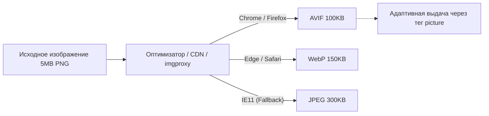

# Image Optimization (Оптимизация изображений)

## Суть концепции
Изображения составляют более 60% веса среднестатистической веб-страницы. Неоптимизированные фотографии на 5 мегабайт, вставленные в карточки товаров размером 200x200 пикселей — это классический сценарий, убивающий время загрузки сайта и метрику LCP (Largest Contentful Paint). 

Оптимизация изображений — это комплексный подход по доставке графики подходящего формата, размера и качества в зависимости от устройства пользователя. Мы решаем боль огромного потребления трафика и медленного рендеринга.

## Как это работает

Современная стратегия работы с изображениями строится на трех китах:
1. **Формат:** Использование современных форматов (WebP, AVIF) вместо устаревших (JPEG, PNG). AVIF на 30-50% меньше JPEG при сопоставимом качестве.
2. **Разрешение (Resizing & Art Direction):** Отдача маленькой картинки для мобильных устройств и большой для десктопов, учитывая плотность пикселей (Retina экраны).
3. **Отложенная загрузка:** Использование `loading="lazy"` и плейсхолдеров (Blurhash, LQIP - Low Quality Image Placeholder).



## Примеры кода

### ❌ Антипаттерн: Один размер и формат для всех
```html
<!-- Скачивает 3MB файл даже на смартфоне, блокируя сеть -->

```

### ✅ Как надо: Адаптивность + Современные форматы (`<picture>`)
```html
<picture>
  <!-- Браузер выберет первый поддерживаемый формат сверху вниз -->
  <source type="image/avif" srcset="/images/hero-banner.avif">
  <source type="image/webp" srcset="/images/hero-banner.webp">
  
  <!-- Fallback для старых браузеров -->
  
  />
</picture>
```

### ✅ Как надо: Разные размеры для разных экранов (`srcset`)
```html
<!-- Браузер сам скачает 400px картинку на телефоне и 1200px на Retina десктопе -->

/>
```

## Трейдоффы и границы применимости

- **Оверхед на билде:** Генерация AVIF и WebP в 5-6 размерах во время сборки проекта (Webpack/Vite) занимает колоссальное время. Для 1000 изображений билд может длиться десятки минут.
  - *Решение:* Использовать динамические Image CDN (Cloudinary, Imgix) или возможности фреймворка (Next.js Image), которые оптимизируют картинки "на лету" (On-the-fly) при первом запросе и кэшируют результат на Edge-серверах.
- **Поддержка AVIF:** Декодирование AVIF ресурсоемко. На слабых мобильных устройствах распаковка огромного AVIF-файла может потребовать больше времени CPU, чем скачивание более тяжелого JPEG.
- **Сдвиги макета (CLS):** Никогда не забывайте атрибуты `width` и `height` (или CSS `aspect-ratio`). Без них браузер не знает пропорции до загрузки файла, и страница будет "прыгать".
- **Вектор vs Растр:** Для логотипов, иконок и простых графиков всегда используйте SVG (желательно оптимизированный через SVGO). Не переводите текст и линии в растровые PNG.
