# Resource Hints

```mermaid
gantt
    title Без подсказок vs С подсказками
    dateFormat  s
    axisFormat %S
    section Без подсказок
    Parse HTML     :a1, 0, 1s
    Fetch CSS      :a2, after a1, 1s
    Parse CSS      :a3, after a2, 0.5s
    Fetch Font (Discovered later) :a4, after a3, 1s
    section С подсказками (Preload)
    Parse HTML     :b1, 0, 1s
    Fetch Font (Preload) :b2, 0, 1s
    Fetch CSS      :b3, 0, 1s
    Parse CSS      :b4, after b3, 0.5s
```

Resource Hints (Подсказки для ресурсов) — это набор HTML-тегов (`<link rel="...">`) и HTTP-заголовков, которые помогают браузеру принимать правильные решения о том, какие ресурсы (скрипты, стили, шрифты, домены) понадобятся в ближайшем или отдаленном будущем. Боль: браузер парсит HTML сверху вниз. Пока он не дойдет до тега `<script src="app.js">`, он даже не начнет скачивать этот скрипт, а скрипт может внутри себя запросить картинку. Это создает последовательную цепочку загрузки (водопад) и увеличивает время до отрисовки (FCP/LCP). Resource Hints позволяют разработчику сказать браузеру: "Эй, я знаю, что тебе точно понадобится этот шрифт через секунду, начни качать его прямо сейчас в фоне!". Практика: добавление `preload` для критичных шрифтов/картинок, `preconnect` для сторонних API и `prefetch` для ресурсов следующих страниц. Трейдоффы: избыточное использование хинтов (например, прелоад всего подряд) забьет пропускную способность канала связи, и браузер не сможет скачать действительно критичные ресурсы. Это сделает сайт медленнее, а не быстрее.



```html
<!-- Антипаттерн: Ждем, пока браузер сам найдет критичные ресурсы глубоко в CSS/JS -->
<head>
  <link rel="stylesheet" href="/styles.css"> <!-- Шрифт запросится только после парсинга этого CSS -->
</head>

<!-- Правильное решение: Использование Resource Hints для распараллеливания -->
<head>
  <!-- Устанавливаем раннее соединение с доменом API -->
  <link rel="preconnect" href="https://api.example.com">
  <!-- Начинаем скачивать критичный шрифт сразу же -->
  <link rel="preload" href="/fonts/inter-bold.woff2" as="font" type="font/woff2" crossorigin>
  <link rel="stylesheet" href="/styles.css">
</head>
```
