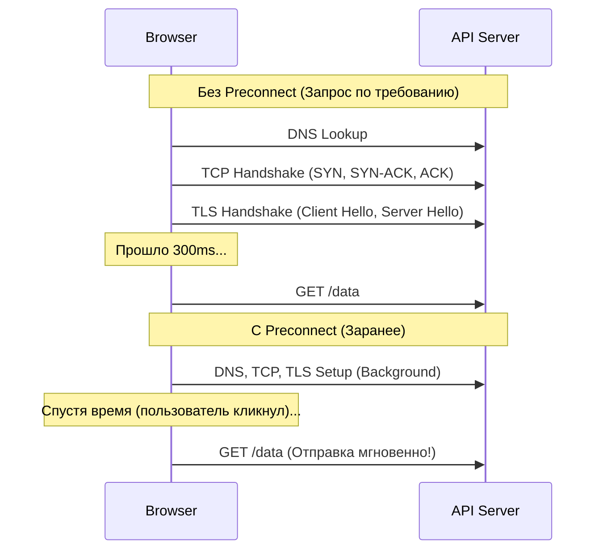

# Preconnect
Preconnect (`<link rel="preconnect">`) — это хинт, который сообщает браузеру о намерении в ближайшее время установить соединение с другим доменом. Боль: установка безопасного соединения с новым доменом — долгий процесс. Он включает DNS Lookup, установку TCP-соединения (TCP Handshake) и установку TLS-шифрования (TLS Negotiation). Если мы делаем API-запрос к `api.my-backend.com` только по клику кнопки или из JS после парсинга бандла, пользователь будет ждать лишние 200-500 мс на установку соединения, прежде чем вообще начнется передача данных запроса. Preconnect заставляет браузер выполнить всю эту работу заранее (в фоне). Практика: используется для критичных сторонних ресурсов (API, CDN с картинками, Google Fonts). Трейдоффы: установка соединения потребляет процессорное время и сетевые порты на клиенте и сервере. Если соединение не будет использовано в течение ~10 секунд, браузер его закроет, и ресурсы будут потрачены впустую.



```html
<!-- Антипаттерн: Браузер узнает о домене только когда выполнится JS-код (fetch) -->

<!-- Правильное решение: Подключаемся к критичным доменам заранее -->
<head>
  <!-- Предварительное подключение к CDN для медиа-ресурсов -->
  <link rel="preconnect" href="https://cdn.my-website.com" crossorigin>
  
  <!-- Предварительное подключение к API backend'а -->
  <link rel="preconnect" href="https://api.my-website.com" crossorigin>
</head>
```
