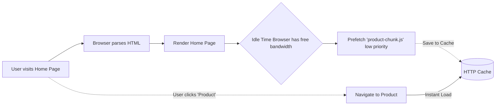

# Prefetch
Prefetch (`<link rel="prefetch">`) — это хинт, указывающий браузеру на ресурс, который, вероятно, понадобится для **следующей** навигации пользователя. Браузер скачает этот ресурс с самым низким приоритетом (в фоне, во время простоя — Idle time) и положит в HTTP-кэш. Боль: когда пользователь переходит с главной страницы на страницу товара (SPA навигация), он вынужден ждать загрузки JS-чанка этой страницы, а затем и данных. Мы могли бы загрузить этот код заранее, пока пользователь просто читает текст на главной. Практика: фреймворки вроде Next.js и Nuxt.js автоматически делают prefetch чанков для тех `<Link>`, которые попали в область видимости пользователя (viewport). Трейдоффы: вы тратите трафик (bandwidth) и батарею пользователя на ресурсы, которые могут никогда ему не пригодиться. На мобильных сетях агрессивный prefetch может стоить пользователю реальных денег за трафик.



```html
<!-- HTML подход для статических сайтов -->
<head>
  <!-- Браузер скачает этот файл, когда ему будет нечего делать -->
  <link rel="prefetch" href="/js/heavy-product-page.js">
</head>

<!-- Правильное решение в SPA (React/Next.js) -->
<script>
  // Программный prefetch, например при наведении мыши на ссылку
  document.querySelector('#product-link').addEventListener('mouseenter', () => {
    // Пользователь навел мышь, скорее всего кликнет. Начинаем качать код роута.
    const link = document.createElement('link');
    link.rel = 'prefetch';
    link.href = '/js/heavy-product-page.js';
    document.head.appendChild(link);
  });
</script>
```
