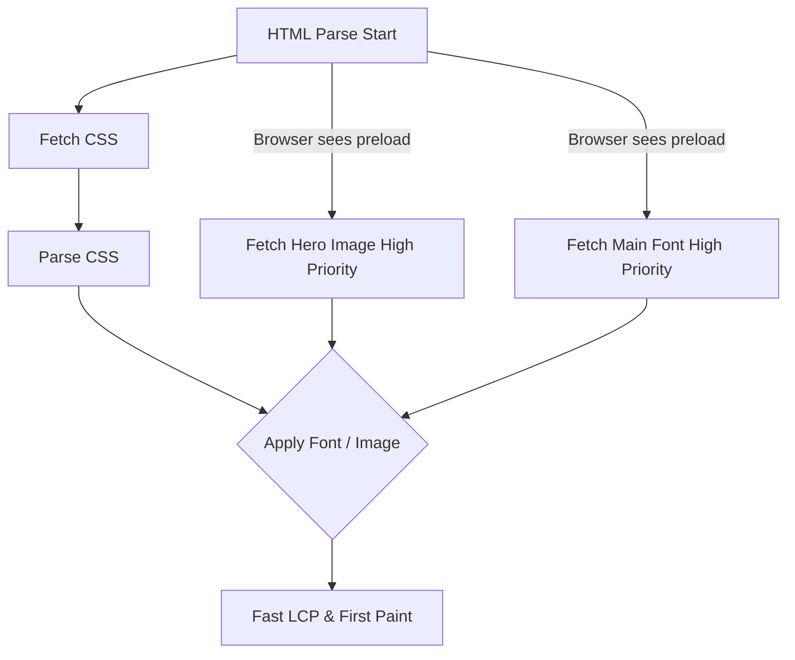

# Preload
Preload (`<link rel="preload">`) — это мощный хинт, который говорит браузеру: "Этот ресурс критически важен для **текущей** страницы, скачай его как можно скорее (с высоким приоритетом), не дожидаясь, пока найдешь его в CSS или JS". Боль: браузер находит ссылку на главный веб-шрифт (например, WOFF2) только после того, как скачает HTML, затем скачает CSS, распарсит его и применит к DOM. Пока шрифт не скачан, пользователь видит пустой экран или дерганье текста (FOIT/FOUT). Это сильно бьет по метрике LCP и CLS. Практика: `preload` используется исключительно для критических ресурсов (First Contentful Paint/LCP), таких как шрифты, главное hero-изображение (LCP image) или критический JS-бандл. Трейдоффы: если вы сделаете `preload` слишком многих ресурсов, они начнут конкурировать за полосу пропускания, блокируя загрузку самого HTML или критического CSS. Кроме того, если вы сделали `preload` ресурса, но не использовали его в течение 3 секунд, браузер выведет предупреждение в консоли, так как вы потратили трафик впустую.



```html
<!-- Правильное решение: Использование Preload для LCP картинки и шрифта -->
<head>
  <meta charset="UTF-8">
  <title>Fast Page</title>
  
  <!-- Критичный шрифт. crossorigin обязателен для шрифтов! -->
  <link rel="preload" href="/fonts/Inter-Bold.woff2" as="font" type="font/woff2" crossorigin>
  
  <!-- LCP изображение (hero баннер). Помогает улучшить LCP -->
  <link rel="preload" href="/images/hero-banner.webp" as="image" type="image/webp">
  
  <link rel="stylesheet" href="/styles.css">
</head>
```
