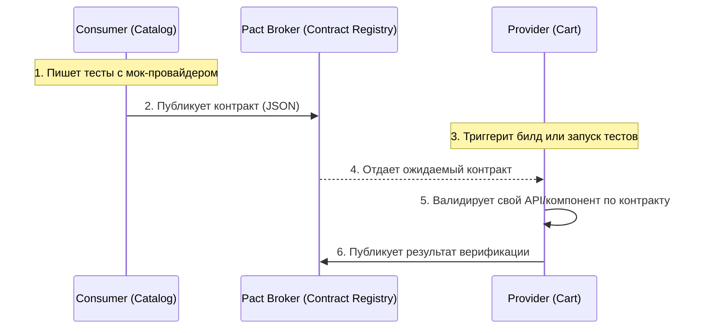

# Contract Testing в Microfrontends

Представьте классическую проблему распределенных систем: команда корзины (Cart) обновила формат ответа своего API (или интерфейс экспортируемого React-компонента), успешно прогнала свои unit-тесты и выкатила релиз. В этот момент команда каталога (Catalog), которая использует этот компонент для отображения количества товаров, внезапно падает в проде. Классические E2E-тесты поймали бы это, но они долгие, хрупкие и часто запускаются только ночью или перед большим релизом. Здесь на сцену выходит **Contract Testing** (контрактное тестирование).

Контрактное тестирование — это методология, при которой проверяется не вся система целиком (как в E2E), а только взаимодействие между двумя ее частями (consumer и provider) на основе заранее согласованного "контракта". В мире микрофронтендов (особенно при использовании Module Federation) контрактами выступают как сетевые запросы между MF-приложениями и BFF (Backend-for-Frontend), так и интерфейсы (props) экспортируемых UI-компонентов.

## Как это работает на практике

Потребитель (Consumer) описывает свои ожидания (какие данные или пропсы ему нужны) и генерирует контракт. Поставщик (Provider) берет этот контракт и проверяет, удовлетворяет ли его текущая реализация этим ожиданиям.



### Пример: Тестирование контракта UI-компонента

**Антипаттерн**: Полагаться только на общие TypeScript интерфейсы. TS компилируется в build-time, но в runtime микрофронтенды деплоятся независимо. Если Cart обновит тип и задеплоится, Catalog упадет в рантайме, так как его сборка старая.

**Правильное решение**: Использование Pact для фиксации ожиданий потребителя.

```javascript
// Consumer (Catalog) - описываем ожидания от компонента BuyButton (из Cart)
const { Pact } = require('@pact-foundation/pact');

describe('BuyButton Contract', () => {
  it('ожидает пропсы onClick и productId', () => {
    // В реальности для UI компонентов используются Pact-плагины 
    // или инструменты вроде Module Federation Types / Zephyr
    const expectedProps = {
      productId: Matchers.string(),
      onClick: Matchers.anyFunction()
    };
    
    // Генерируем контракт...
  });
});

// Provider (Cart) - валидирует свой компонент при CI
import { BuyButton } from './BuyButton';

describe('Provider verification', () => {
  it('должен соответствовать контракту Catalog', () => {
    // Верификация через Pact Verifier:
    // проверяет, что экспортируемый компонент действительно
    // может принимать ожидаемые пропсы и не упадет.
  });
});
```

## Неочевидные нюансы и трейдоффы

1. **Оверхед на инфраструктуру**: Внедрение Contract Testing требует Pact Broker (или аналога) для хранения контрактов и управления их версиями. Настройка пайплайнов "Can I Deploy?" (проверка совместимостей перед деплоем) может занять больше времени, чем написание самих микрофронтендов.
2. **Сложность для фронтендеров**: Исторически Contract Testing (например, Pact) зародился для бэкенд-коммуникаций (HTTP). Адаптация этих инструментов для валидации React/Vue-компонентов или Module Federation объектов пока еще костыльна. Часто команды решают это "дешевле" через публикацию общих NPM-пакетов с типами и строгую версионизацию, хоть это и нарушает идеальную независимость.
3. **Где это ломается**: Если команд всего две-три, контракты избыточны — проще договориться в Slack. Контракты спасают, когда команд десятки, и вы не знаете, кто именно потребляет ваш микрофронтенд.
4. **Consumer-Driven Contracts**: Важный сдвиг майндсета — контракты диктуют *потребители*. Если Catalog использует только `productId`, Cart может безопасно удалить старый пропс `productName`, так как контракт Catalog этого не заметит.
