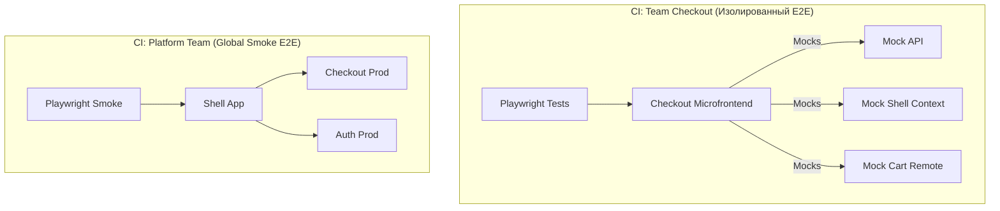

# E2E Testing в Microfrontends

Представьте монолитное frontend-приложение: мы поднимаем его локально, натравливаем Cypress или Playwright и пишем длинные сценарии "Залогиниться -> Положить в корзину -> Оплатить". Когда мы переходим к микрофронтендам (MF), этот подход начинает трещать по швам. Микрофронтенды созданы для независимой разработки и деплоя команд. Если для деплоя микрофронтенда `Checkout` нужно прогнать E2E-тесты, которые затрагивают микрофронтенд `Auth` и `Catalog`, то мы потеряли независимость. Любая сетевая нестабильность в чужой зоне ответственности заблокирует ваш релиз.

**E2E в микрофронтендах** решает боль изоляции: как протестировать свой кусок системы максимально реалистично, не поднимая половину интернета и не ожидая, пока починят staging-окружение соседней команды.

## Как это работает на практике

Архитектура E2E-тестирования в MF дробится на два уровня:
1. **Изолированные компонентные E2E-тесты** (на уровне отдельного микрофронтенда).
2. **Интеграционные/Smoke тесты** (на уровне Shell/Host-приложения).



### Пример: Изолированный E2E (Правильный подход)

**Антипаттерн**: Во время CI микрофронтенда `Checkout` делать реальный логин через микрофронтенд `Auth` по сети. Если `Auth` лежит, `Checkout` не задеплоится.

**Правильное решение**: Мокировать среду (Shell) и чужие Remote-модули на этапе сборки тестов или перехвата сетевых запросов.

```typescript
// Изолированный тест (Playwright) для микрофронтенда Checkout
import { test, expect } from '@playwright/test';

test.beforeEach(async ({ page }) => {
  // 1. Мокаем API-вызовы соседних доменов (backend)
  await page.route('**/api/cart', route => 
    route.fulfill({ status: 200, json: { items: ['id-123'], total: 100 } })
  );

  // 2. Мокаем загрузку чужих Module Federation ремоутов!
  // Если Checkout рендерит мини-виджет AuthProfile из микрофронтенда Auth,
  // мы подменяем JS-файл ремоута на заглушку.
  await page.route('**/authRemoteEntry.js', route => 
    route.fulfill({ 
      status: 200, 
      contentType: 'application/javascript',
      body: 'window.Auth = { getProfile: () => "Mock User" };' 
    })
  );

  // 3. Открываем наш Checkout автономно (например, через спец. страницу-обертку)
  await page.goto('http://localhost:3000/checkout-standalone');
});

test('Отображает сумму корзины и позволяет оплатить', async ({ page }) => {
  await expect(page.locator('.total-price')).toHaveText('100');
  await page.click('button:has-text("Pay")');
  // ...
});
```

## Неочевидные нюансы и трейдоффы

1. **Illusion of Safety (Иллюзия безопасности)**: Вы покрыли свой MF изолированными моками, всё зеленое. Вы выкатываете в прод, а там `Auth` изменил контракт, и всё падает. Изолированные E2E *обязательно* должны дополняться Contract Testing или узким набором кросс-доменных Smoke-тестов.
2. **Глобальные E2E тесты (Smoke)**: Они должны существовать, но владеть ими должна платформенная команда (или QA Core). Эти тесты проверяют только "золотые пути" (critical user journeys) на собранном staging/production окружении. Их не должно быть много, иначе они превратятся в бутылочное горлышко.
3. **Тестирование Module Federation**: В MF часто сложно замокать `remoteEntry.js` стандартными средствами браузера, если используются сложные механизмы шаринга зависимостей. Приходится создавать фиктивные Host-приложения специально для CI-запусков вашего Remote-модуля.
4. **Среды окружения (Staging)**: Традиционный "стейджинг" умирает в MF. Вы не можете заморозить версии 20 микрофронтендов для тестирования. Вместо этого используется **Testing in Production** (через Feature Flags или Shadow Traffic) либо эфемерные окружения, где к продакшену "подмешивается" ветка вашего микрофронтенда.
