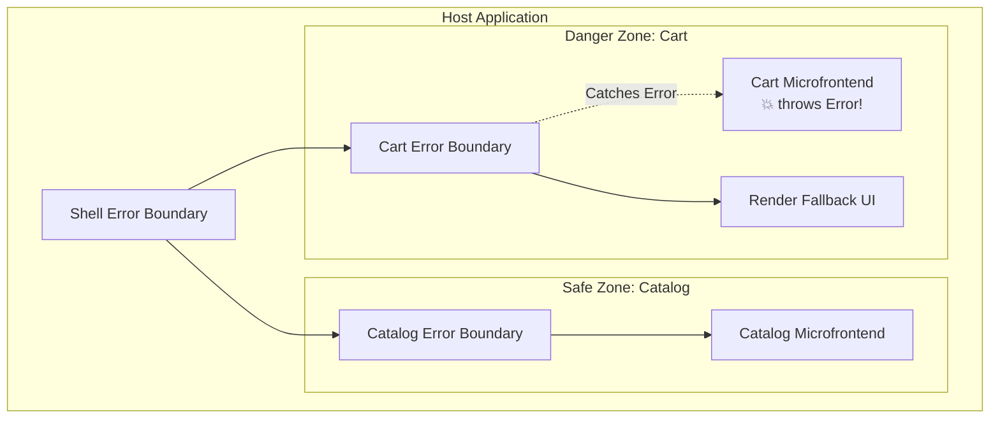

# Error Isolation в Microfrontends

Представьте, что вы построили микросервисный бэкенд, но если один микросервис падает с `NullPointerException`, то автоматически "умирают" и все остальные микросервисы на соседних серверах. Звучит абсурдно? Но именно так по умолчанию работает Frontend, когда вы собираете из независимых микрофронтендов (MF) единый Single Page Application (SPA). 

Поскольку все микрофронтенды делят один поток выполнения JavaScript в браузере (Main Thread), **неперехваченная ошибка в микрофронтенде "Корзина" убьет весь Host-контейнер и микрофронтенд "Каталог" вместе с ним**, оставив пользователя смотреть на белый экран. **Error Isolation** (Изоляция ошибок) — это стратегия защиты приложения от "взрыва" соседних модулей.

## Как это работает на практике

Изоляция ошибок базируется на нескольких слоях: изоляция рантайма (JS), изоляция стилей (CSS) и изоляция глобального стейта (Window). Главная цель — превратить фатальное падение (белый экран) в gracefully degraded UI (например, серый плейсхолдер "Сервис временно недоступен" только в том месте, где должен был быть упавший микрофронтенд).



### Пример: Изоляция React-компонентов (Module Federation)

**Антипаттерн**: Динамически импортировать удаленный компонент напрямую в основное дерево. Если он не загрузится (упал сервер) или упадет при рендере, упадет весь React-дерево.

**Правильное решение**: Обернуть каждый интеграционный узел в `ErrorBoundary` и `Suspense`.

```jsx
import React, { Suspense } from 'react';
import { ErrorBoundary } from 'react-error-boundary';

// Динамический импорт микрофронтенда Корзины
const RemoteCartWidget = React.lazy(() => import('cart/CartWidget'));

function FallbackError({ error }) {
  // Изолированное падение: пользователь всё еще видит меню и каталог
  return (
    <div className="mf-error-state">
      <p>Корзина временно недоступна.</p>
      {/* Опционально: кнопка retry */}
    </div>
  );
}

export function Header() {
  return (
    <header>
      <Logo />
      <nav>...</nav>
      {/* Изолируем Remote-модуль от падения хоста */}
      <ErrorBoundary FallbackComponent={FallbackError}>
        <Suspense fallback={<div className="skeleton-loader" />}>
          <RemoteCartWidget />
        </Suspense>
      </ErrorBoundary>
    </header>
  );
}
```

## Неочевидные нюансы и трейдоффы

1. **Утечки через глобальную область видимости (Window)**: `ErrorBoundary` ловит ошибки React-рендера. Но если микрофронтенд делает `window.addEventListener('scroll', handler)` и обработчик падает или бесконечно мутирует DOM, это всё равно затронет всё приложение (просадки FPS, утечки памяти). Полной изоляции в браузере (как в Docker) без `iframe` не существует.
2. **Изоляция стилей (CSS Bleeding)**: Ошибка может быть визуальной. Если MF_A импортирует глобальный `h1 { color: red !important; }`, все заголовки на странице станут красными. **Решение**: CSS Modules, Styled Components с хешированными классами, или Shadow DOM (Web Components).
3. **Race Conditions и конфликты версий**: В Module Federation библиотеки могут "шариться". Если MF_A ожидает React 18, а MF_B тайно инициализирует React 17 и переписывает глобальный объект, всё сломается. Необходим строгий контроль shared-зависимостей (singleton).
4. **Где это ломается**: Если критическая ошибка происходит в **Shared Routing** (маршрутизаторе, который лежит в Host), изоляция бессильна — сломается навигация всего портала. Host-приложение должно быть максимально тонким и безглючным ("dumb shell").
