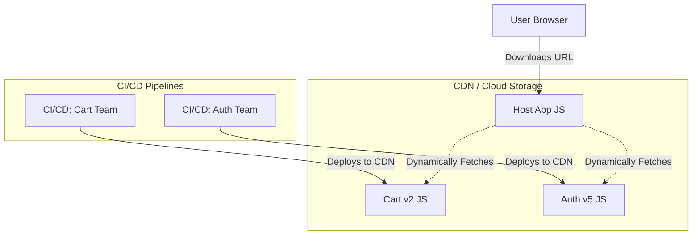

# Independent Deployment (Независимое развертывание)

Главная боль монолитных Frontend-приложений в энтерпрайзе — это релизный поезд (Release Train). Когда над одним кодом работает 10 команд, деплой превращается в ритуал: код замораживается на день, QA тестирует всё приложение целиком, а если команда А сломала сборку, команда Б не может выкатить свою критическую фичу. **Independent Deployment** (Независимое развертывание) — это фундаментальный столп и главная бизнес-причина перехода на микрофронтенды.

Суть: каждая команда должна иметь возможность запушить код, прогнать CI/CD и выкатить свою часть интерфейса в продакшен **без синхронизации с другими командами и без пересборки родительского приложения (Host)**.

## Как это работает на практике

При использовании Run-Time интеграции (например, Webpack Module Federation или импортов через `<script>`), Host-приложение лишь ссылается на URL, по которому лежит микрофронтенд. Когда команда деплоит микрофронтенд, она просто обновляет JS-файлы на этом URL (на CDN). При следующем открытии страницы пользователи загрузят новую версию.



### Пример: Деплой Module Federation Remote

**Антипаттерн**: Сборка (Build-Time Integration), когда Host-приложение скачивает микрофронтенды как NPM-пакеты. Чтобы обновить "Корзину", платформенной команде нужно обновить версию пакета в Host-приложении и задеплоить Host заново. Это не независимый деплой.

**Правильное решение**: Run-Time загрузка и перезапись Entry-файла. 

При деплое "Корзины", пайплайн заливает новые бандлы (с хешами в названиях для кэширования, напр. `cart.8f9a.js`) в бакет, а затем **перезаписывает** файл `remoteEntry.js` (без хеша в имени!).

```bash
# Пример шагов CI/CD для микрофронтенда
npm run build
# 1. Загружаем все статические ассеты (кэшируются навсегда)
aws s3 sync ./dist s3://my-cdn/cart/ --exclude "remoteEntry.js" --cache-control max-age=31536000
# 2. Загружаем точку входа (инвалидируем кэш, чтобы Host сразу скачал новую версию)
aws s3 cp ./dist/remoteEntry.js s3://my-cdn/cart/remoteEntry.js --cache-control no-cache
```

## Неочевидные нюансы и трейдоффы

1. **Кэширование на клиенте (Cache Busting)**: Если `remoteEntry.js` (точка входа в микрофронтенд) жестко закешируется браузером пользователя, он никогда не увидит ваш релиз, даже если вы его выкатили. Необходимо строго настраивать HTTP-заголовки `Cache-Control: no-cache`.
2. **Контроль версий и "незаметные" поломки**: Поскольку Host-приложение всегда тянет свежий `remoteEntry.js`, ваш деплой моментально попадает в прод. Если вы удалили компонент, который ожидает Host, приложение сломается. Выкатка становится очень быстрой, но требует высокой инженерной культуры (см. Contract Testing).
3. **Rollback (Откат)**: Откат становится моментальным. Достаточно загрузить на CDN `remoteEntry.js` от предыдущей сборки, и все новые пользователи вернутся на старую версию.
4. **Где это ломается**: В жестких корпоративных сетях (банки), где запрещена динамическая загрузка скриптов из-за Content Security Policy (CSP), либо где релиз требует ручного аппрува службы безопасности. Там приходится возвращаться к Build-Time сборке или монолиту.
