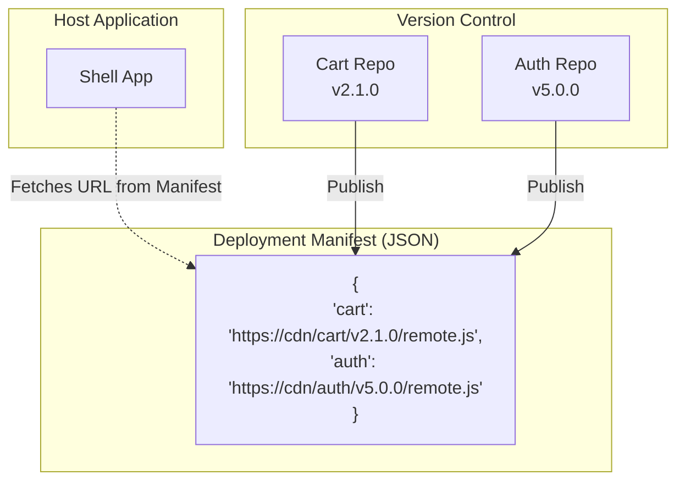

# Independent Versioning (Независимое версионирование)

Когда приложение разбивается на микрофронтенды, возникает вопрос: как мы версионируем этот "зоопарк"? В монолите или монорепозитории (Lerna/Nx с единой версией) релиз любой мелкой фичи часто увеличивает версию всего портала (с v1.2.0 до v1.3.0). Это создает ментальный оверхед: если баг случился в версии v1.3.0, какой именно кусок кода его вызвал?

**Independent Versioning** подразумевает, что каждый микрофронтенд имеет свой собственный жизненный цикл, свой `package.json`, свою семантическую версию (SemVer) и свой чейнджлог. Микрофронтенд "Корзина" может быть версии `v12.4.1`, тогда как "Каталог" застрял на `v2.0.0` из-за редких обновлений.

## Как это работает на практике

На практике независимое версионирование тесно связано с реестром микрофронтендов (Registry) или манифестом развертывания. Host-приложение должно понимать, *какую именно* версию каждого микрофронтенда ему загружать прямо сейчас.



### Пример: Динамическое разрешение версий (Manifest-based)

**Антипаттерн**: Зашивать URL и версии микрофронтендов прямо в код Host-приложения. Тогда для обновления версии "Корзины" вам придется делать коммит и релиз Host-приложения (теряется независимый деплой).

**Правильное решение**: Host запрашивает специальный `manifest.json` в рантайме или сервер подставляет актуальные URL-ы при отдаче `index.html`.

```javascript
// manifest.json - лежит где-то на сервере конфигураций
{
  "remotes": {
    "cart": "https://assets.mycompany.com/cart/v2.1.0/remoteEntry.js",
    "catalog": "https://assets.mycompany.com/catalog/v4.0.1/remoteEntry.js"
  }
}

// Host Application (псевдокод)
async function loadMicrofrontend(name) {
  const response = await fetch('/api/manifest.json');
  const manifest = await response.json();
  
  const scriptUrl = manifest.remotes[name];
  return loadScriptDynamically(scriptUrl);
}
```

## Неочевидные нюансы и трейдоффы

1. **A/B Тестирование и Canary Releases**: Независимое версионирование через манифест — это мощнейший инструмент. Сервер (или Edge worker) может отдавать *разные* версии манифеста разным пользователям. 10% юзеров получат `cart/v2.0.0`, а 90% — `cart/v1.0.0`. Это основа для канареечных релизов во фронтенде.
2. **"Тег Latest"**: Часто команды ленятся версионировать папки на CDN (типа `/v1.2.0/`) и просто пишут поверх в папку `/latest/`. Это лишает возможности сделать моментальный rollback (придется делать revert в Git и заново ждать пайплайн сборки). Правильно — деплоить иммутабельные версии по папкам, а переключать только URL в манифесте.
3. **Сложность дебага (Dependency Hell)**: Если пользователь жалуется на баг, QA инженеру теперь нужно собрать "слепок" системы: какие версии всех 15 микрофронтендов были загружены в браузере в тот момент времени? Для этого в консоль или логгер (Sentry) обязательно пишут текущие версии загруженных Remote-ов.
4. **Обратная совместимость (Backward Compatibility)**: Если Host-приложение ожидает от `cart` компонент `Sidebar`, а `cart` версии v2.0.0 переименовал его в `Panel`, мажорное обновление сломает рантайм. Semantic Versioning здесь играет критическую роль: ломающие изменения в интерфейсе (экспортах) требуют обновления мажорной версии и синхронного апдейта Host'а.
