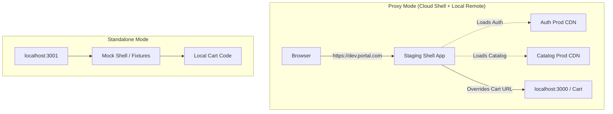

# Local Development (Локальная разработка) в Microfrontends

Классическая проблема микросервисов, перекочевавшая на Frontend: чтобы разработчику добавить кнопку в "Корзину", нужно ли ему поднимать у себя на ноутбуке Host-приложение (Shell), "Каталог", "Авторизацию" и еще десяток сервисов? Если да, то через год MacBook взлетит на воздух от нехватки оперативной памяти, а onboarding нового сотрудника будет занимать неделю. 

**Удобный Developer Experience (DX) при локальной разработке** — это лакмусовая бумажка качества архитектуры микрофронтендов. Идеальный сценарий: разработчик клонирует только *один* репозиторий (со своим микрофронтендом), запускает `npm start` и работает.

## Как это работает на практике

Существует два основных подхода к организации локальной разработки:

1. **Standalone Mode (Режим песочницы)**: Микрофронтенд запускается полностью автономно, вне Host-приложения.
2. **Proxy Mode (Host из облака / Local Remote)**: Запускается реальный Host (с продакшена или стейджинга), но URL-ы подменяются так, чтобы Host загружал конкретный микрофронтенд с `localhost`.



### Пример: Подмена URL через Local Storage / Cookie (Proxy Mode)

**Антипаттерн**: Заставлять разработчика запускать 5 микрофронтендов локально: `npm run start:shell`, `npm run start:cart`, `npm run start:auth`. Порты конфликтуют, CPU забит сборщиками Webpack/Vite.

**Правильное решение**: В Host-приложение (Shell) встраивается скрытая developer-панель или скрипт, который умеет переопределять пути к Module Federation ремоутам на лету, сохраняя оверрайды в LocalStorage.

```javascript
// Код внутри Host-приложения (например, в index.js до загрузки React)
const LOCAL_OVERRIDES = JSON.parse(localStorage.getItem('mf-overrides') || '{}');

// Инициализация Module Federation с динамическими путями
const remotes = {
  cart: LOCAL_OVERRIDES['cart'] || 'https://prod-cdn.com/cart/remoteEntry.js',
  auth: LOCAL_OVERRIDES['auth'] || 'https://prod-cdn.com/auth/remoteEntry.js'
};

// Таким образом, разработчик заходит на ПРОДАКШЕН (или стейджинг)
// вводит в консоль localStorage.setItem('mf-overrides', '{"cart": "http://localhost:3000/remoteEntry.js"}')
// обновляет страницу, и видит ВЕСЬ рабочий портал, но Корзина грузится с ЕГО ноутбука!
```

## Неочевидные нюансы и трейдоффы

1. **CORS и HTTPS**: Если вы используете подход с подменой на продакшене (Proxy Mode), ваш `localhost` (http) будет заблокирован браузером по соображениям безопасности (Mixed Content), так как стейджинг работает по HTTPS. Приходится запускать локальный сервер с самоподписанными сертификатами (`https://localhost:3000`).
2. **Аутентификация в Standalone Mode**: Если разработчик запускает свой кусок автономно, ему неоткуда взять JWT-токены, которые обычно выдает Host или микрофронтенд `Auth`. Решение — встраивать в локальный режим "моковые" токены или специальную mock-login страницу.
3. **Сложность мокирования**: В Standalone режиме сложно воспроизвести реальное поведение Host-приложения (глобальные стейты, роутинг). Вы можете написать код, который отлично работает автономно, но при интеграции в Host упадет из-за конфликта стилей или версий React.
4. **Инструментарий**: Современные платформы (например, Zephyr Cloud) или плагины (`@module-federation/enhanced`) предлагают встроенные Chrome Extensions, которые позволяют кликом перенаправлять трафик конкретного микрофронтенда на ваш `localhost` без ручного редактирования LocalStorage.
