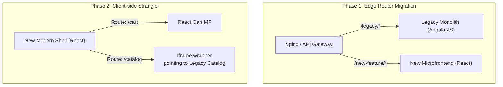

# Migration to Microfrontends (Миграция)

Редко какая компания решает писать микрофронтенды с абсолютного нуля. Обычно к этой архитектуре приходят от боли: существует гигантский Legacy-монолит (на старом React/Angular/Vue или даже серверном рендеринге вроде JSP/PHP), который собирается 30 минут, а любая правка CSS ломает непредсказуемую часть портала. Бизнес не может остановить разработку новых фич на полгода ради "переписывания с нуля". Требуется стратегия постепенного перехода.

Для миграции используется классический паттерн **Strangler Fig (Паттерн Душителя)**: новое приложение постепенно обвивает старое, перехватывая на себя всё больше трафика и страниц, пока старое не "умрет".

## Как это работает на практике

Миграция делится на два основных подхода по точке интеграции: на уровне сервера (Edge/Nginx) или на уровне клиента (Браузера).



### Пример: Миграция через Iframe-обертку (Client-side Strangler)

**Антипаттерн**: Пытаться подружить старый Angular 1.x и новый React 18 в одном DOM-дереве через костыльные адаптеры с общей памятью. Это приведет к катастрофическим утечкам памяти и конфликтам глобальных переменных.

**Правильное решение**: Создать новый, чистый Shell (Host-приложение). Новые фичи писать как нативные микрофронтенды. Старые страницы встраивать в Shell через `iframe`, пока они не будут переписаны.

```jsx
// New Shell App (React) - Роутер
import { BrowserRouter, Route, Routes } from 'react-router-dom';
import { Suspense, lazy } from 'react';

// Новый микрофронтенд (переписанный)
const ReactCart = lazy(() => import('cart/CartPage'));

// Обертка для старого монолита
function LegacyIframe({ legacyPath }) {
  // Передаем токен авторизации через postMessage или Cookie
  return (
    <iframe 
      src={`https://legacy.portal.com/${legacyPath}`} 
      style={{ width: '100%', height: '100vh', border: 'none' }}
      title="Legacy Content"
    />
  );
}

export function AppRouter() {
  return (
    <Routes>
      {/* Полностью переписанная страница */}
      <Route path="/cart" element={<ReactCart />} />
      
      {/* Все остальные страницы проксируются в старый монолит через Iframe */}
      <Route path="*" element={<LegacyIframe legacyPath={window.location.pathname} />} />
    </Routes>
  );
}
```

## Неочевидные нюансы и трейдоффы

1. **Разрыв UI/UX**: В процессе миграции пользователь будет прыгать между "старым" и "новым" дизайном. Если у монолита и новых MF разный дизайн, это выглядит как поломка. Платформенной команде часто приходится "натягивать" новые CSS-стили (хотя бы базовые: шапка, шрифты, цвета) на старый монолит, чтобы сгладить переход.
2. **Дублирование состояния**: Если в старом монолите есть корзина и в новом MF есть корзина, их состояния рассинхронизируются. Приходится выносить стейт на бэкенд (Sync via API) или настраивать сложный бридж через `postMessage`.
3. **SEO-пенальти**: Миграция через `iframe` или Client-Side роутер может ударить по SEO, так как поисковики плохо индексируют динамически склеенные страницы. Если SEO критично, миграцию нужно делать на уровне сервера (Nginx Reverse Proxy: отдавать разные HTML файлы в зависимости от URL).
4. **Застревание на середине**: Это главная бизнес-проблема. Зачастую команды переписывают 80% приложения (самое интересное), а оставшиеся 20% (скучные настройки, легаси админка) остаются в старом монолите навсегда, заставляя компанию поддерживать две инфраструктуры (Webpack 3 + Vite, старые CI/CD и новые пайплайны). Стратегия миграции должна иметь жесткий дедлайн выключения монолита.
