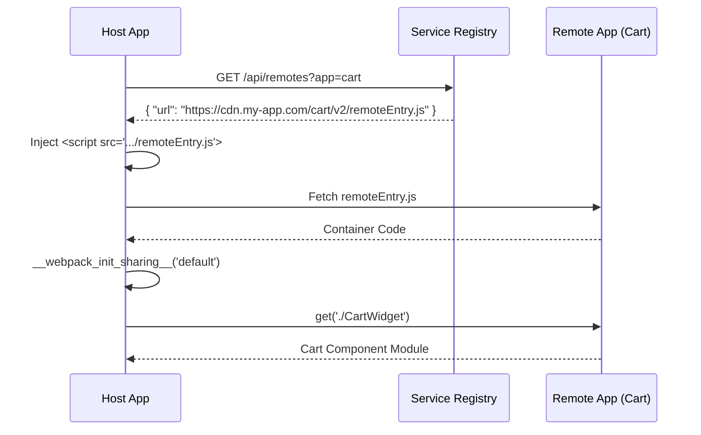

# Module Federation: Dynamic Remotes

Представьте, что вы построили микрофронтендную архитектуру с помощью Module Federation. Всё отлично работает: `Host` загружает `Cart` и `Checkout` в рантайме. Но однажды DevOps-инженер меняет схему деплоя, и URL микрофронтенда `Cart` меняется. Внезапно вам приходится делать ребилд и редеплой `Host`-приложения, просто чтобы обновить одну строчку в `webpack.config.js`. 

Здесь мы сталкиваемся с болью **статичных ремоутов (Static Remotes)**: адреса микрофронтендов жестко зашиты на этапе сборки (или инициализации) хоста. Если вам нужен динамический реестр микрофронтендов, A/B тестирование разных версий ремоутов или tenant-based роутинг (разные клиенты получают разные сборки) — статика ломается.

**Dynamic Remotes** решают эту проблему. Это паттерн, при котором URL удаленного модуля не прописывается в конфиге сборки, а вычисляется и загружается "на лету" прямо в браузере.

## Как это работает

Вместо того чтобы полагаться на встроенный механизм Webpack для разрешения путей, мы берем управление в свои руки:
1. Идем по API в **Registry** (реестр микрофронтендов) и узнаем актуальный URL для нужного нам ремоута.
2. Динамически создаем тег `<script>` с `remoteEntry.js` и вставляем его в DOM.
3. Инициализируем скоуп шаренных зависимостей (`__webpack_init_sharing__`).
4. Извлекаем нужный модуль из загруженного контейнера.



## Примеры кода

### ❌ Антипаттерн: Зашиваем урлы в конфиг (Static)

```javascript
// webpack.config.js (Host)
plugins: [
  new ModuleFederationPlugin({
    name: 'host',
    remotes: {
      // Боль: URL зашит в сборку. Изменился URL - нужен редеплой хоста.
      cart: 'cart@https://prod.mycdn.com/cart/remoteEntry.js', 
    },
  }),
]
```

### ✅ Как надо: Динамическая загрузка (Dynamic)

С появлением `@module-federation/utilities` (или в современных версиях Webpack/Rspack) это делается элегантно через `loadRemote`.

```javascript
// webpack.config.js (Host)
// Мы вообще не объявляем 'remotes'!
plugins: [
  new ModuleFederationPlugin({
    name: 'host',
    // remotes: {} - пусто!
    shared: ['react', 'react-dom'],
  }),
]
```

```javascript
// App.jsx (Host)
import { loadRemote } from '@module-federation/runtime';
import React, { lazy, Suspense } from 'react';

// Функция получения актуального URL из Registry
const fetchRemoteUrl = async () => {
    const response = await fetch('/api/registry/cart');
    const data = await response.json();
    return data.url; // e.g., "https://cdn.../cart@2.1.0/remoteEntry.js"
};

const DynamicCart = lazy(async () => {
    const url = await fetchRemoteUrl();
    
    // loadRemote берет на себя инжект скрипта, инициализацию контейнера
    // и резолв шаренных зависимостей.
    const CartModule = await loadRemote({
        name: 'cart',
        entry: url,
    }, './CartWidget');
    
    return CartModule;
});

export const App = () => (
    <Suspense fallback={<Spinner />}>
        <DynamicCart />
    </Suspense>
);
```

## Скрытые трейдоффы и границы применимости

Хотя Dynamic Remotes дают максимальную гибкость, за неё приходится платить:

1. **Network Waterfall (Задержки при старте):** 
   При статичных ремоутах браузер может начать скачивать `remoteEntry.js` параллельно с основным бандлом. В динамическом подходе мы сначала ждем загрузки JS хоста, потом делаем API-вызов в Registry, потом качаем `remoteEntry.js`, потом парсим его и только потом качаем сами чанки компонента. *Решение:* Предзагрузка (prefetching) ссылок из реестра на этапе SSR или в `<head>`.
2. **"Ад" версий (Dependency Hell):** 
   Когда URL меняется динамически, сложнее гарантировать, что загружаемая версия ремоута совместима с версиями `shared` библиотек хоста. Если `Cart` неожиданно начал требовать `React 18`, а хост отдает `React 17` (и нет fallback'а), приложение упадет в рантайме.
3. **Отладка и мониторинг:** 
   Сложнее понять, какая именно версия кода сейчас работает в проде у конкретного пользователя. В Sentry и логах могут появляться фантомные ошибки от версий, о которых хост-приложение даже не знает. *Решение:* Обязательно передавать версию ремоута в логгер.
4. **Security:** 
   Динамический инжект `<script>` тегов с URL, полученными по сети — это вектор для XSS, если реестр скомпрометирован. Обязательны строгие CSP (Content Security Policy) и валидация доменов.

**Итог:** Используйте Dynamic Remotes, если у вас **Platform Team**, десятки независимых продуктовых команд, и вам жизненно необходимы независимые релизы, канареечные деплои и A/B тесты. Если у вас 2-3 микрофронтенда в рамках одного продукта — статических ремоутов (и переменных окружения при сборке/старте) будет более чем достаточно.
