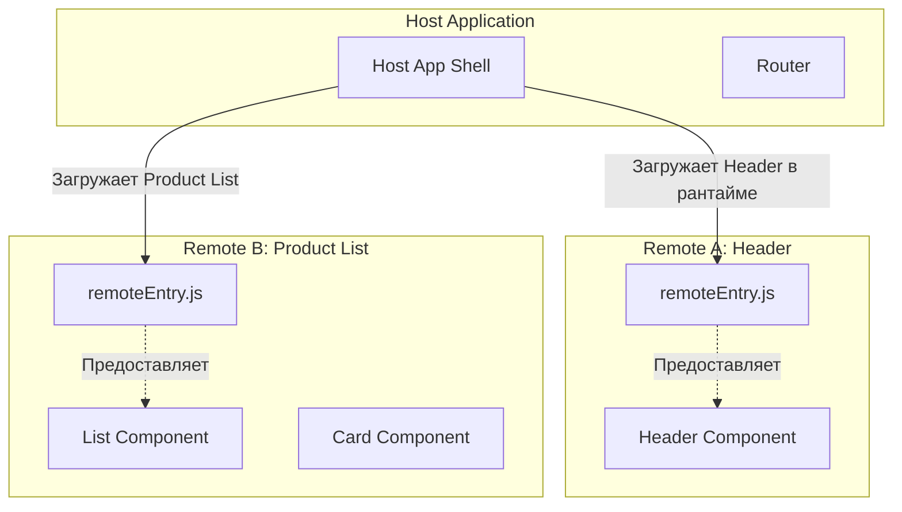

# Host и Remote в Module Federation

## Суть концепции: Разделяй и властвуй в рантайме
Исторически фронтенд страдал от "монолитных" сборок. По мере роста проекта время билда увеличивалось, а деплой малейшего изменения требовал пересборки всего приложения. Концепция **Module Federation** (появившаяся в Webpack 5) элегантно решает эту боль, разделяя приложения на независимые куски, которые собираются отдельно, но объединяются **в рантайме** прямо в браузере.

В основе этой магии лежат две главные роли:
*   **Host (Хост / Контейнер):** Приложение, которое инициализируется первым при загрузке страницы. Оно "втягивает" в себя чужой код.
*   **Remote (Удаленный модуль):** Приложение (или его часть), которое "отдает" свой скомпилированный код наружу.

> [!NOTE] Роли не взаимоисключающие
> Приложение может быть одновременно и Host (потреблять чужие компоненты), и Remote (отдавать свои). Это называется *Bidirectional Host*.

## Как это работает

Вместо того чтобы скачивать все зависимости на этапе npm install и собирать их в один бандл, Host скачивает специальный манифест (обычно `remoteEntry.js`) от Remote-приложения во время работы приложения. Этот файл содержит информацию о том, как загрузить нужные чанки (куски кода) и общие зависимости (shared dependencies).



## Примеры кода: Как надо

**1. Настройка Remote (Отдаем компонент Button):**
```javascript
// webpack.config.js (Remote)
const ModuleFederationPlugin = require('webpack/lib/container/ModuleFederationPlugin');

module.exports = {
  plugins: [
    new ModuleFederationPlugin({
      name: 'ui_library', // Имя нашего remote
      filename: 'remoteEntry.js', // Манифест
      exposes: {
        './Button': './src/components/Button', // Что отдаем наружу
      },
      shared: ['react', 'react-dom'], // Общие библиотеки (чтобы не дублировать)
    }),
  ],
};
```

**2. Настройка Host (Потребляем компонент):**
```javascript
// webpack.config.js (Host)
const ModuleFederationPlugin = require('webpack/lib/container/ModuleFederationPlugin');

module.exports = {
  plugins: [
    new ModuleFederationPlugin({
      name: 'host_app',
      remotes: {
        // 'ui_library' - имя из remote, 'http...' - где искать
        ui_library: 'ui_library@http://localhost:3001/remoteEntry.js',
      },
      shared: ['react', 'react-dom'],
    }),
  ],
};
```

**3. Использование в Host-коде:**
```javascript
// React пример: ленивая загрузка
import React, { Suspense } from 'react';

// Импорт из remote! Webpack поймет это благодаря конфигу.
const RemoteButton = React.lazy(() => import('ui_library/Button'));

function App() {
  return (
    <div>
      <h1>Host Application</h1>
      <Suspense fallback={<div>Loading remote button...</div>}>
        <RemoteButton onClick={() => alert('Clicked!')} />
      </Suspense>
    </div>
  );
}
```

## Антипаттерны и типичные ошибки

```javascript
// ❌ АНТИПАТТЕРН: Тесная связность (Tight Coupling)
// Remote ожидает, что Host обязательно передаст сложный и специфичный для хоста объект конфигурации
const RemoteWidget = ({ complexHostStore, hostSpecificRouterParams }) => { ... }

// ✅ КАК НАДО: Слабая связность (Loose Coupling)
// Remote получает только примитивы или простые DTO.
const RemoteWidget = ({ userId, onAction }) => { ... }
```

## Трейдоффы и границы применимости

| Аспект | Описание |
| :--- | :--- |
| **Независимый деплой** | Главный плюс. Можно обновить корзину (Remote) без пересборки и деплоя всего магазина (Host). |
| **Управление зависимостями** | Общие библиотеки (shared) могут привести к "аду версий". Если Host использует React 18, а Remote жестко требует React 17, приложение может упасть. Настройка `shared: { react: { singleton: true, requiredVersion: '^18.0.0' } }` обязательна для таких случаев. |
| **Типизация (TypeScript)** | Из коробки Host не знает типы импортируемого Remote-модуля. Приходится настраивать плагины вроде `@module-federation/typescript` или раздавать `.d.ts` файлы через npm/отдельные серверы. |
| **Надежность рантайма** | Если сервер с `remoteEntry.js` упал — Host не сможет загрузить модуль. Необходимы Error Boundaries и фоллбеки для graceful degradation. |
| **Производительность** | Хоть мы и грузим код лениво, инициализация нескольких федераций при старте требует дополнительных сетевых запросов (сначала манифест, потом чанк). Для критически быстрого First Input Delay это может быть проблемой. |

Module Federation идеально подходит для крупных проектов с несколькими независимыми командами, но будет явным оверинжинирингом для небольшого монолита, разрабатываемого одной командой.
