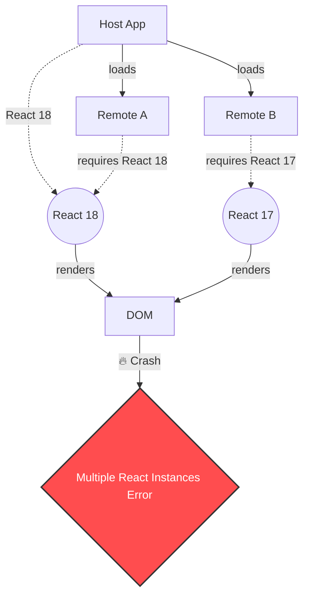

# Module Federation: Подводные камни (Pitfalls)

Webpack Module Federation (MF) продал нам красивую мечту: независимые деплои, отсутствие огромного монолитного бандла, переиспользование зависимостей "на лету". Кажется, что достаточно прописать пару строк в `webpack.config.js`, и наступит микрофронтенд-нирвана. На практике же, решая проблему монолита, мы переносим сложность из времени сборки (build-time) во время выполнения (runtime).

Ошибки, которые раньше ловил компилятор, теперь взрываются прямо в браузере у пользователя.

## Как это ломается: Основные ловушки

### 1. Ад разделяемых зависимостей (Dependency Hell)
Самая частая боль — конфликты версий в `shared` зависимостях. Если Host использует React 18, а Remote ожидает React 17, и вы не настроили правила разруливания (singletons), на странице загрузятся обе версии. Это приведет к непредсказуемым багам (например, `Hooks can only be called inside the body of a function component`).



### 2. Отсутствие изоляции стилей и глобального стейта
В отличие от iframes, микрофронтенды на MF живут в одном DOM и делят один объект `window`. 
- **CSS конфликты**: Глобальные стили Remote-модуля могут сломать верстку Host-приложения и наоборот.
- **Глобальные переменные и стейт**: Два разных ремоута, использующих один и тот же ключ в `localStorage` или глобальный Redux store, будут затирать данные друг друга.

### 3. Каскадные сбои (Network Waterfalls)
Если Host зависит от Remote A, а Remote A зависит от Remote B, возникает водопад сетевых запросов. Сначала грузится `remoteEntry.js` хоста, затем `remoteEntry.js` A, и только потом B. Если Remote B недоступен (упал сервер или блочит adblock), падает всё приложение, если не предусмотрены Error Boundaries.

## Примеры конфигурации: Антипаттерн vs Как надо

**Антипаттерн: Жадное расшаривание всего подряд**
```javascript
// ❌ webpack.config.js (Плохо)
plugins: [
  new ModuleFederationPlugin({
    name: 'host',
    shared: {
      ...deps, // Расшаривает весь package.json. Приведет к загрузке лишнего кода.
    },
  }),
]
```

**Как надо: Точечный контроль и строгие правила**
```javascript
// ✅ webpack.config.js (Хорошо)
plugins: [
  new ModuleFederationPlugin({
    name: 'host',
    shared: {
      react: { 
        singleton: true, // Гарантирует только один инстанс React
        requiredVersion: deps.react,
        strictVersion: true, // Упадет с ошибкой, если версии несовместимы, предотвращая тихие баги
      },
      'react-dom': { 
        singleton: true, 
        requiredVersion: deps['react-dom'] 
      },
      '@my-org/ui-kit': {
        singleton: true,
        eager: true // Грузим сразу, так как это критично для первого рендера
      }
    },
  }),
]
```

## Скрытые трейдоффы и границы применимости

| Трейдофф | Описание |
|----------|----------|
| **Runtime vs Build-time Errors** | Вы теряете гарантии статической типизации между приложениями. Если Remote изменил контракт (props компонента), Host узнает об этом только в рантайме (если не внедрить сложные схемы шаринга TypeScript-типов, например `@module-federation/typescript`). |
| **Local DX (Developer Experience)** | Для разработки фичи, затрагивающей Host и два Remote, разработчику часто нужно поднять локально все три приложения на разных портах. Это жрет RAM и усложняет онбординг. |
| **SSR (Server-Side Rendering)** | Module Federation для SSR — это боль. Динамическая загрузка чанков по сети на Node.js сервере требует кастомных решений (например, `@module-federation/nextjs-mf`), которые часто ломаются при обновлениях фреймворков. |
| **Вендор-лок на Webpack** | Долгое время MF был привязан только к Webpack. И хотя сейчас есть порты на Vite (vite-plugin-federation) и Rspack, экосистема все еще сильно зависит от конкретного бандлера. |

## Итог
Module Federation — это мощный инструмент масштабирования организации, а не просто способ уменьшить размер бандла. Применять его стоит только тогда, когда независимость команд (конвейеров развертывания) важнее, чем простота инфраструктуры и гарантии статической сборки.
