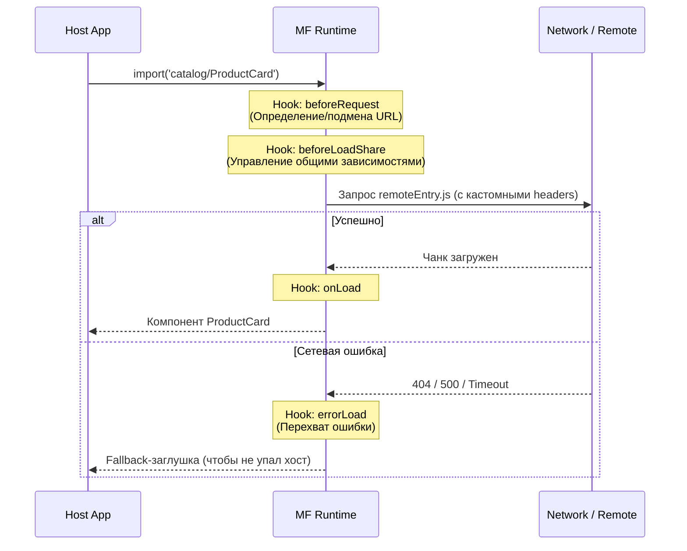

# Module Federation: Runtime Plugins

## Суть: От статики к живой инфраструктуре

Когда архитектура микрофронтендов (MFE) только зарождается, статических адресов в конфиге `ModuleFederationPlugin` (`webpack.config.js`) вполне достаточно. Но по мере взросления платформы появляются новые, кросс-каттинг (сквозные) боли:
- **Динамика окружений:** Как подменять URL ремоутов на лету без пересборки хоста (например, для A/B тестирования или деплоя в разные зоны)?
- **Безопасность:** Как прокидывать токены авторизации или кастомные заголовки при загрузке `remoteEntry.js`?
- **Отказоустойчивость:** Как предотвратить "белый экран смерти", если один из микрофронтендов недоступен по сети?

**Runtime Plugins** (стандартизированные в экосистеме `@module-federation/enhanced`) — это механизм перехвата (middleware) для жизненного цикла Module Federation в браузере. Они позволяют вмешиваться в процессы резолва путей, загрузки скриптов, шаринга зависимостей и обработки ошибок.

## Жизненный цикл и место плагинов

Runtime-плагины работают как хуки, оборачивающие стандартный процесс подтягивания внешнего кода.



## Примеры кода: Как надо и Антипаттерн

### Как надо: Роутинг и Graceful Degradation

Идеальный юзкейс для плагина — централизованная обработка ошибок и динамическая маршрутизация.

```javascript
// error-boundary-plugin.js
export const fallbackPlugin = () => ({
  name: 'mf-fallback-plugin',
  
  // Меняем конфигурацию запроса на лету
  beforeRequest(args) {
    if (args.id.startsWith('payment_remote')) {
      // Подтягиваем актуальный URL из глобального стора/env
      args.options.remotes[0].entry = window.RUNTIME_ENV.PAYMENT_URL;
    }
    return args;
  },

  // Отлавливаем ошибку до того, как она "взорвет" React-дерево
  errorLoad(args) {
    console.error(`[MFE Runtime] Ошибка загрузки ${args.id}`);
    
    // Возвращаем заглушку вместо упавшего модуля
    return () => () => (
      <div className="mfe-fallback">
        Сервис временно недоступен. Попробуйте позже.
      </div>
    );
  }
});

// Инициализация в entry хоста
import { init } from '@module-federation/enhanced/runtime';

init({
  name: 'host_app',
  remotes: [
    { name: 'payment_remote', entry: 'placeholder' }
  ],
  plugins: [fallbackPlugin()]
});
```

### Антипаттерн: Тяжелая логика в критическом пути

Хуки вроде `beforeRequest` или `beforeLoadShare` вызываются синхронно и/или на *каждый* запрашиваемый чанк.

```javascript
// ПЛОХО: Синхронная тяжелая операция в хуке
const badPlugin = () => ({
  name: 'bad-perf-plugin',
  beforeRequest(args) {
    // Антипаттерн: долгие вычисления, парсинг огромных JSON 
    // или блокирующие вызовы затормозят загрузку каждого компонента!
    const heavyConfig = JSON.parse(localStorage.getItem('huge-config'));
    doExpensiveCalculations(heavyConfig);
    return args;
  }
});
```

## Трейдоффы и границы применимости

| Аспект | Плюсы | Минусы / Риски |
| :--- | :--- | :--- |
| **Гибкость** | Можно решить практически любую инфраструктурную задачу (мониторинг, A/B, auth). | Слишком много "магии". Разработчику сложно понять, откуда физически берется модуль, если URL меняется плагином. |
| **Производительность** | Можно кешировать резолвы или откладывать загрузку тяжелых библиотек. | Плагины стоят на критическом пути. Неоптимизированный код в хуках увеличит TTI (Time to Interactive). |
| **Вендор-лок** | Готовые решения от `@module-federation/enhanced` из коробки. | Механизм плагинов специфичен для этой библиотеки, он не является стандартом ECMAScript Imports. |

### Резюме

Runtime-плагины превращают Module Federation из простого "склеивателя бандлов" в полноценную **Frontend Platform**. Они необходимы крупным Enterprise-проектам для обеспечения отказоустойчивости и динамики, но требуют жесткой дисциплины: код в них должен быть максимально легковесным, чистым и надежно покрытым тестами, так как ошибка в плагине сломает все микрофронтенды сразу.
