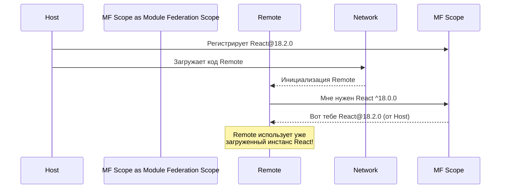

# Shared Dependencies в Module Federation

Разделение фронтенда на независимые модули (микрофронтенды) часто приводит к одной и той же архитектурной боли — **дублированию зависимостей**. Представьте: у вас есть `Host`-приложение и три `Remote`-виджета. Если каждый из них соберет свой собственный бандл с `React`, `ReactDOM` и тяжелой дизайн-системой, пользователь будет вынужден загрузить один и тот же код четыре раза. Это убивает производительность и смысл микрофронтендной архитектуры.

**Shared Dependencies** в Webpack Module Federation — это механизм, который позволяет разным микрофронтендам "договариваться" об использовании общих библиотек во время выполнения (runtime), скачивая их только один раз.

## Как это работает?

Когда приложение (Host или Remote) загружается, оно регистрирует свои shared-зависимости в глобальном скоупе Module Federation. Перед тем как загрузить библиотеку, Module Federation проверяет:
1. Загружена ли уже эта библиотека другим микрофронтендом?
2. Подходит ли загруженная версия под требования текущего микрофронтенда?

Если да — библиотека переиспользуется. Если нет (или нужной версии нет) — загружается fallback-версия из собственного бандла.



## Как это настраивается (Пример кода)

Настройка происходит в плагине `ModuleFederationPlugin` внутри `webpack.config.js`.

### Хороший паттерн: Правильная настройка синглтонов

Библиотеки, которые хранят глобальное состояние (например, `React` или `Vue`), **обязаны** быть синглтонами. Если на странице окажется два разных экземпляра React, вы получите ошибку (например, инвалидацию хуков).

```javascript
// webpack.config.js
const { ModuleFederationPlugin } = require('webpack').container;
const deps = require('./package.json').dependencies;

module.exports = {
  plugins: [
    new ModuleFederationPlugin({
      name: 'app_name',
      // ... exposes / remotes
      shared: {
        // Передаем все зависимости из package.json (удобно, но нужно быть осторожным)
        ...deps,
        // Явно настраиваем критичные зависимости
        react: {
          singleton: true, // Гарантирует только один экземпляр в рантайме
          requiredVersion: deps.react,
          eager: false, // Если true, библиотека попадет в основной бандл, а не в отдельный чанк
        },
        'react-dom': {
          singleton: true,
          requiredVersion: deps['react-dom'],
        },
        'design-system-lib': {
          singleton: true,
          strictVersion: true, // Если версия не совпадет — выкинет ошибку!
        }
      },
    }),
  ],
};
```

### Антипаттерн: Eager загрузка всего подряд

Флаг `eager: true` заставляет Webpack упаковать зависимость прямо в инициализирующий бандл (main.js), игнорируя возможность асинхронной загрузки. Если сделать все shared-библиотеки `eager`, вы потеряете главное преимущество — разделение кода (code splitting), и размер начального бандла улетит в небеса.

## Трейдоффы и границы применимости

Хотя Shared Dependencies звучит как серебряная пуля, на практике это место номер один по количеству багов в микрофронтендах.

1. **Конфликты версий и `strictVersion`**:
   Если `Host` использует React 17, а `Remote` требует `strictVersion: true` для React 18, приложение просто упадет в рантайме. Использование микрофронтендов требует строгой синхронизации мажорных версий критичных библиотек между командами.
2. **Проблема инициализации (The Bootstrap Problem)**:
   При использовании асинхронных shared-зависимостей, входная точка приложения (обычно `index.js`) не должна содержать импортов этих библиотек, иначе Webpack не успеет договориться о версиях. Поэтому в MF-приложениях всегда делают "бутстрап":
   ```javascript
   // index.js
   import('./bootstrap'); // Асинхронный импорт позволяет MF разрулить зависимости

   // bootstrap.js
   import React from 'react';
   import ReactDOM from 'react-dom';
   // ... рендер приложения
   ```
3. **Обновление общих пакетов**:
   Если вы обновляете `Shared Dependency` (например, мажорную версию дизайн-системы), вам, скорее всего, придется обновить и Host, и все Remotes. Это создает сильное временное сцепление (temporal coupling) между независимыми, казалось бы, командами.

## Резюме
Shared Dependencies — мощный инструмент для оптимизации загрузки, но он превращает независимые микрофронтенды в распределенный монолит на уровне экосистемы библиотек. Используйте `singleton: true` для UI-библиотек и роутеров, аккуратно настраивайте `requiredVersion` и помните о необходимости асинхронного бутстрапа вашего приложения.
