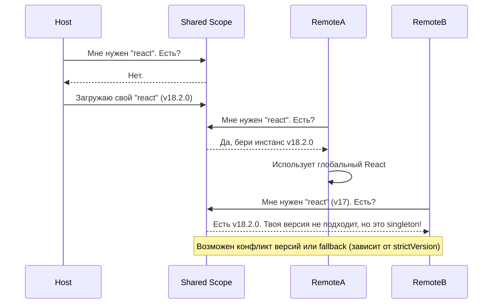

# Singleton Dependencies в Module Federation

## Введение: Проблема дублирования
Представьте, что вы собираете страницу из трех микрофронтендов (Host, Remote A, Remote B). Каждый из них написан на React. Если собрать их "в лоб", браузер загрузит три независимые копии `react` и `react-dom`. 

Кроме раздувания бандла на мегабайты, это приводит к фатальным архитектурным сбоям. Библиотеки вроде React хранят внутреннее состояние (например, контекст выполнения хуков). Когда компонент из Remote A (использующий свою копию React) пытается отрендериться внутри Host-приложения (использующего свою), вы получаете знаменитую ошибку: `Error: Invalid hook call`.

**Singleton Dependencies (Одиночные зависимости)** — это механизм Webpack Module Federation, гарантирующий, что определенная библиотека загрузится и инициализируется в браузере ровно один раз, и все микрофронтенды будут переиспользовать этот единственный инстанс.

## Как это работает?

В конфигурации Module Federation мы объявляем общие зависимости (`shared`) и помечаем их флагом `singleton: true`. Когда приложение стартует, Webpack создает глобальный реестр (Shared Scope). Первый микрофронтенд, которому нужен React, помещает свою версию в этот реестр. Все последующие микрофронтенды видят, что React уже инициализирован, и просто используют готовую ссылку, игнорируя свои локальные копии.



## Примеры кода: Настройка Singleton

Вот как выглядит классическая настройка для React-приложения в `webpack.config.js`:

```javascript
const ModuleFederationPlugin = require('webpack/lib/container/ModuleFederationPlugin');
const deps = require('./package.json').dependencies;

module.exports = {
  // ...
  plugins: [
    new ModuleFederationPlugin({
      name: 'host_app',
      remotes: {
        app1: 'app1@http://localhost:3001/remoteEntry.js',
      },
      shared: {
        // Как надо: строгий синглтон для библиотек с внутренним стейтом
        react: { 
          singleton: true, 
          requiredVersion: deps.react 
        },
        'react-dom': { 
          singleton: true, 
          requiredVersion: deps['react-dom'] 
        },
        
        // Антипаттерн: синглтон для stateless утилит
        // lodash: { singleton: true } // Плохо! Разные версии lodash могут мирно сосуществовать
      },
    }),
  ],
};
```

### Разбор флагов:
- `singleton: true` — Запрещает загрузку нескольких версий.
- `requiredVersion` — Указывает, какую версию ожидает приложение (обычно берется из `package.json`).
- `strictVersion: true` — Если версии не совпадают (например, Host дал v17, а Remote требует v18), приложение бросит ошибку и упадет, вместо того чтобы пытаться работать с несовместимой версией.

## Трейдоффы и границы применимости

### Где необходимо применять:
1. **Библиотеки рендеринга:** React, Vue, Angular Core. Они ломаются при наличии нескольких инстансов в одном DOM-дереве.
2. **State Managers:** Redux, MobX, Zustand. Если вы делите стор между микрофронтами, у них должен быть один контекст.
3. **Провайдеры тем и роутеры:** `styled-components`, `react-router-dom` (если роутинг общий).

### Где это ломается (Скрытые проблемы):
* **Dependency Hell:** Если Host использует React 16, а Remote — React 18, и стоит `singleton: true`, Module Federation заставит Remote использовать React 16. Remote почти наверняка упадет в рантайме, так как использует новые фичи (например, `useId`).
* **Потеря независимости деплоя:** В идеальном мире микрофронтенды независимы. Но синглтоны жестко связывают их (coupling) по версиям ключевых библиотек. Обновление мажорной версии React в Host-приложении требует одновременного рефакторинга и тестирования всех Remote-приложений.
* **Порядок инициализации:** Версия синглтона в реестре определяется тем, кто загрузился первым. Если Remote загрузится раньше Host (например, на отдельной странице, где он сам выступает хостом), он инициализирует свою версию.

### Резюме
Синглтоны в Module Federation — это неизбежное зло для библиотек, которые не умеют жить в изоляции. Они спасают от ошибок и экономят трафик, но забирают часть свободы, требуя строгой координации версий между командами.
