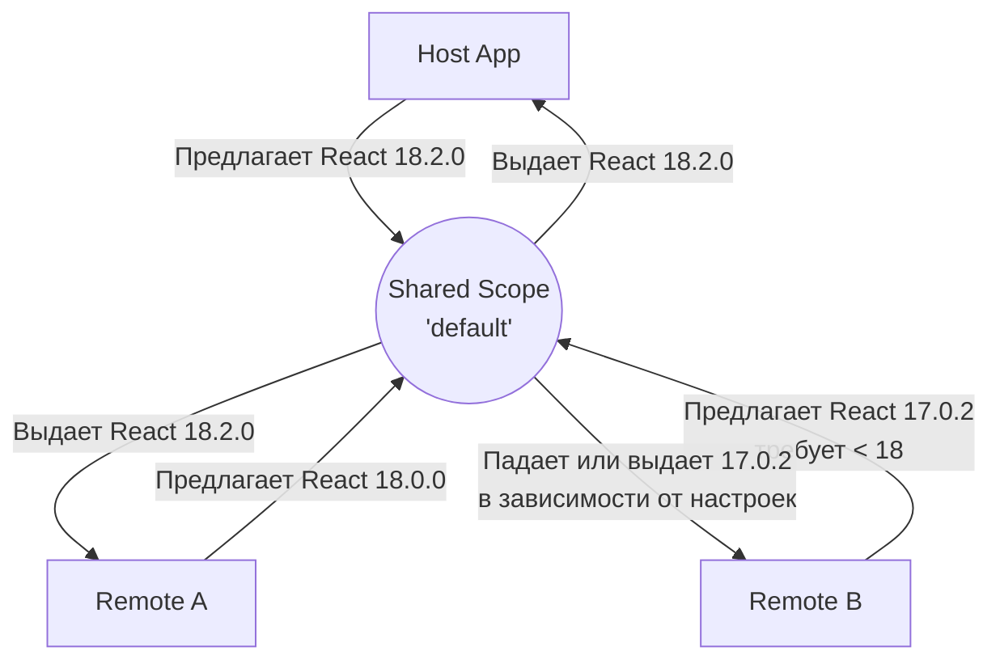

# Version Compatibility в Module Federation

Разработка микрофронтендов с использованием Module Federation решает множество проблем, но порождает одну из самых коварных: управление общими зависимостями. Если каждый микрофронтенд будет грузить свою копию React или Lodash, производительность упадет до нуля. Если все будут использовать одну глобальную версию — неизбежно возникнет "ad-hoc" ад, когда обновление библиотеки в хосте ломает старые ремоуты.

Module Federation предлагает элегантный, но сложный в настройке механизм `shared` зависимостей, который берет на себя ответственность за согласование (negotiation) версий в рантайме.

## Как это работает?

Вместо того чтобы жестко вшивать зависимости в бандл, микрофронтенды объявляют свои требования к ним. В рантайме Webpack собирает реестр доступных библиотек от всех загруженных модулей (хоста и ремоутов) и выбирает **наивысшую подходящую версию**, опираясь на правила SemVer.



## Разбор API: Как надо и антипаттерны

Ключевая конфигурация лежит в массиве/объекте `shared` плагина `ModuleFederationPlugin`.

### Антипаттерн: Наивный шаринг
```javascript
// webpack.config.js
plugins: [
  new ModuleFederationPlugin({
    // ...
    shared: ["react", "react-dom"] // Плохо: неявные версии, возможны гонки
  })
]
```
Если передать просто массив строк, Webpack выведет требуемые версии из вашего `package.json`, но поведение может быть непредсказуемым при сложной иерархии зависимостей, и могут загружаться дубликаты.

### Правильный подход: Тонкая настройка версий
```javascript
const deps = require('./package.json').dependencies;

plugins: [
  new ModuleFederationPlugin({
    name: 'host',
    shared: {
      react: {
        singleton: true, // Гарантирует только один инстанс в памяти
        requiredVersion: deps.react, // Требует версию, указанную в package.json
      },
      'react-dom': {
        singleton: true,
        requiredVersion: deps['react-dom'],
      },
      lodash: {
        // singleton не указан. Если версии несовместимы, загрузятся несколько копий
        requiredVersion: '^4.17.0'
      }
    }
  })
]
```

### Ключевые флаги
*   **`singleton: true`**: Критично для библиотек, хранящих внутреннее состояние (React, Vue, Zustand). Если загрузить два React в один DOM, приложение упадет с ошибкой хуков. Если версии несовместимы, Webpack выдаст предупреждение (или ошибку при `strictVersion`), но загрузит только одну (высшую) версию.
*   **`requiredVersion`**: Указывает диапазон (SemVer), с которым совместим данный микрофронтенд.
*   **`strictVersion: true`**: Запрещает Webpack загружать версию, не попадающую в `requiredVersion`. По умолчанию (false) Webpack лишь выдаст предупреждение в консоль, но попытается отрендерить с тем, что есть.

## Трейдоффы и подводные камни

1.  **"Eager" consumption vs "Async" boundary**: Чтобы Module Federation успел прочитать реестр общих зависимостей до их использования, точка входа должна быть асинхронной (`import('./bootstrap')`). Иначе вы получите ошибку `Shared module is not available for eager consumption`.
2.  **Смерть от `strictVersion`**: Включение `strictVersion: true` — это палка о двух концах. С одной стороны, вы гарантируете предсказуемость. С другой — если хост обновит React с 17 до 18, все ремоуты с `strictVersion: true` и `requiredVersion: "^17.0.0"` моментально сломаются в продакшене. Рекомендуется использовать `strictVersion: false` (поведение по умолчанию) и полагаться на обратную совместимость библиотек, отлавливая ворнинги на этапе мониторинга.
3.  **Дублирование не-синглтонов**: Если библиотека не помечена как `singleton` (например, утилиты типа `lodash` или `date-fns`), и микрофронтенды требуют разные мажорные версии, Webpack честно загрузит *обе* версии. Это спасает от багов, но раздувает общий вес страницы.

## Границы применимости

Управление версиями через Module Federation отлично работает в экосистемах с единой командой платформы, где обновления мажорных версий (например, React 18 -> 19) координируются централизованно. В децентрализованных enterprise-средах, где десятки команд обновляют зависимости асинхронно, Module Federation не спасет от необходимости договариваться: вам придется либо поддерживать строгую политику версионирования общих библиотек, либо использовать Web Components (где каждый компонент инкапсулирует свой рантайм, жертвуя производительностью).
