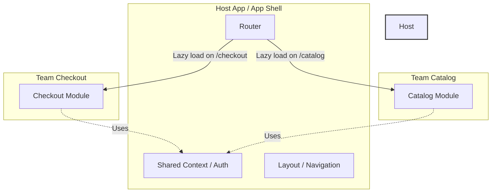

# Microfrontends и Frontend Platform

В какой-то момент успешный монолитный frontend становится невыносимым. Сборка занимает 20 минут, релизные циклы растягиваются, а попытка обновить версию React в одной части приложения ломает три другие. Команды начинают мешать друг другу, и скорость доставки фич падает до нуля.

**Microfrontends** — это архитектурный подход, при котором единое клиентское приложение разбивается на небольшие, независимые части (микрофронтенды), каждая из которых разрабатывается, тестируется и деплоится отдельной командой. 
**Frontend Platform** (платформенная команда) — это инженерный фундамент, который связывает эти части воедино, предоставляя общий роутинг, авторизацию, дизайн-систему и инфраструктуру, чтобы продуктовые команды не изобретали велосипед.

## Как это работает (Module Federation)

Сегодня де-факто стандартом для микрофронтендов является **Module Federation** (появился в Webpack 5, сейчас активно поддерживается Rspack/Vite). Он позволяет загружать код из других сборок прямо в браузере в рантайме.



В этой схеме **Host (App Shell)** — это зона ответственности Frontend Platform. Он инициализирует приложение и подтягивает **Remote** приложения от продуктовых команд.

## Пример: Module Federation на практике

### Антипаттерн: Build-time интеграция (через NPM пакеты)
Частая ошибка — пытаться делать микрофронтенды через вынос фич в NPM-пакеты. Это не микрофронтенды, это распределенный монолит.
```javascript
// Плохо: при каждом изменении Header мы должны пересобрать и задеплоить Host App
import { Header } from '@my-company/header';
```

### Как надо: Runtime интеграция
Вместо жесткой зависимости на этапе сборки, мы объявляем удаленный модуль в конфигурации сборщика и загружаем его асинхронно по сети.

*Host App (`webpack.config.js`):*
```javascript
new ModuleFederationPlugin({
  name: 'host',
  remotes: {
    // Указываем, откуда скачивать код в рантайме
    app_checkout: 'app_checkout@https://cdn.example.com/checkout/remoteEntry.js',
  },
  shared: { 
    react: { singleton: true }, 
    'react-dom': { singleton: true } 
  }, // Шарим общие библиотеки
});
```

*Использование в React (Host App):*
```jsx
import React, { Suspense } from 'react';

// Динамический импорт микрофронтенда по сети
const CheckoutApp = React.lazy(() => import('app_checkout/CheckoutComponent'));

function App() {
  return (
    <div>
      <h1>Main Application</h1>
      <Suspense fallback={<Spinner />}>
        <CheckoutApp />
      </Suspense>
    </div>
  );
}
```

## Скрытые трейдоффы и границы применимости

Микрофронтенды — это не серебряная пуля, а инструмент решения организационных проблем. 

1. **Закон Конвея:** Микрофронтенды нужны, когда у вас несколько независимых кросс-функциональных команд (от 15-20 фронтенд-разработчиков). Если вас 5 человек — микрофронтенды вас убьют накладными расходами на инфраструктуру.
2. **Ад зависимостей:** Module Federation умеет шарить зависимости (singleton), но если Remote App использует React 18, а Host — React 16, вы получите рантайм конфликты. Платформенная команда должна жестко версионировать "shared" слой (Platform API).
3. **Изоляция стилей:** Глобальный CSS одного микрофронтенда легко может сломать другой. Приходится использовать строгую изоляцию (CSS Modules, CSS-in-JS, Shadow DOM) или префиксы.
4. **Тестирование и дебаг (Developer Experience):** Воспроизвести баг локально становится квестом. Нужно поднимать Host и нужный Remote (а иногда и еще пару соседних), чтобы понять, на чьей стороне проблема. Инвестиции в локальную среду разработки требуются колоссальные.

**Резюме:** Frontend Platform и Microfrontends позволяют масштабировать *организацию* за счет усложнения технической архитектуры. Внедряйте их только тогда, когда стоимость простоев из-за монолита начинает превышать стоимость содержания целой инфраструктурной команды.
