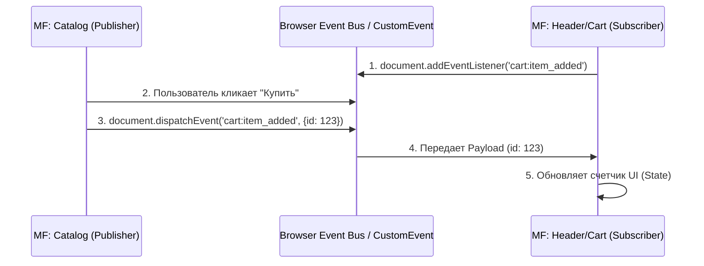

# Cross App Communication (Кросс-апп коммуникация)

В идеальном мире микрофронтенды абсолютно изолированы. Но на практике UI требует интерактивности: пользователь нажимает кнопку "В корзину" в микрофронтенде `Catalog`, и циферка счетчика товаров должна моментально обновиться в микрофронтенде `Header` (Shell). 

Главный вызов **Cross App Communication** — организовать передачу данных так, чтобы микрофронтенды не знали друг о друге (чтобы избежать жесткого связывания — Tight Coupling). Если `Catalog` вызывает функцию `window.Header.updateCart()`, то `Catalog` упадет, если `Header` решит изменить название метода или вообще не загрузится.

## Как это работает на практике

Архитектура коммуникации строится на паттерне Publish/Subscribe (Pub/Sub) или Event Bus. Компоненты общаются не напрямую, а через центральную шину (часто встроенную в браузер).



### Пример: Использование Native CustomEvents

**Антипаттерн**: Использовать общий Redux store, который один микрофронтенд прокидывает в другой. Это привяжет оба приложения к определенной версии Redux и заставит их синхронизировать типы Action'ов.

**Правильное решение**: Использовать нативный API браузера `CustomEvent`. Это фреймворк-агностик подход: Publisher может быть написан на Vue, а Subscriber на React.

```javascript
// MF: Catalog (Publisher - где-то в компоненте ProductCard)
function handleAddToCart(product) {
  // 1. Отправляем API запрос на бэкенд (источник истины)
  api.post('/cart', { id: product.id });
  
  // 2. Бросаем глобальное событие в DOM
  const event = new CustomEvent('mf:cart:updated', {
    detail: { 
      productId: product.id,
      timestamp: Date.now() 
    }
  });
  window.dispatchEvent(event); // или document.dispatchEvent
}

// MF: Header (Subscriber - например, React useEffect)
import { useEffect, useState } from 'react';

function CartWidget() {
  const [count, setCount] = useState(0);

  useEffect(() => {
    const handleCartUpdate = (event) => {
      console.log('Событие из другого MF:', event.detail);
      // Оптимистичное обновление или перезапрос данных
      setCount(prev => prev + 1);
    };

    // Подписываемся на глобальное событие
    window.addEventListener('mf:cart:updated', handleCartUpdate);

    // ОБЯЗАТЕЛЬНО: Отписка для предотвращения Memory Leaks!
    return () => window.removeEventListener('mf:cart:updated', handleCartUpdate);
  }, []);

  return <div>В корзине: {count}</div>;
}
```

## Неочевидные нюансы и трейдоффы

1. **Backend as the Source of Truth**: Кросс-апп события должны передавать *уведомления*, а не *состояние*. Не передавайте весь массив товаров корзины в событии. Событие должно говорить "Корзина изменилась". Услышав это, виджет Корзины должен пойти на сервер (или в кэш Apollo/React Query) и забрать актуальные данные.
2. **Типизация контрактов**: `CustomEvent` не типизирован. В больших системах платформенная команда создает NPM-пакет (Event Bus Contract), который экспортирует константы событий и TS-интерфейсы payload'ов: `import { CART_UPDATED, CartPayload } from '@platform/events'`.
3. **Гонка состояний (Race Conditions)**: Если событие `mf:cart:updated` выстрелит до того, как `Header` успел загрузиться по сети и подписаться на него (например, при медленном интернете), событие улетит в пустоту. Для таких случаев используют продвинутые Event Bus (например, на RxJS `ReplaySubject`), которые запоминают последние N событий и отдают их новым подписчикам.
4. **Коммуникация в iframe**: Если микрофронтенд завернут в `iframe`, `CustomEvent` не пересечет границу window. Придется использовать `window.postMessage API`, что требует строгой валидации `origin` для защиты от XSS атак.
