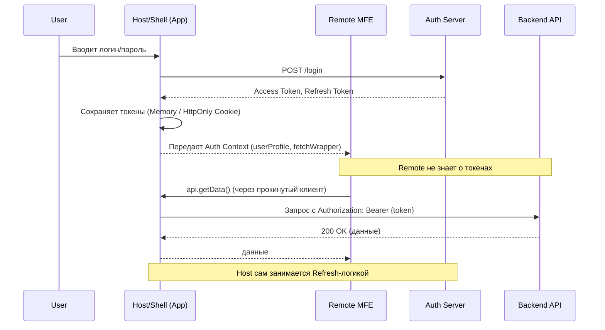

# Shared Authentication в микрофронтендах

## Что это и какую боль решаем

Когда приложение распиливается на микрофронтенды (MFE), возникает очевидная проблема: кто отвечает за логин пользователя и как независимые модули узнают, что пользователь авторизован? 

**Боль:** Если каждый микрофронтенд будет самостоятельно ходить за токенами, управлять процессом логина/логаута и реализовывать логику refresh-токенов, мы получим:
- Избыточное дублирование кода.
- Рассинхронизацию сессий (один микрофронтенд считает, что токен протух, другой — еще нет).
- Дыры в безопасности (токены расползаются по разным `localStorage` разных приложений).
- Ужасный UX (пользователя может выкинуть на страницу логина прямо в середине флоу внутри одного из микрофронтов).

**Суть Shared Authentication:** Выделение единой точки ответственности за аутентификацию (обычно это **Host/Shell-приложение** или выделенный платформенный модуль). Host авторизует пользователя, надежно хранит токены и предоставляет "чистый" контекст авторизации (информация о юзере, права, интерфейс для запросов) всем гостевым Remote-приложениям.

## Как это работает

В современных MFE-архитектурах предпочтение отдается делегированию сетевого слоя или управления состоянием наверх, в Host. 



## Примеры кода

### Антипаттерн: Каждый сам за себя
Remote-модуль сам лезет в `localStorage` и пытается управлять заголовками.
```typescript
// Remote/api.ts (Антипаттерн)
export const fetchUserData = async () => {
  // Remote жестко привязывается к механизму хранения токена
  const token = localStorage.getItem('access_token');
  
  const response = await fetch('/api/user', {
    headers: { Authorization: `Bearer ${token}` }
  });
  
  if (response.status === 401) {
    // Дублирование логики перенаправления на логин в КАЖДОМ микрофронте
    window.location.href = '/login'; 
  }
  
  return response.json();
};
```

### Как надо: Внедрение зависимостей через Shell
Shell предоставляет настроенный API-клиент или разделяемое состояние. Remote просто потребляет его.

**В Host-приложении (React + Module Federation):**
```tsx
// Host/App.tsx
import { AuthProvider } from './AuthContext';
import { apiGateway } from './api';
// Remote компонент
import Dashboard from 'dashboard/Dashboard';

const App = () => {
  return (
    // Провайдим состояние авторизации и преднастроенный http-клиент
    <AuthProvider client={apiGateway}>
      <Dashboard />
    </AuthProvider>
  );
};
```

**В Remote-приложении:**
```tsx
// Remote/Dashboard.tsx
import { useAuth } from 'host/AuthContext'; // Импортируем хук из хоста

const Dashboard = () => {
  // Remote вообще не знает, как устроен токен
  const { user, apiClient, logout } = useAuth();

  const handleFetch = async () => {
    // В apiClient уже вшиты интерсепторы для добавления токенов и refresh-логики
    const data = await apiClient.get('/dashboard-data');
    console.log(data);
  };

  if (!user) return <Loader />;

  return (
    <div>
      <h1>Привет, {user.name}</h1>
      <button onClick={handleFetch}>Загрузить данные</button>
      <button onClick={logout}>Выйти</button>
    </div>
  );
};
```

## Скрытые трейдоффы и границы применимости

1. **Coupling (Связность):** Передавая контекст или API-клиент из Host в Remote, вы создаете жесткий контракт. Если Host изменит интерфейс `apiClient`, сломаются все Remote. 
   *Решение:* Использовать строгие TypeScript-контракты в shared библиотеке (`@company/auth-core`), от которой зависят и Host, и Remote.

2. **Безопасность (Хранение токенов):** 
   - *LocalStorage:* Уязвимо к XSS. Если хотя бы один микрофронтенд притащит уязвимую библиотеку, токены утекут.
   - *HttpOnly Cookies:* Самый безопасный путь (BFF - Backend For Frontend паттерн). В этом случае фронтенд (ни Host, ни Remote) вообще не трогает токены. Браузер сам прикрепляет куки к запросам на один домен. Тогда "Shared Authentication" сводится просто к тому, чтобы Host один раз дернул эндпоинт `/api/me` и раздал `userProfile` по микрофронтам.

3. **Изолированная разработка (Standalone mode):** Если Remote жестко зависит от `useAuth` из Host, как его запускать локально разработчику?
   *Решение:* Remote должен иметь fallback-провайдер для локальной разработки, который мокает пользователя и API-запросы, либо оборачивать локальный запуск в мини-Host (Dev Sandbox).

4. **SSR (Server-Side Rendering):** Если микрофронтенды рендерятся на сервере (например, через Module Federation for Node.js), шаринг авторизации усложняется. Контекст запроса (cookie) должен быть аккуратно проброшен через серверный Host в серверные Remote при рендеринге страницы, чтобы Remote не срендерили "скелетоны" неавторизованного стейта.
