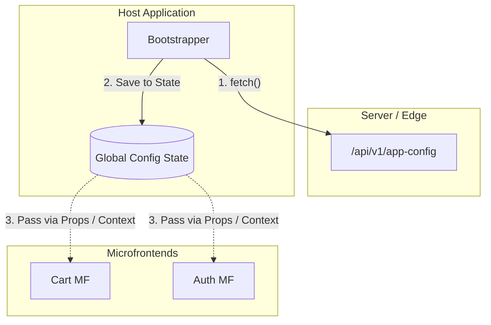

# Shared Configuration (Общая конфигурация)

В микрофронтендной архитектуре у каждого приложения может быть свой бэкенд, но существуют общие платформенные сущности, которые должны быть одинаковыми для всех:
- Базовый URL API Gateway (чтобы знать, куда слать запросы).
- Ключи систем аналитики (Google Analytics, Amplitude, Sentry).
- Текущая локаль пользователя (ru/en).
- Feature Flags (флаги фичей).

Если каждый микрофронтенд будет самостоятельно выкачивать эти настройки с бэкенда или, что еще хуже, хардкодить свои `.env` файлы при сборке, мы получим рассинхронизацию: "Каталог" шлет аналитику в один проект, а "Корзина" в другой; или при смене домена API придется пересобирать 15 репозиториев.

**Shared Configuration** решает эту проблему путем создания единого источника истины для конфигурации на уровне Host-приложения (Shell).

## Как это работает на практике

Host-приложение при инициализации (до рендеринга первого UI) скачивает манифест конфигурации с сервера. Затем оно передает этот конфиг всем дочерним микрофронтендам — либо инжектируя его в глобальный объект, либо через контекст React/Vue.



### Пример: Инициализация и прокидывание конфига (React)

**Антипаттерн**: В каждом микрофронтенде писать `process.env.REACT_APP_API_URL`. При смене среды (dev -> staging -> prod) придется пересобирать бандл каждого микрофронтенда.

**Правильное решение**: Внедрение Runtime Configuration Provider.

```jsx
// 1. Host Application: Загрузка конфига ДО старта приложения
let globalConfig = null;

async function bootstrap() {
  const res = await fetch('/api/runtime-config.json');
  globalConfig = await res.json();
  
  // Инициализация платформ (Sentry, Analytics)
  Sentry.init({ dsn: globalConfig.sentryDsn });

  const root = createRoot(document.getElementById('root'));
  root.render(
    // Провайдер, доступный всем вложенным MF
    <PlatformConfigProvider config={globalConfig}>
      <AppShell />
    </PlatformConfigProvider>
  );
}

bootstrap();

// --- 

// 2. Microfrontend: Использование конфига
// MF импортирует хук из общей библиотеки (@platform/core)
import { usePlatformConfig } from '@platform/core';

export function CartWidget() {
  const config = usePlatformConfig();
  
  const handleCheckout = () => {
    // Используем динамический URL из хоста
    fetch(`${config.apiGatewayUrl}/checkout`, { method: 'POST' });
  };

  return <button onClick={handleCheckout}>Купить</button>;
}
```

## Неочевидные нюансы и трейдоффы

1. **Blocking Request**: Загрузка конфига в `bootstrap()` блокирует отрисовку ВСЕГО приложения. Если запрос висит 2 секунды, юзер видит белый экран. Решение: встраивать `runtime-config.json` прямо в `index.html` силами сервера или Nginx (Server-Side Injection) в виде `<script>window.__PLATFORM_CONFIG__ = {...}</script>`.
2. **Безопасность (Secrets)**: Никогда не передавайте секретные токены (например, ключи AWS или JWT бэкенда) в Shared Configuration. Всё, что попадает в конфиг фронтенда, публично доступно в DevTools браузера. Конфиг фронтенда должен содержать только *публичные* идентификаторы.
3. **Версионирование контракта конфига**: Если Host-приложение переименует ключ `apiGatewayUrl` в `gatewayUrl`, микрофронтенды, которые еще не обновились, упадут. Конфигурация является неявным контрактом, поэтому требует строгой обратной совместимости (никогда не удалять старые ключи, пока все MF не мигрируют).
4. **Конфиг по умолчанию (Fallbacks)**: Если микрофронтенд запускается в режиме локальной разработки (Standalone), у него нет Host-приложения, которое передаст ему конфиг. Поэтому хук `usePlatformConfig` должен уметь возвращать дефолтные `localhost` значения для dev-окружения.
