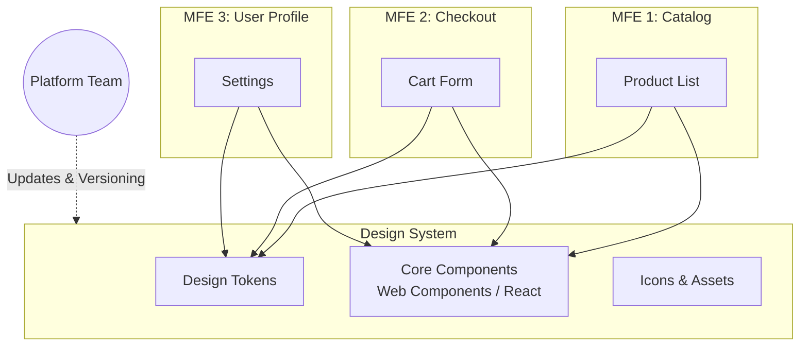

# Shared Design System в микрофронтендах

В мире монолитов консистентность UI достигается относительно легко — все живут в одной кодовой базе. Но когда продукт разбивается на десяток независимых микрофронтендов (MFE), разрабатываемых разными командами, возникает риск создать «франкенштейна». Кнопки разного оттенка синего, отличающиеся отступы и разное поведение модальных окон — всё это разрушает пользовательский опыт. 

**Shared Design System (Общая дизайн-система)** — это платформенное решение, единый источник истины для UI, который предоставляет всем микрофронтендам общие токены (цвета, шрифты, отступы), компоненты и гайдлайны. Она возвращает визуальную целостность в распределенную архитектуру.

## Как это работает

В микрофронтенд-архитектуре дизайн-система обычно выделяется в отдельный пакет (или набор пакетов) и поставляется командам как зависимость. Важно, чтобы дизайн-система была максимально изолирована и не тянула за собой бизнес-логику.



### Два пути реализации:
1. **Framework-specific (например, React-UI):** Идеально, если все MFE написаны на одном фреймворке. Обеспечивает лучший Developer Experience и типизацию.
2. **Framework-agnostic (Web Components):** Оправдано, если в компании зоопарк технологий (React, Vue, Angular). Гарантирует, что компонент кнопки будет работать везде, но интеграция с фреймворками (особенно с React) может требовать написания оберток.

## Пример кода: Как надо и Антипаттерн

**Как надо:** Использование дизайн-токенов и готовых компонентов. Команда MFE фокусируется на бизнес-фичах.

```tsx
// ✅ MFE: Используем только публичный API дизайн-системы
import { Button, Card, ThemeProvider } from '@platform/design-system';

export const CheckoutWidget = () => (
  <Card padding="large" elevation="medium">
    <h2>Оформление заказа</h2>
    {/* Цвета и типографика зашиты внутри */}
    <Button variant="primary" size="large">
      Оплатить
    </Button>
  </Card>
);
```

**Антипаттерн:** Локальное переопределение стилей. Это ломает консистентность и делает невозможным безболезненный редизайн (например, смену темы с помощью токенов).

```tsx
// ❌ MFE: Жесткое переопределение стилей (CSS override)
import { Button } from '@platform/design-system';
import './checkout-hacks.css'; 

export const CheckoutWidget = () => (
  // Класс .ds-button переопределяется в checkout-hacks.css
  <Button className="checkout-custom-button" style={{ borderRadius: '0px', backgroundColor: 'red' }}>
    Оплатить
  </Button>
);
```

## Трейдоффы и границы применимости

Внедрение общей дизайн-системы — это не только технический, но и организационный вызов.

- **Versioning Hell (Ад версионирования):** Если MFE-1 использует `ds-button@v1`, а MFE-2 обновился до `ds-button@v2`, на одной странице могут отрендериться визуально разные компоненты (и загрузиться два бандла дизайн-системы). *Решение:* Строгий governance, Module Federation для runtime-доставки критичных компонентов или Peer Dependencies.
- **Узкое бутылочное горлышко (Bottleneck):** Продуктовым командам нужен новый компонент прямо сейчас, а платформенная команда дизайн-системы сможет взять его в спринт только через месяц. *Решение:* Модель внутреннего Open Source (InnerSource), где команды MFE могут контрибьютить в дизайн-систему, или создание локального компонента с последующим рефакторингом и переносом в общую библиотеку.
- **Размер бандла:** Дизайн-система может раздуться, если не поддерживается строгий tree-shaking. Каждый MFE рискует утащить к себе мегабайты неиспользуемых иконок и сложных компонентов.

## Резюме
Shared Design System — это обязательный элемент платформы при масштабировании микрофронтендов. Без нее вы получите не интегрированный продукт, а набор разрозненных виджетов. Однако успех кроется не столько в коде компонентов, сколько в правилах их версионирования, дистрибуции и процессах взаимодействия между командами.
