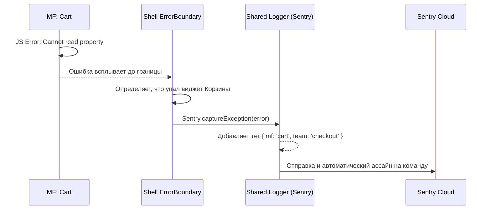

# Shared Observability (Мониторинг и логирование)

В монолите найти виновника ошибки легко: багтрекер (например, Sentry) показывает стек-трейс, ведущий в компонент `CartPage.tsx`, и тикет летит в команду Корзины. В микрофронтендах на одной странице (в одном браузере) работают 5 разных приложений от 5 разных команд. Если в браузере падает `TypeError: undefined is not a function`, в Sentry летит алерт. **Чей это алерт?** Кто дежурит ночью? Без правильного Shared Observability тикет упадет в платформенную команду (Host), которая будет часами разбираться, чей бандл вызвал ошибку.

**Shared Observability** — это платформенный механизм, который автоматически тегирует логи, ошибки и метрики (Core Web Vitals) идентификатором микрофронтенда, в котором они произошли.

## Как это работает на практике

Host-приложение инициализирует глобального клиента мониторинга. Когда микрофронтенд монтируется в DOM или перехватывает ошибку, он обогащает глобальный контекст логгера своим тегом (или создает изолированный child-инстанс логгера).



### Пример: Тегирование ошибок в React

**Антипаттерн**: Каждая команда импортирует свой пакет `@sentry/browser`, вызывает `Sentry.init` со своим DSN. В браузере можно инициализировать Sentry только один раз. Вторая инициализация затрет первую или приведет к конфликтам перехватчиков глобальных ошибок (`window.onerror`).

**Правильное решение**: Host-приложение предоставляет обертку ErrorBoundary или логгер-фасад, который проставляет теги.

```jsx
// @platform/core (Библиотека, поставляемая платформенной командой)
import * as Sentry from '@sentry/react';

// Умный ErrorBoundary, который тегирует ошибки
export function MicrofrontendErrorBoundary({ mfName, children, fallback }) {
  return (
    <Sentry.ErrorBoundary
      fallback={fallback}
      beforeCapture={(scope) => {
        // Привязываем ошибку к конкретному микрофронтенду!
        scope.setTag('microfrontend', mfName);
        scope.setTag('routing_domain', window.location.pathname);
      }}
    >
      {children}
    </Sentry.ErrorBoundary>
  );
}

// MF: Catalog (Код команды Каталога)
import { MicrofrontendErrorBoundary } from '@platform/core';

export default function CatalogEntry() {
  return (
    <MicrofrontendErrorBoundary mfName="catalog-app">
      <ProductList />
    </MicrofrontendErrorBoundary>
  );
}
```

## Неочевидные нюансы и трейдоффы

1. **Глобальные ошибки (Uncaught Promise Rejections)**: Если ошибка произошла внутри `setTimeout` или асинхронного `fetch`, она обойдет `ErrorBoundary` React'а и попадет в глобальный обработчик `window.onerror`. Понять, какой микрофронтенд вызвал `setTimeout`, практически невозможно. Единственный костыль — парсить стек-трейс и искать имена бандлов (напр., `cart.hash.js`), чтобы определить владельца.
2. **Performance Monitoring (Web Vitals)**: В MF сложно замерять метрику LCP (Largest Contentful Paint). LCP измеряет самую большую картинку или текст на экране. Если Host отрендерился за 100мс (показав скелетон), а тяжелый MF Каталога загрузил картинку через 3 секунды, LCP будет 3с. Метрика плохая, но виноват Каталог, а не Host. Платформе нужно уметь атрибутировать метрики производительности к конкретным MF.
3. **Объем логов (Noise)**: Если включен трейсинг (Session Replay, Network tracing), один MF с багом "бесконечный рендер" может выжрать весь лимит квот (денег) всей компании в Sentry за час. Host должен внедрять Rate Limiting на уровне Shared Logger'а.
4. **Слепые зоны**: Изолированные iframe легко логировать (у них свой контекст), но сложно связать с сессией родительского окна (нужно прокидывать SessionID внутрь).
