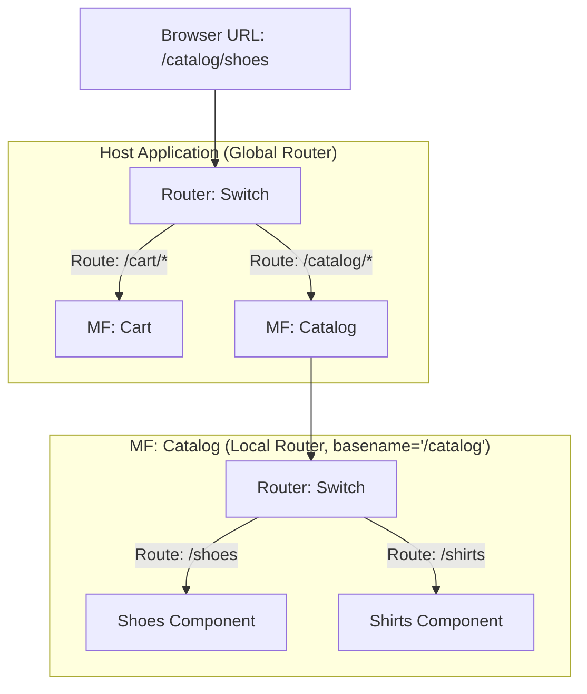

# Shared Routing (Общий роутинг)

В одностраничном приложении (SPA) роутинг — это то, что связывает URL в браузере с отображаемыми компонентами. В микрофронтендах роутинг становится одной из самых сложных архитектурных задач: 
Если Host-приложение отвечает за маршрутизацию верхнего уровня (`/catalog` -> отрендерить MF Каталога), то что происходит, когда сам MF Каталога имеет внутренние страницы (`/catalog/shoes`, `/catalog/shirts`)? А если из MF Каталога нужно программно перейти в Корзину (`/cart`)? 

**Shared Routing** определяет, кто владеет объектом History браузера и как микрофронтенды синхронизируют свой локальный роутинг с глобальным URL.

## Как это работает на практике

Используется двухуровневая маршрутизация:
1. **Global Router (Host)**: Смотрит на первый сегмент пути (`/catalog/*`) и монтирует нужный микрофронтенд.
2. **Local Router (Microfrontend)**: Монтируется внутри своего префикса (basename) и управляет вложенными путями (`/shoes`, `/shirts`).



### Пример: Настройка роутинга в React (React Router v6)

**Антипаттерн**: Использовать `BrowserRouter` и в Host-приложении, и внутри микрофронтендов. Они начнут бороться за объект `window.history`, дублировать записи в истории (кнопка "Назад" сломается) и вызывать бесконечные циклы рендеринга.

**Правильное решение**: Host использует `BrowserRouter`, а микрофронтенды не инстанцируют свой провайдер истории, либо используют `MemoryRouter` (если нужно полностью скрыть пути от URL), либо интегрируются в существующий роутер Host'а через пропс `basename`.

```jsx
// Host Application (Shell)
import { BrowserRouter, Routes, Route } from 'react-router-dom';

function ShellApp() {
  return (
    <BrowserRouter>
      <Routes>
        {/* Делегируем управление путями /catalog/* микрофронтенду Каталога */}
        <Route path="/catalog/*" element={<RemoteCatalog basename="/catalog" />} />
        <Route path="/cart/*" element={<RemoteCart basename="/cart" />} />
      </Routes>
    </BrowserRouter>
  );
}

// Microfrontend: Catalog
// Каталог принимает basename и настраивает свои локальные пути относительно него
import { Routes, Route } from 'react-router-dom';

export default function CatalogEntry({ basename }) {
  // Важно: Каталог не оборачивает себя в <BrowserRouter>!
  // Он переиспользует контекст роутинга, предоставленный Host-ом.
  return (
    <Routes>
      <Route path="/" element={<CatalogHome />} />
      <Route path="/shoes" element={<ShoesCategory />} />
    </Routes>
  );
}
```

## Неочевидные нюансы и трейдоффы

1. **Кросс-навигация (Из MF в MF)**: Если MF Каталога хочет редиректнуть юзера в Корзину (`/cart`), он не может использовать обычный `<Link to="/cart">`, так как локальный роутер попытается перейти по пути `/catalog/cart` (относительно своего basename). Приходится либо использовать нативный `window.location.href = '/cart'` (что вызывает жесткую перезагрузку страницы!), либо платформенная команда должна предоставить глобальный объект навигации (например, EventBus: `dispatch(navigate('/cart'))`).
2. **Две технологии роутинга**: Если Host написан на React (React Router), а MF на Vue (Vue Router), передать контекст роутинга напрямую невозможно. В таком случае приходится синхронизировать локальный `MemoryRouter` Vue-приложения с глобальным `window.history` через слушатели событий `popstate`. Это называется "Routing Sync" и является крайне хрупким механизмом.
3. **404 Not Found**: Кто рисует 404? Если юзер ввел `/catalog/unknown`, Host передает управление Каталогу, но Каталог не знает такого маршрута. Каталог должен отрендерить *свою* локальную страницу 404, либо выбросить событие наверх, чтобы Host отрендерил глобальную красивую 404.
4. **Ленивая загрузка**: При навигации по микрофронтендам вы часто сталкиваетесь с паузами, когда загружается JS-бандл следующего MF. Host-роутер должен уметь показывать `Suspense` (лоадер) не ломая текущую страницу до загрузки новой.
