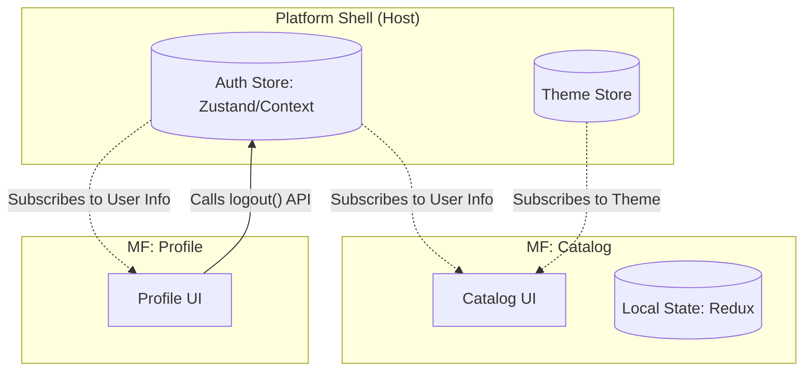

# Shared State (Общее состояние)

Главное правило микрофронтендов (MF) звучит так: **Никакого общего состояния (Shared State)**. Как только два микрофронтенда начинают зависеть от единого древа данных в памяти (например, от одного большого Redux-стора), они теряют независимость. Изменение структуры данных одним приложением немедленно ломает другое. Это называется *Tight Coupling* (тесная связность).

Но на практике 100% изоляция невозможна. Есть глобальные сущности, которые нужны абсолютно всем приложениям на странице:
- **Сессия пользователя** (id, имя, аватарка, права доступа / роли).
- **Тема оформления** (Dark/Light).
- **Общие корзины** (иконка в шапке должна знать количество товаров).

**Shared State** в MF — это искусство передачи минимально необходимого объема данных между независимыми системами без жесткой привязки к библиотекам управления состоянием.

## Как это работает на практике

Host-приложение (или специальный Core-MF) становится владельцем (Owner) глобального стейта. Остальные микрофронтенды выступают в роли потребителей (Consumers), которые подписываются на изменения, но не мутируют стейт напрямую, а отправляют запросы (Intent / Events) владельцу.



### Пример: Использование легковесных сторов (Zustand / RxJS)

**Антипаттерн**: Создавать гигантский Redux Store в Host-приложении и заставлять микрофронтенды "инжектить" (inject) туда свои редьюсеры в рантайме. Это невероятно сложно настроить (особенно асинхронную подгрузку редьюсеров) и это намертво привязывает всех к Redux.

**Правильное решение**: Host предоставляет абстрактный реактивный контракт (например, хуки, основанные на Zustand, RxJS или просто `EventTarget`). Микрофронтенды используют этот контракт, а свои бизнес-данные хранят в *своих* изолированных сторах (Redux, MobX, React Query).

```jsx
// @platform/store (Пакет, который шарится через Module Federation)
import create from 'zustand';

// Host владеет этим стором.
export const useAuthStore = create((set) => ({
  user: null,
  isAuthenticated: false,
  login: (userData) => set({ user: userData, isAuthenticated: true }),
  logout: () => set({ user: null, isAuthenticated: false }),
}));

// ---

// MF: Catalog
import { useAuthStore } from '@platform/store';

export function ProductList() {
  // Микрофронтенд просто подписывается на селектор глобального стора.
  // Если Host обновит user, компонент перерендерится.
  const { user, isAuthenticated } = useAuthStore(state => ({ 
    user: state.user, 
    isAuthenticated: state.isAuthenticated 
  }));

  if (!isAuthenticated) return <div>Пожалуйста, войдите, чтобы увидеть цены</div>;

  return <div>Привет, {user.name}! Вот товары: ...</div>;
}
```

## Неочевидные нюансы и трейдоффы

1. **Владелец данных (Data Ownership)**: Если MF Корзины и MF Шапки используют данные корзины, кто является владельцем? Правило: Владельцем должен быть *только один* MF (обычно Корзина). Если Корзина еще не загрузилась на странице (Lazy Loading), Шапка не знает, сколько там товаров. Приходится выносить стейт корзины на уровень платформы (что плохо) либо делать предзапрос на бэкенд из Шапки (что лучше).
2. **Синхронизация через LocalStorage**: Иногда лучший Shared State — это его отсутствие в памяти JS. Если MF A записывает JWT токен в LocalStorage, а MF B его оттуда читает, они делят состояние через браузер. Это надежно, фреймворк-агностик, но не реактивно (нужно слушать событие `storage`).
3. **Версионирование контракта**: Если вы экспортируете глобальный стор как NPM-пакет или MF-модуль, форма объекта (TypeScript интерфейс) становится контрактом. Если Host удалит поле `user.avatar_url`, старые MF упадут. Расширять глобальный стейт можно только обратно-совместимо.
4. **Проблема Фреймворков**: Zustand/React Context отлично работают, если всё написано на React. Если вы смешиваете React и Angular, вам придется опускаться до нативных `CustomEvent` (Event Bus) или паттерна Наблюдатель (RxJS), чтобы реактивность работала между границами фреймворков.
