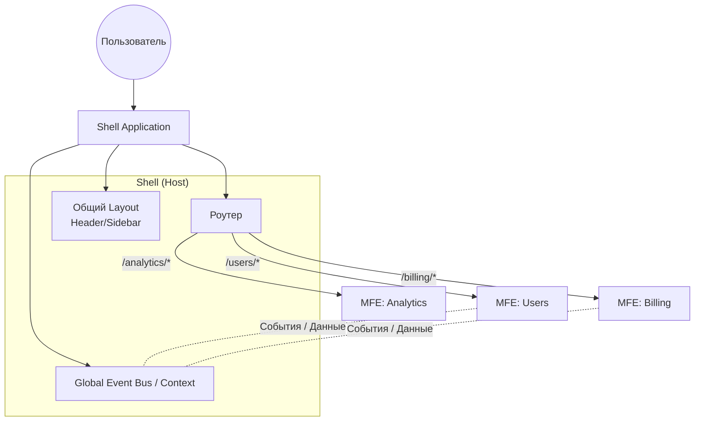

# Shell Application (App Shell)

Shell Application — это «хост» или приложение-контейнер в микрофронтенд-архитектуре, которое выступает единой точкой входа для пользователя. Оно не содержит бизнес-логики, но отвечает за оркестрацию независимых микроприложений (Microfrontends).

## Какую боль решаем?

Когда над продуктом работают десятки автономных команд, их код неизбежно фрагментируется. Без Shell-приложения переход между доменами команд означал бы жесткие перезагрузки страницы (переходы по обычным ссылкам между разными монолитами). 

Shell решает эту проблему, склеивая разрозненные куски в единый, бесшовный Single Page Application (SPA) опыт. Он предоставляет общий каркас: навигацию, шапку, сайдбар, систему авторизации — и загружает нужный микрофронтенд в контентную область в зависимости от текущего URL.

## Как это работает?

В момент загрузки пользователь получает минимальный HTML и скрипты Shell-приложения. Shell инициализирует глобальные сервисы, проверяет сессию пользователя и смотрит на текущий роут. Затем, часто с помощью технологий вроде Webpack Module Federation или Import Maps, Shell динамически скачивает и монтирует («mount») код соответствующего микрофронтенда. 



## Примеры кода

### ✅ Как надо (Dumb Shell)

Идеальный Shell — это просто роутер и лэйаут. Он ничего не знает о внутренней структуре микрофронтендов, а лишь делегирует им контроль над определенным префиксом URL.

```tsx
import React, { Suspense } from 'react';
import { BrowserRouter, Routes, Route } from 'react-router-dom';
import { AppLayout, Spinner } from '@platform/ui';

// Ленивая загрузка микроприложений через Module Federation
const UsersApp = React.lazy(() => import('users_mfe/App'));
const BillingApp = React.lazy(() => import('billing_mfe/App'));

export const Shell = () => {
  return (
    <BrowserRouter>
      <AppLayout>
        <Suspense fallback={<Spinner size="large" />}>
          <Routes>
            {/* Shell отдает управление роутингом внутри /users самому MFE */}
            <Route path="/users/*" element={<UsersApp />} />
            <Route path="/billing/*" element={<BillingApp />} />
          </Routes>
        </Suspense>
      </AppLayout>
    </BrowserRouter>
  );
};
```

### ❌ Антипаттерн (Fat Shell)

Худшее, что можно сделать — начать прокидывать бизнес-данные, коллбэки и специфичный стейт из Shell в микрофронтенды. Это создает жесткую связанность (tight coupling).

```tsx
// АНТИПАТТЕРН: Shell знает слишком много
const Shell = () => {
  // Shell держит стейт, который нужен только биллингу
  const [invoices, setInvoices] = useState([]); 
  
  return (
    <Routes>
      {/* При изменении API микрофронтенда придется деплоить Shell! */}
      <Route 
        path="/billing/*" 
        element={<BillingApp invoices={invoices} onPay={handlePayment} />} 
      />
    </Routes>
  );
};
```

## Трейдоффы и границы применимости

- **Единая точка отказа (SPOF):** Если Shell сломался или упал при деплое, пользователь не увидит ни один микрофронтенд. Shell должен быть максимально стабильным, легковесным и редко деплоиться.
- **Dependency Hell:** Часто Shell предоставляет «общие» зависимости (React, UI-kit) через shared scope (в Module Federation). Если MFE требует несовместимую версию React, начнутся конфликты или дублирование бандлов, бьющее по производительности.
- **Где ломается:** Парадигма ломается, если микрофронтендам нужно слишком тесно общаться друг с другом (например, сложный drag-and-drop элементов из одного MFE в другой). В таких случаях Shell превращается в огромную шину данных, что убивает автономность команд.

Shell Application — это дирижер. Он должен задавать темп и показывать, кому играть, но ни в коем случае не пытаться играть на инструментах за самих музыкантов.
