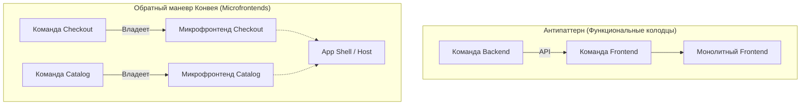

# Закон Конвея в контексте Microfrontends

## Суть концепции
В 1967 году Мелвин Конвей сформулировал наблюдение, ставшее краеугольным камнем современной архитектуры: 
> *"Организации проектируют системы, которые копируют структуру коммуникаций в этой организации."*

В контексте фронтенда это означает: если над одним огромным монолитным SPA (Single Page Application) работают три разные команды, их код неизбежно переплетется, релизные циклы начнут блокировать друг друга, а архитектура превратится в спагетти. **Боль, которую мы решаем** микрофронтендами — это не столько техническая проблема размера бандла, сколько проблема масштабирования команд и независимости их поставок.

Для решения этой боли применяется **Обратный маневр Конвея (Inverse Conway Maneuver)**: мы сначала проектируем желаемую архитектуру (независимые микрофронтенды), а затем реорганизуем команды так, чтобы они соответствовали этой архитектуре (кросс-функциональные фиче-команды).

## Как это работает

Закон Конвея диктует, что границы модулей в коде должны совпадать с границами ответственности команд. 



## Примеры: Антипаттерн vs Хорошая практика

**Антипаттерн: Разделение по технологиям (Horizontal Slicing)**
Когда команды делятся на "фронтендеров" и "бэкендеров", фронтенд неизбежно становится монолитом, зависящим от всех бэкенд-сервисов. Любая новая фича требует координации между командами.

```javascript
// Антипаттерн: Монолитный стор, которым "владеют" все команды сразу
const globalStore = {
  catalog: { /* логика команды A */ },
  checkout: { /* логика команды B */ },
  user: { /* логика команды C */ }
};
// Изменение в checkout может сломать catalog из-за неявных связей
```

**Как надо: Вертикальные срезы (Vertical Slicing)**
Кросс-функциональная команда (BFF, Frontend, QA, Product) полностью владеет бизнес-доменом от базы данных до UI-компонента.

```javascript
// Хорошая практика: Изолированный микрофронтенд (Module Federation)
// Команда Checkout экспортирует только готовый бизнес-компонент,
// скрывая внутренний стейт и логику.
export const CheckoutWidget = ({ orderId, onComplete }) => {
  // Вся логика, стейт и работа с API инкапсулированы внутри
  return <CheckoutProvider id={orderId}><UI /></CheckoutProvider>;
};
```

## Трейдоффы и границы применимости

Закон Конвея неумолим, и разделение на микрофронтенды приносит свои компромиссы:

1. **Дублирование vs Связность:** Изолированные команды могут писать один и тот же код (например, UI-компоненты). Попытка создать "общую библиотеку компонентов" часто приводит к появлению "Команды Дизайн Системы", которая становится узким горлышком.
2. **Накладные расходы на инфраструктуру:** Каждой команде нужен свой CI/CD, свой мониторинг и свои процессы деплоя. Без сильной Frontend Platform команды утонут в DevOps-задачах.
3. **Размер компании:** Микрофронтенды (и применение маневра Конвея) — это инструмент для крупных организаций (от 3-4 независимых команд на фронтенде). Для стартапа из 5 человек попытка внедрить микрофронтенды приведет к архитектурному оверхеду без реальной пользы.

**Итог:** Архитектура фронтенда — это отражение вашего штатного расписания. Если вы хотите независимые релизы микрофронтендов, вам придется дать командам полную автономию, даже ценой дублирования кода.
