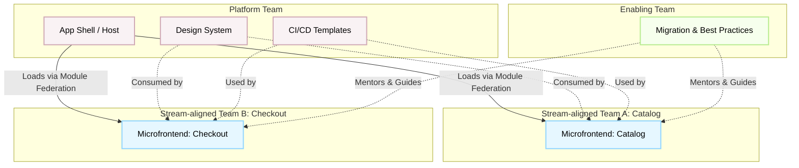

# Team Topologies в микрофронтендах

Любая микрофронтенд-архитектура — это, в первую очередь, архитектура *людей*, а уже потом — кода. Если вы пилите микрофронтенды, но команды сидят в одном репозитории, ждут апрува от лида соседнего отдела и релизят всё раз в месяц единым поездом — вы просто усложнили себе жизнь сборщиком. 

**Team Topologies** (Топологии команд) — это концепция организации инженерных команд, которая идеально ложится на микросервисы и микрофронтенды. Она решает главную боль: **как масштабировать разработку так, чтобы разработчики не наступали друг другу на ноги.**

## Какую боль решаем?

В монолитном фронтенде или при неправильной нарезке микрофронтендов:
1. **Размытая ответственность:** Страница чекаута упала. Кто виноват? Команда корзины? Команда платежей? Команда UI-кита?
2. **Бесконечные синхронизации:** Чтобы выкатить фичу, нужно согласовать релиз с тремя другими командами.
3. **Высокая когнитивная нагрузка:** Разработчику нужно понимать, как работает весь исполинский фронтенд, чтобы безопасно поменять одну кнопку.

Закон Конвея гласит: *"Организации проектируют системы, которые копируют структуру коммуникаций в этой организации"*. Если мы хотим независимые, слабо связанные микрофронтенды (систему), нам нужны независимые, слабо связанные команды (структура).

## Как это работает: 4 типа команд

В контексте Frontend Platform и микрофронтендов мы чаще всего оперируем следующими типами команд:

1. **Stream-aligned team (Продуктовая / Доменная команда)**
   * **Суть:** Владеет конкретным бизнес-доменом (E2E) от бэкенда до фронтенда (например, "Поиск и Каталог", "Чекаут").
   * **В микрофронтендах:** Они разрабатывают, тестируют и деплоят свои собственные микрофронтенды. Они полностью автономны в рамках своего домена.
2. **Platform team (Платформенная команда)**
   * **Суть:** Предоставляет внутренние инструменты как продукт (XaaS). Снижает когнитивную нагрузку продуктовых команд.
   * **В микрофронтендах:** Отвечают за App Shell (контейнер), настройку Module Federation/Single-SPA, CI/CD пайплайны для фронтенда, Design System (UI-kit) и базовые утилиты (логирование, мониторинг).
3. **Enabling team (Команда поддержки / интеграции)**
   * **Суть:** Эксперты, которые помогают Stream-aligned командам освоить новые инструменты или практики.
   * **В микрофронтендах:** Помогают переехать со старого монолита на микрофронтенды, обучают работе с новой архитектурой, но *не пишут фичи за продуктовые команды*.
4. **Complicated-subsystem team (Команда сложной подсистемы)**
   * **Суть:** Узкие специалисты.
   * **В микрофронтендах:** Редкость, но это может быть команда, пилящая сложный WebGL-редактор или тяжелый видеоплеер, который подключается как микрофронтенд в разные части приложения.

## Наглядная архитектура взаимодействия



## Примеры из жизни: Как надо и как не надо

Главное правило независимых команд — отсутствие сильного зацепления (coupling) на уровне кода.

### Антипаттерн: Жёсткое связывание между командами
Команда Checkout импортирует состояние прямо из кишок микрофронтенда команды Catalog.
```typescript
// ❌ АНТИПАТТЕРН: Checkout MFE (Team B)
// Завязываемся на внутреннюю структуру чужого микрофронтенда
import { useCartStore } from '@app/catalog-mfe/src/store/cart';

function CheckoutButton() {
  const cartItems = useCartStore(state => state.items);
  // Если команда Каталога перепишет store (например, с Redux на Zustand), 
  // Чекаут сломается, релиз заблокирован.
  return <button>Pay {cartItems.length} items</button>;
}
```

### Паттерн: Общение через контракты Платформы (Event Bus или Shared API)
Платформенная команда предоставляет шину событий или глобальный контекст. Команды не знают о внутренностях друг друга.
```typescript
// ✅ ПАТТЕРН: Checkout MFE (Team B)
// Общение через изолированные контракты (CustomEvents)
import { useEffect, useState } from 'react';

function CheckoutButton() {
  const [itemsCount, setItemsCount] = useState(0);

  useEffect(() => {
    // Слушаем агностичный ивент, который кидает Catalog MFE
    const handler = (e: CustomEvent) => setItemsCount(e.detail.count);
    window.addEventListener('platform:cart:updated', handler as EventListener);
    return () => window.removeEventListener('platform:cart:updated', handler as EventListener);
  }, []);

  return <button>Pay {itemsCount} items</button>;
}
```

## Трейдоффы и границы применимости

Не стоит слепо делить людей на независимые команды, не учитывая контекст. У такого подхода есть своя цена:

1. **Дублирование усилий и кода:** Так как команды независимы, они могут решать одни и те же проблемы (например, валидация форм) по-разному. *Платформенная команда должна вовремя это замечать и выносить в общие библиотеки, но это баланс, который сложно найти.*
2. **Франкенштейн UI:** Если нет жесткой дизайн-системы, продукт будет выглядеть так, будто его собирали разные люди (потому что так и есть). Отступы в Каталоге будут 16px, а в Чекауте — 15px.
3. **Integration Testing Hell:** Команды тестят свои микрофронтенды изолированно. Но в продакшене они собираются в App Shell. Появляется риск, что новая версия `Catalog MFE` ломает `Checkout MFE` из-за конфликта стилей или глобальных переменных. Нужны мощные E2E тесты на уровне Платформы.
4. **Оверхед для небольших компаний:** Если у вас 5-10 фронтендеров, вам не нужны Team Topologies и микрофронтенды. Вы просто убьете время на инфраструктуру вместо того, чтобы поставлять фичи. Это инструмент для масштабирования (50+ фронтендеров, 4+ независимых стрима).
