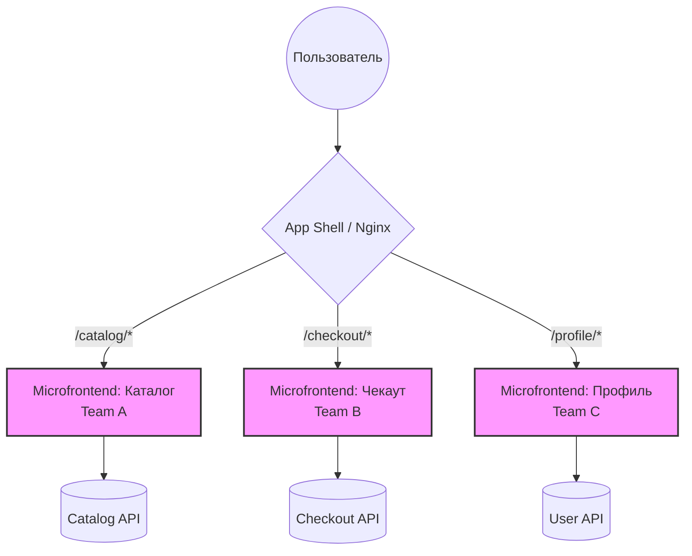

# Вертикальные Microfrontends

## Суть концепции: Инженерная история

Когда Single Page Application (SPA) разрастается до мегабайтов JS-кода, а релизный цикл начинает блокироваться из-за зависимостей между десятками команд, единый монолит становится обузой. Вертикальные микрофронтенды — это способ решить боль масштабирования *организации*. 

Вместо того чтобы разрабатывать один гигантский клиент, мы разрезаем приложение «вертикально» по бизнес-доменам. Каждая команда владеет своей частью приложения end-to-end (от базы данных до UI) и отвечает за конкретный изолированный пользовательский путь (например, Каталог, Корзина, Профиль пользователя). 

Главное отличие вертикального сплита от горизонтального: **в один момент времени на экране работает только один микрофронтенд**. Пользователь просто перемещается между разными "приложениями" под капотом одного продукта.

## Как это работает

Пользователь переходит по URL. Роутер верхнего уровня определяет, какому микрофронтенду принадлежит этот URL, и передает ему управление. Это может быть реализовано жестко (через Nginx и перезагрузку страницы) или мягко (через тонкий App Shell на клиенте, загружающий микрофронтенды динамически).



## Примеры реализации

### Как надо: Изолированный роутинг через App Shell

Идеальный вариант — когда App Shell ничего не знает о бизнес-логике. Он лишь отвечает за роутинг, глобальный Layout (шапка/футер из дизайн-системы) и передачу базового контекста (например, сессии).

```javascript
// App Shell роутер (Пример с React и Module Federation)
import React, { Suspense } from 'react';
import { BrowserRouter, Route, Switch } from 'react-router-dom';
import { Header } from '@company/ui-core';

// Загружаем микрофронтенды как удаленные бандлы
const CatalogApp = React.lazy(() => import('catalog/App'));
const CheckoutApp = React.lazy(() => import('checkout/App'));

export const AppShell = () => (
  <BrowserRouter>
    <Header />
    <Suspense fallback={<div className="spinner" />}>
      <Switch>
        {/* Передаем управление приложению Каталога */}
        <Route path="/catalog" component={CatalogApp} />
        {/* Передаем управление приложению Чекаута */}
        <Route path="/checkout" component={CheckoutApp} />
      </Switch>
    </Suspense>
  </BrowserRouter>
);
```

### Антипаттерн: Общий State Manager

Худшее, что можно сделать при вертикальном разделении — это попытаться расшарить глобальное состояние (например, Redux Store) между независимыми микрофронтендами. Это мгновенно убивает идею независимых релизов.

```javascript
// ❌ АНТИПАТТЕРН: Жесткая связность через глобальный стейт
import { rootReducer } from 'shared-core'; 
import catalogReducer from 'catalog/reducer';
import checkoutReducer from 'checkout/reducer';

// App Shell вынужден импортировать логику (редьюсеры) из всех микрофронтендов.
// Любое изменение контракта в стейте Каталога может сломать Чекаут.
const store = createStore(combineReducers({
  core: rootReducer,
  catalog: catalogReducer, 
  checkout: checkoutReducer
}));
```

*Как нужно:* Передавать состояние через URL (query params), `localStorage` / `sessionStorage`, или, что надежнее, синхронизировать данные через бэкенд (сохранили в корзину -> перешли в чекаут -> чекаут сам запросил корзину у API).

## Скрытые трейдоффы и границы применимости

**Где применимо:**
- Крупные E-commerce, SaaS-платформы, банковские приложения с четко выраженными пользовательскими сценариями.
- Организации, масштабирующиеся по модели кросс-функциональных продуктовых команд, где команда полностью автономна и владеет доменом от БД до кнопки.

**Где ломается (Трейдоффы):**
1. **Разрывы UX (UX Discontinuity):** Команды разрабатывают независимо. Если они разойдутся в версиях компонентов дизайн-системы, пользователь сразу заметит, что "Каталог" и "Профиль" выглядят как два разных сайта. Требуется строгая дисциплина работы с UI-kit.
2. **Производительность переходов (Cold Starts):** При навигации между доменами браузеру нужно загрузить новый JS-бандл. Если общие библиотеки (React, lodash) не вынесены в `shared` (например, через Webpack Module Federation), пользователь будет скачивать их заново каждый раз.
3. **Сложность обмена данными:** Вертикалям трудно "общаться". Если им нужны одни и те же данные, им приходится использовать API или Custom Events в браузере, что увеличивает когнитивную нагрузку на разработчиков.

**Итог:** Вертикальные микрофронтенды — это архитектурный паттерн для решения *коммуникационных проблем людей*, а не проблем производительности кода. Применяйте их, когда цена координации между командами при релизе монолита начинает превышать издержки на поддержку инфраструктуры микрофронтендов.
