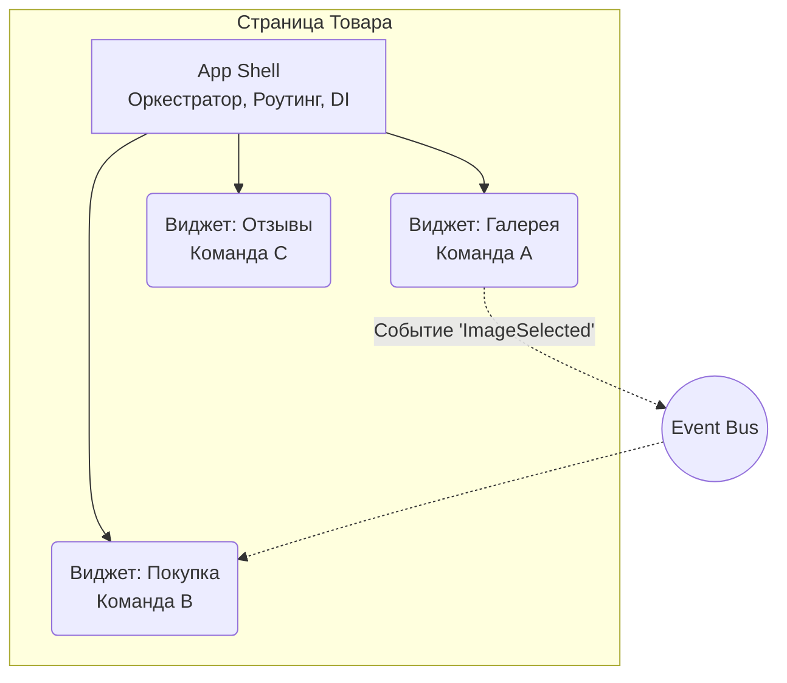

# Горизонтальные Microfrontends

Горизонтальные микрофронтенды — это архитектурный паттерн, при котором один пользовательский интерфейс (например, страница или экран) композируется из множества независимых фрагментов, за каждый из которых отвечает своя кросс-функциональная команда.

В отличие от *вертикального* разделения (где команда владеет целым разделом приложения, например, всем роутом `/checkout`), горизонтальное разделение дробит интерфейс на уровне виджетов. Страница товара в e-commerce может состоять из виджета галереи (Команда А), блока цены и корзины (Команда B) и блока отзывов (Команда C).

## Какую боль мы решаем?

Представьте огромный портал (например, банковский дашборд), над которым работает 10 разных команд. В монолите это приводит к постоянным merge conflict-ам, тяжеловесным CI/CD пайплайнам и "поездам релизов", где баг в корзине блокирует релиз новой фичи в отзывах. 

Горизонтальные микрофронтенды возвращают автономность: каждая команда может деплоить свой виджет независимо, используя свой стек (в разумных пределах) и свои циклы релизов, не ломая соседей по экрану.

## Как это работает: App Shell и оркестрация

Основой горизонтальной архитектуры является **App Shell** (или Host Application). Это легковесный контейнер, который отвечает за:
1. Инициализацию базового окружения (роутинг, тема, глобальный стор).
2. Динамическую загрузку микрофронтендов (Remote-приложений).
3. Обеспечение контрактов взаимодействия между ними.



## Как надо и как не надо: Взаимодействие

Главная ловушка горизонтальных микрофронтендов — **сильная связность**. Если виджеты начинают напрямую импортировать стор друг друга или дергать чужие методы, вы получаете распределенный монолит.

### Антипаттерн: Прямая зависимость
```javascript
// Виджет корзины напрямую зависит от стейта виджета товаров
import { useProductsStore } from 'product-widget/store';

const Cart = () => {
  const products = useProductsStore(); // ❌ Жесткая связь! Ломает автономность.
  // ...
};
```

### Как надо: Событийная модель или контракты
Связь должна происходить через общую шину событий (Event Bus), CustomEvents или коллбэки, пробрасываемые через App Shell.

```javascript
// Виджет корзины просто слушает глобальные контракты
import { useEffect } from 'react';

const Cart = () => {
  useEffect(() => {
    const handleAddToCart = (event) => {
      console.log('Added to cart:', event.detail.productId);
    };
    
    // ✅ Изолированное общение через браузерный API или Event Bus
    window.addEventListener('@mfe/add-to-cart', handleAddToCart);
    return () => window.removeEventListener('@mfe/add-to-cart', handleAddToCart);
  }, []);
  // ...
};
```

## Трейдоффы и границы применимости

Горизонтальные микрофронтенды — это мощный, но **очень дорогой** инструмент.

**Где ломается (скрытые проблемы):**
1. **Перформанс и дублирование зависимостей:** Если Команда А использует React 17, а Команда В — React 18, пользователь скачает оба. Решается через Module Federation (shared dependencies), но требует строгой координации версий.
2. **Изоляция стилей (CSS Bleeding):** Глобальные стили одного виджета могут сломать верстку другого. Необходимы строгие правила: CSS Modules, Shadow DOM или жесткие префиксы (BEM).
3. **Согласованность UI/UX:** Когда разные команды пилят разные куски экрана, интерфейс может стать "франкенштейном". Требуется мощная, единая Design System.
4. **Обеспечение стабильности:** Если виджет отзывов упадет с ошибкой, он не должен "положить" весь экран. Обязательны `Error Boundaries` вокруг каждого микрофронтенда.

**Вердикт:** Применяйте горизонтальные микрофронтенды только тогда, когда организационная сложность (команд > 4-5, работающих над одним экраном) превышает техническую сложность поддержки микрофронтендовой архитектуры. В 80% случаев грамотно структурированный монолит или *вертикальные* микрофронтенды (по страницам) решат ваши проблемы дешевле и надежнее.
