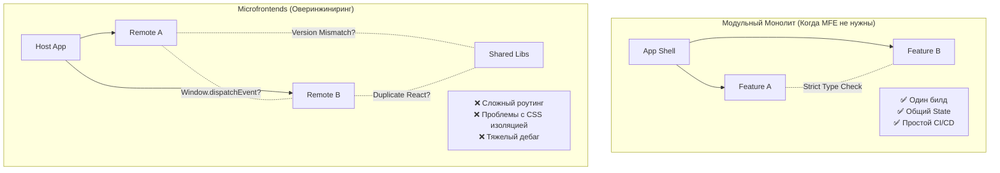

# Когда не нужны Microfrontends (Или почему модульный монолит — ваш лучший друг)

Микрофронтенды (MFE) часто продаются как серебряная пуля для масштабирования frontend-разработки. Однако на практике их внедрение без реальной необходимости приводит к колоссальному усложнению инфраструктуры, деградации производительности и боли при разработке. Если вы решаете проблемы коммуникации в команде через архитектуру — вы идете по тонкому льду.

## Какую боль (не) решаем?

Основная цель MFE — независимая разработка и деплой функциональности большими кросс-функциональными или распределенными командами. Если ваша боль заключается в "у нас спагетти-код" или "долго собирается Webpack", микрофронтенды лишь умножат эту боль на количество ваших независимых приложений.

### Главные маркеры того, что MFE вам не нужны:

1. **Компактная команда:** У вас меньше 30 frontend-инженеров, работающих над продуктом.
2. **Сильная связность домена:** Фичи тесно переплетены, UI-компоненты постоянно обмениваются стейтом и событиями.
3. **Отсутствие зрелой DevOps культуры:** Нет ресурсов на поддержку сложных CI/CD пайплайнов, версионирования, registry компонентов и мониторинга разрозненных приложений.
4. **Слабая дизайн-система:** Вы еще не стандартизировали UI-кит. В MFE это приведет к визуальному франкенштейну и дублированию стилей.

## Иллюзия простоты: Монолит vs Микрофронтенды



## Антипаттерн: Глобальный State в MFE

Попытка использовать микрофронтенды там, где требуется тесная интеграция данных, обычно приводит к созданию монструозных шин данных (Event Bus) через объект `window` или попыткам прокинуть Redux Store через все приложения.

```javascript
// ❌ АНТИПАТТЕРН: Использование MFE для тесно связанных фичей
// Приложение A публикует событие
window.dispatchEvent(new CustomEvent('USER_DATA_UPDATED', { 
    detail: { user, complexNestedState, functionsWeShouldntPass } 
}));

// Приложение B слушает (и надеется, что типы совпадают, а порядок загрузки правильный)
window.addEventListener('USER_DATA_UPDATED', (e) => {
    // Хрупко. Не типизировано. Зависит от гонки состояний (Race conditions).
    updateMyLocalState(e.detail.user);
});
```

Если вашим "независимым" приложениям постоянно нужно общаться друг с другом — они не независимы. В таком случае нужен модульный монолит.

## Альтернатива: Модульный монолит в Монорепозитории

Вместо разрезания приложения на runtime-куски (Module Federation, iframe), разрежьте его на этапе компиляции (build-time). Используйте Nx, Turborepo или Yarn Workspaces.

```javascript
// ✅ КАК НАДО: Модульный монолит с жесткими границами (Strict Boundaries)
// apps/main-app/src/app.tsx
import { UserProfile } from '@my-org/feature-profile'; // Импорт из локального пакета
import { Checkout } from '@my-org/feature-checkout';

// Каждая фича разрабатывается в своей изолированной папке/пакете, 
// но собирается вместе, гарантируя совместимость версий и типов.
```

## Трейдоффы и границы применимости

| Критерий | Модульный Монолит | Микрофронтенды |
| :--- | :--- | :--- |
| **Деплой** | Вместе (All-or-nothing). Может быть долго, но безопасно. | Независимый. Быстро, но есть риск сломать Host-приложение. |
| **Переиспользование кода** | 100% эффективно (Tree-shaking работает идеально). | Требует настройки Shared Dependencies (риск дублирования бандлов). |
| **DX (Developer Experience)** | Отличный (типизация из коробки, один `npm start`, простой рефакторинг). | Сложный (нужно поднимать несколько серверов, мокать зависимости). |
| **Размер бандла** | Минимальный и предсказуемый. | Часто раздут из-за дублирования библиотек в разных Remote-модулях. |

**Вывод:** Микрофронтенды — это архитектура уровня организации, а не техническое решение для "наведения порядка в коде". Если ваша структура компании (Закон Конвея) не требует полностью независимых, не общающихся друг с другом кросс-функциональных стримов — оставайтесь на модульном монолите. Вы сэкономите тысячи часов на инфраструктуре и сохраните нервы команде.
