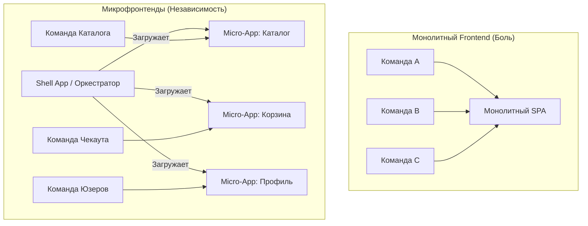

# Когда нужны Microfrontends: Архитектура для масштабирования команд

В какой-то момент успешный продукт вырастает из "стартапа в гараже" в огромную корпоративную систему. И тут классический SPA-монолит начинает трещать по швам. Микрофронтенды — это не просто очередной хайповый паттерн, это **организационный инструмент**, переодетый в техническое решение. 

Суть микрофронтендов — перенести принципы микросервисной архитектуры на клиентскую часть. Мы дробим единый UI на независимые фрагменты, которыми владеют разные кросс-функциональные команды.

## Какую боль решаем?

Представьте монолитный Frontend, над которым работают 100 разработчиков из 10 разных команд:
1. **CI/CD ад**: Сборка занимает 40 минут. Чья-то упавшая фича или тест блокирует релиз для всех остальных.
2. **Конфликты слияния**: Постоянная борьба в `package.json` и роутере.
3. **Хрупкость**: Ошибка в корзине кладет весь сайт, включая каталог и блог.
4. **Стек застрял во времени**: Невозможно обновить React с 16 на 18 версию, так как нужно переписать половину приложения разом.

Микрофронтенды решают эту проблему, позволяя командам разрабатывать, тестировать и **деплоить свой кусок UI независимо** от остальных.

## Как это работает концептуально?

Вместо одного гигантского бандла у нас появляется **Host (Shell) приложение**, которое выступает в роли оркестратора, и множество **Remote (Микрофронтенд) приложений**, которые подгружаются в Host на лету (например, через Webpack Module Federation).



Каждая команда полностью владеет своим доменом — от базы данных и микросервиса на бекенде до визуального отображения (UI) в браузере.

## Примеры кода: Как общаться между микрофронтендами?

Скрытая угроза микрофронтендов — это соблазн связать их так же плотно, как компоненты в монолите. 

**Антипаттерн: Общий глобальный стейт (Redux/Zustand)**
Если один микрофронт пишет в общий `store`, а второй читает, вы только что создали распределенный монолит. Изменение структуры данных в одной команде сломает приложение другой.

```javascript
// ❌ АНТИПАТТЕРН: Жесткая связность через глобальный стейт Host-приложения
// Команда Корзины ожидает специфичный экшен из Каталога
window.store.dispatch({ type: 'CATALOG/ADD_TO_CART', payload: item });
```

**Как надо: Слабая связность (Custom Events / Props)**
Микрофронтенды должны общаться как микросервисы — через стандартизированные, версионируемые контракты. Идеальный вариант — использование браузерных Custom Events, о которых не знает конкретный фреймворк.

```javascript
// ✅ ПРАВИЛЬНО: Использование Custom Events (Event Bus)
// Micro-App Каталога просто "кричит" в космос, что товар выбран
const event = new CustomEvent('app:cart:add', { 
  detail: { productId: '123', qty: 1 } 
});
window.dispatchEvent(event);

// Micro-App Корзины слушает это событие (если оно загружено на странице)
window.addEventListener('app:cart:add', (e) => {
  addToCart(e.detail);
});
```

## Границы применимости и скрытые трейдоффы

Микрофронтенды — это архитектура **для масштабирования людей, а не технологий**. Если вы внедрите их слишком рано, вы просто умножите сложность системы на количество микрофронтендов.

**Когда точно НУЖНЫ:**
- У вас 4+ кросс-функциональные команды (от 30-50 frontend-разработчиков суммарно).
- Разные части приложения имеют принципиально разный жизненный цикл (например, лендинги обновляются по 10 раз в день, а биллинг — раз в квартал).
- У команд есть потребность в независимом релизном цикле.

**Когда это УБЬЕТ ваш проект (Трейдоффы):**
- **Дублирование кода и размер бандла**: Если не настроить общие зависимости (`shared` в Module Federation), пользователи будут загружать React по 5 раз.
- **Инфраструктурный налог**: Вам придется строить сложный CI/CD для независимых деплоев, версионирования и управления кешом.
- **UI/UX неконсистентность**: Очень легко скатиться в ситуацию, когда каждая команда реализует свои кнопки и модалки. Требуется сильная, версионируемая UI-kit библиотека (Design System).

**Итог:** Микрофронтенды — это дорогостоящий инструмент для решения проблем коммуникации и релизов в крупных энтерпрайзах. Если ваша команда помещается в две пиццы — оставайтесь на монолите, просто держите его модульным.
