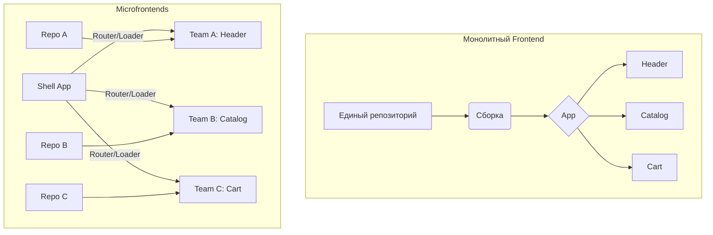

# Что такое Microfrontends

Представьте, что ваш продукт вырос из небольшого SPA в огромного монстра: десятки разработчиков, разные команды отвечают за разные фичи, сборка длится 40 минут, а любая ошибка в корзине валит весь интернет-магазин. Вы столкнулись с классической проблемой монолитного фронтенда. 

**Микрофронтенды (Microfrontends)** — это архитектурный подход, при котором цельное веб-приложение собирается из независимых фрагментов, разрабатываемых разными командами. Это логичное продолжение идей микросервисной архитектуры на клиенте.

Мы решаем боль масштабирования команд: позволяем им независимо разрабатывать, тестировать, деплоить и обновлять свои части UI, не блокируя друг друга.

## Как это работает

Вместо одного огромного приложения мы создаем «приложение-хост» (shell), которое отвечает за роутинг, общую авторизацию и базовый лейаут. В него динамически подгружаются «микроприложения» — самостоятельные модули, отвечающие за конкретные бизнес-домены (например, каталог, корзина, профиль).



## Варианты интеграции (и примеры)

Есть несколько способов "склеить" микрофронтенды.

### Антипаттерн: iframe
Самый старый и надежный способ изоляции, но с ужасным UX.
```html
<!-- Как не надо делать в 2024 году, если важен UX и SEO -->
<div>
  <iframe src="https://header.mycorp.com"></iframe>
  <iframe src="https://catalog.mycorp.com"></iframe>
</div>
```
*Минусы:* Проблемы с роутингом, всплывающими окнами (модалки обрезаются краями iframe), дублирование зависимостей и сложная коммуникация (через `postMessage`).

### Современный стандарт: Webpack Module Federation
Позволяет динамически подгружать код из других сборок в рантайме.

```javascript
// webpack.config.js (Host)
const ModuleFederationPlugin = require('webpack/lib/container/ModuleFederationPlugin');

module.exports = {
  plugins: [
    new ModuleFederationPlugin({
      name: 'host',
      remotes: {
        // Подключаем микрофронтенд корзины
        cart: 'cart@http://localhost:3002/remoteEntry.js',
      },
      shared: ['react', 'react-dom'], // Делим общие библиотеки
    }),
  ],
};

// App.jsx (Host)
import React, { Suspense } from 'react';
// Динамический импорт компонента из другого приложения!
const CartWidget = React.lazy(() => import('cart/Widget'));

const App = () => (
  <div>
    <h1>Мой Магазин</h1>
    <Suspense fallback="Loading cart...">
      <CartWidget />
    </Suspense>
  </div>
);
```

## Скрытые трейдоффы и границы применимости

Микрофронтенды — это не серебряная пуля, а инструмент для решения организационных проблем. 

**Когда применять:**
- В компании больше 3-4 независимых кросс-функциональных команд, работающих над одним продуктом.
- Разные части приложения имеют радикально разные циклы релизов (например, промо-лендинги обновляются каждый день, а сложная админка — раз в месяц).
- Есть необходимость постепенной миграции легаси (например, с AngularJS на React).

**Где ломается (Trade-offs):**
1. **Performance payload:** Вы можете случайно загрузить 3 разные версии React или Lodash, если не настроите `shared` зависимости грамотно. Первоначальная загрузка может пострадать.
2. **Global State & Communication:** Как передать данные о пользователе из Shell в микроприложение? (Обычно используют Custom Events или RxJS-шину, но это усложняет отладку).
3. **Единообразие UI/UX:** Каждая команда может начать "пилить" свои кнопки. Обязательно нужна строгая Design System.
4. **Dev Experience:** Локальная разработка усложняется. Чтобы запустить "одну кнопочку", иногда приходится поднимать локально 5 связанных микроприложений или настраивать проксирование на стейджинг.

Если у вас стартап на 5 фронтендеров — пишите модульный монолит. Микрофронтенды нужны там, где цена коммуникации между людьми становится выше, чем цена технической сложности оркестрации.
