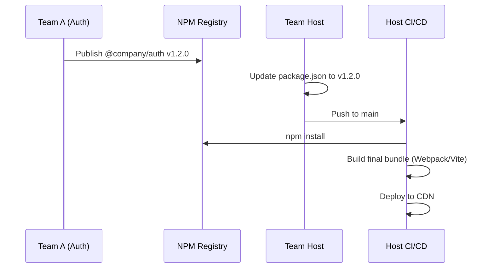

# Build Time Integration

Build-time интеграция — это самый исторически ранний и, пожалуй, самый прямолинейный подход к созданию микрофронтендов. В этой модели микрофронтенды рассматриваются просто как разделяемые библиотеки. Каждая команда разрабатывает свой кусок приложения, публикует его (например, в приватный NPM-реестр), а хост-приложение (shell) устанавливает эти пакеты как зависимости и собирает всё вместе в единый бандл на этапе компиляции.

## Какую боль решаем?

Когда монолит становится слишком большим, первая мысль — разделить код. Build-time интеграция решает проблему **разделения кодовой базы и ответственности**. Разные команды могут жить в разных репозиториях, иметь свои собственные циклы тестирования и код-ревью, не мешая друг другу на этапе написания кода. При этом сохраняется привычный и понятный Developer Experience (DX) — типизация из коробки, удобная навигация по коду и отсутствие магии в рантайме.

## Как это работает

Жизненный цикл выглядит так:
1. Команда А разрабатывает компонент (микрофронтенд) и публикует его как npm-пакет с семантическим версионированием.
2. Команда хост-приложения обновляет версию зависимости в `package.json`.
3. CI/CD хоста скачивает новую версию пакета и запускает стандартный билд (Webpack, Vite, Rollup).
4. На выходе получается старый добрый монолитный бандл, который деплоится на сервер.



## Примеры кода

Всё выглядит как работа с обычными библиотеками компонентов.

**Как надо (Хост приложение):**

```json
// package.json хоста
{
  "dependencies": {
    "@company/mfe-auth": "^1.2.0",
    "@company/mfe-catalog": "^2.0.1",
    "react": "^18.2.0"
  }
}
```

```tsx
// App.tsx
import { AuthWidget } from '@company/mfe-auth';
import { CatalogRouter } from '@company/mfe-catalog';

export const App = () => (
  <div className="layout">
    <header>
      <h1>My Store</h1>
      <AuthWidget />
    </header>
    <main>
      <CatalogRouter basePath="/catalog" />
    </main>
  </div>
);
```

## Скрытые трейдоффы и границы применимости

Несмотря на простоту и отличную поддержку TypeScript, этот подход часто называют «распределённым монолитом» (Distributed Monolith), и вот почему:

1. **Блокировка релизов (Coupling at deploy time)**: Вы не можете задеплоить обновление микрофронтенда независимо. Если команда А нашла критический баг, она публикует фикс в NPM, но затем **обязательно** нужно пересобрать и задеплоить хост-приложение. Если в этот момент хост сломан командой Б, релиз команды А блокируется.
2. **Раздувание бандла (Bundle bloat)**: Если микрофронтенды неаккуратно управляют своими зависимостями (не выносят React, lodash и т.д. в `peerDependencies`), в итоговый бандл попадут дубликаты библиотек.
3. **Время сборки**: По мере роста количества микрофронтендов, хост-приложению становится всё тяжелее собирать итоговый бандл. Время CI/CD пайплайна неуклонно растет.
4. **Версионный ад**: Постоянная необходимость синхронизировать версии пакетов в хост-приложении, особенно если микрофронтенды зависят друг от друга.

**Где применимо:**
* В небольших проектах, где нужно логическое разделение команд, но нет жесткого требования к независимому деплою.
* Для создания общих библиотек UI-компонентов (Design Systems).
* Когда важна строгая статическая типизация и проверка контрактов на этапе сборки, и вы готовы платить за это скоростью доставки фичей (Time-to-Market).

**Где ломается:**
* В Enterprise-масштабах (10+ команд), где независимость релизных циклов критична для бизнеса. Там, где независимый деплой — это вопрос выживания, Build-Time интеграция уступает место Run-Time решениям (Module Federation, iframe, Web Components).
