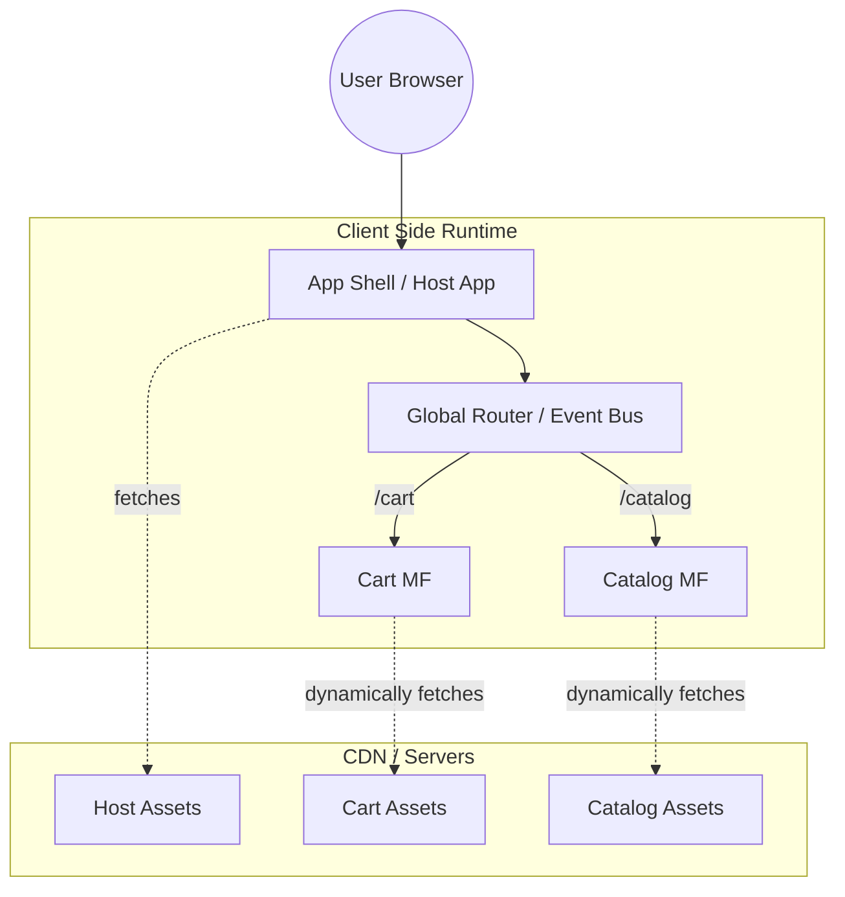

# Client Side Composition (Композиция на клиенте)

## Суть и какую боль решаем
Исторически монолитные фронтенд-приложения (SPA) с ростом команды превращаются в неповоротливого монстра: долгие сборки, конфликты в мерж-реквестах, невозможность обновить фреймворк или библиотеку без боли на весь проект. 
**Client Side Composition (CSC)** — это подход в архитектуре микрофронтендов, при котором сборка итогового интерфейса из независимых кусочков (микрофронтендов) происходит прямо в браузере пользователя, во время выполнения (runtime).

Мы решаем боль сильной связности: команды могут деплоить свои части приложения полностью независимо друг от друга. App Shell (приложение-контейнер) динамически подгружает только те микрофронтенды, которые нужны на текущей странице, не требуя пересборки всего проекта.

## Как это работает
В основе лежит **App Shell (Host)**, который берет на себя роль оркестратора:
- **Глобальный роутинг:** определяет, какой микрофронтенд показать по текущему URL.
- **Инфраструктура:** авторизация, телеметрия, перехват глобальных ошибок.
- **Оркестрация загрузки:** скачивает JavaScript/CSS бандлы удаленных модулей (Remotes).

Микрофронтенды билдятся и деплоятся как отдельные статические ассеты. Host знает их адреса (через манифест или реестр) и запрашивает код "на лету".



## Примеры реализации: Module Federation

Webpack (и Rspack) Module Federation стал стандартом де-факто для реализации CSC. Он позволяет динамически шарить код и зависимости между независимыми сборками.

### Как надо (Хороший паттерн)

Использование динамических URL (через window-переменные или fetch-запросы за манифестом), чтобы Host не был прибит гвоздями к конкретным URL деплоев.

**Host (webpack.config.js):**
```javascript
const ModuleFederationPlugin = require('webpack/lib/container/ModuleFederationPlugin');

module.exports = {
  plugins: [
    new ModuleFederationPlugin({
      name: 'host_app',
      remotes: {
        // promise-based dynamic resolution
        cart_app: `promise new Promise(resolve => {
          const url = window.MICROFRONTENDS_REGISTRY.cart;
          // ... динамическая загрузка remoteEntry.js
        })`, 
      },
      // Шарим зависимости, чтобы React не грузился дважды
      shared: { 
        react: { singleton: true, eager: true, requiredVersion: '^18.0.0' }, 
        'react-dom': { singleton: true, eager: true } 
      },
    }),
  ],
};
```

**Remote (webpack.config.js):**
```javascript
const ModuleFederationPlugin = require('webpack/lib/container/ModuleFederationPlugin');

module.exports = {
  plugins: [
    new ModuleFederationPlugin({
      name: 'cart_app',
      filename: 'remoteEntry.js',
      exposes: {
        './CartWidget': './src/components/CartWidget', // Экспортируем только конкретные модули
      },
      shared: { react: { singleton: true }, 'react-dom': { singleton: true } },
    }),
  ],
};
```

### Антипаттерн: Сильная связность

Попытка прокинуть глобальный Redux Store или огромные объекты с контекстом сверху вниз через пропсы во все микрофронтенды.

```javascript
// Плохо: Host диктует структуру стейта Remote приложению, связывая их намертво
<CartWidget 
   globalStore={store} 
   userToken={user.token} 
   onStoreUpdate={(newState) => syncState(newState)} 
/>
```
*Почему это плохо?* Нарушается инкапсуляция. Если структура стейта или версия Redux в Host изменится, CartWidget неминуемо сломается. Лучше общаться через `CustomEvent` в браузере или специализированные Event Bus, а стейт держать локальным для каждого микрофронтенда.

## Скрытые трейдоффы и границы применимости

> [!WARNING]
> Главный враг Client Side Composition — это **Деградация производительности (Network Waterfalls)**.

1. **Водопад запросов (Network Waterfall):**
   Браузер сначала качает Host -> Host запускается и понимает, что нужен Remote -> качает Remote -> Remote запускается и качает свои данные. Из-за этого метрики Time To Interactive (TTI) и Largest Contentful Paint (LCP) сильно проседают.
   *Митигация:* Использовать префетчинг (prefetching) частых модулей, Skeleton Loaders или переносить часть композиции на сервер (SSR).

2. **Ад зависимостей (Dependency Hell):**
   Module Federation позволяет делиться библиотеками (`singleton: true`), но если Host использует React 17, а Remote жестко требует React 18 — начнутся конфликты в рантайме или загрузятся две версии React одновременно, что раздует бандл.
   *Митигация:* Строгий Platform Governance. Выделение Core-команды, которая жестко фиксирует и обновляет версии общих зависимостей для всех.

3. **Сложность локальной разработки:**
   Чтобы доработать фичу, плотно интегрированную в Host-приложение, разработчику зачастую приходится поднимать локально не только свой Remote, но и Host, а иногда и соседние Remotes.
   *Митигация:* Использование моков Host-окружения для изолированной разработки (Standalone mode).

### Когда применимо?
- В **B2B / Enterprise продуктах** (внутренние порталы, админки, CRM, дашборды), где SEO вообще не играет роли, а скорость первой загрузки (Cold Start) менее критична, чем возможность 10+ командам релизиться независимо каждый день.
- Когда приложения представляют собой логически изолированные крупные модули-страницы.

### Когда ломается?
- В **B2C e-commerce или медиа-площадках**, где важны SEO, Core Web Vitals и максимальная конверсия с первой секунды. Там лучше смотреть в сторону Server-Side Composition (Edge Side Includes, Module Federation for Node.js, Podium).
- В маленьких командах (до 10 человек). Оверхед на настройку CI/CD, версионирование манифестов и решение багов Webpack/Rspack превысит всю полученную пользу.
