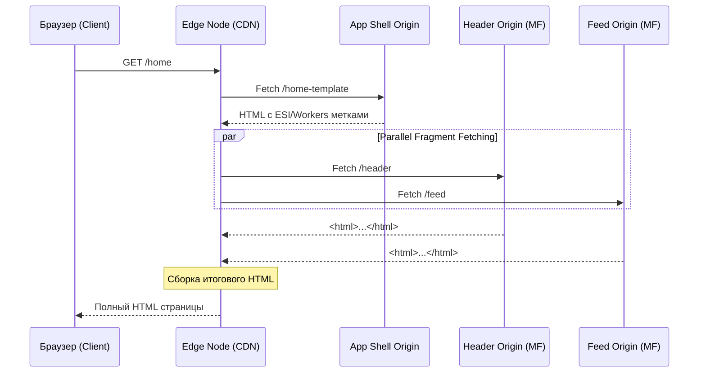

# Edge Side Composition

Представь классическую дилемму микрофронтендов: мы распилили монолит на независимые приложения. Если собирать их на клиенте (Client-side), мы грузим браузер сотнями килобайт JS и страдаем от водопадов запросов (Network Waterfall). Если собирать на сервере (Server-side), мы нагружаем origin-сервер, теряем преимущества глобального кэширования и увеличиваем TTFB (Time to First Byte) для пользователей на другом конце света.

**Edge Side Composition** (композиция на границе сети) решает эту боль, перенося этап сборки страницы на CDN (Content Delivery Network). Мы склеиваем HTML прямо на ближайшем к пользователю Edge-узле, до того, как ответ уйдет в браузер.

## Как это работает

Концепция опирается на две основные технологии:
1. **ESI (Edge Side Includes)** — старый, но рабочий XML-подобный стандарт тегов, который поддерживается Varnish, Akamai, Cloudflare.
2. **Edge Workers** (Cloudflare Workers, AWS Lambda@Edge) — современный подход, позволяющий запускать легковесный JavaScript/WASM прямо на узлах CDN для кастомной склейки и роутинга.

CDN перехватывает запрос пользователя, берет "шаблон" (shell) страницы и параллельно дозапрашивает необходимые фрагменты микрофронтендов из их origin-серверов или кэша, собирает итоговый HTML и отдает клиенту.



## Примеры реализации

### Классический ESI (Edge Side Includes)

Приложение-каркас отдает HTML, в котором вместо реального контента стоят ESI-теги. Edge-сервер парсит документ, находит теги и заменяет их контентом по ссылке.

```html
<!-- Как надо: Каркас (App Shell) отдает такой HTML -->
<!DOCTYPE html>
<html>
<head>
    <title>My Store</title>
</head>
<body>
    <!-- CDN перехватит этот тег и сделает подзапрос -->
    <esi:include src="https://header.microfrontend.com/api/fragment" onerror="continue" />
    
    <main>
        <esi:include src="https://product.microfrontend.com/api/details/123" />
    </main>
</body>
</html>
```

### Современный подход: Edge Workers

Более гибкий вариант, где мы пишем логику склейки на JS/TS. Это позволяет управлять таймаутами, фоллбеками и персонализацией.

```javascript
// Cloudflare Worker (или подобный Edge Runtime)
export default {
  async fetch(request) {
    // Получаем базовый шаблон
    let response = await fetch("https://shell.app.com/template");
    let html = await response.text();

    // Параллельно запрашиваем микрофронтенды
    const [headerRes, footerRes] = await Promise.all([
      fetch("https://header.app.com/fragment"),
      fetch("https://footer.app.com/fragment")
    ]);

    const headerHtml = await headerRes.text();
    const footerHtml = await footerRes.text();

    // Собираем страницу
    html = html.replace('<!-- FRAGMENT_HEADER -->', headerHtml);
    html = html.replace('<!-- FRAGMENT_FOOTER -->', footerHtml);

    return new Response(html, {
      headers: { 'content-type': 'text/html' },
    });
  }
};
```

## Трейдоффы и границы применимости

Edge Side Composition выглядит как "серебряная пуля" для SEO и производительности, но за нее приходится платить высокую цену в Developer Experience (DX) и инфраструктуре.

### Плюсы:
- **Феноменальный Time to First Byte (TTFB)** — страница собирается рядом с пользователем.
- **Отличное SEO** — поисковики получают готовый HTML без необходимости выполнять JS.
- **Изоляция сбоев** — если микрофронтенд рекомендаций упал, Edge может подставить fallback-контент или оставить блок пустым (как в `onerror="continue"` у ESI).
- **Продвинутое кэширование** — каждый фрагмент кэшируется независимо со своим TTL. Шапка может лежать в кэше сутки, а корзина обходить кэш и генерироваться на лету.

### Скрытые грабли (Антипаттерны и боли):

1. **Локальная разработка — это ад.** Разработчикам нужно поднимать локальный Varnish или мокать Edge Workers, чтобы просто запустить приложение и увидеть, как микрофронтенды собираются вместе. Часто это приводит к рассинхрону между локальным окружением и продом.
2. **Vendor Lock-in.** Выбрав ESI или специфичный Edge API (Cloudflare, Fastly), переехать на другую CDN становится архитектурной задачей на квартал.
3. **Отладка и трейсинг.** Если на проде разъехалась верстка, понять, какой именно фрагмент закешировался криво на конкретном Edge-узле в Франкфурте — задача не из легких. Нужен распределенный трейсинг (OpenTelemetry), пробрасываемый через CDN.
4. **Управление ассетами.** Склеить HTML легко. Сложнее гарантировать, что `<style>` и `<script>` разных микрофронтендов не конфликтуют, и что бандлы дедуплицированы (например, чтобы React не грузился трижды).

**Резюме:** Edge Composition идеальна для e-commerce, медиа и контентных проектов, где критичны SEO и скорость первой отрисовки, а контент легко фрагментируется. Для сложных B2B-дашбордов и SPA с богатым интерактивом этот подход принесет больше боли в инфраструктуре, чем реальной пользы.
